# Data Model: Housing Benefits Portal

> **Template Origin**: Official | **ArcKit Version**: 6.16.5 | **Command**: `/arckit:data-model`

## Document Control

| Field | Value |
|-------|-------|
| **Document ID** | ARC-001-DATA-v1.0 |
| **Document Type** | Data Model |
| **Project** | Housing Benefits Portal (Project 001) |
| **Classification** | OFFICIAL-SENSITIVE |
| **Status** | DRAFT |
| **Version** | 1.0 |
| **Created Date** | 2026-09-29 |
| **Last Modified** | 2026-09-29 |
| **Review Cycle** | Monthly |
| **Next Review Date** | 2026-10-29 |
| **Owner** | Priya Nandakumar, Head of Digital (Chair, Design Authority) |
| **Reviewed By** | PENDING |
| **Approved By** | PENDING |
| **Distribution** | Design Authority; Information Governance Group; Service Owner; project delivery team. Describes the structure of special category data: not for onward circulation. |

## Revision History

| Version | Date | Author | Changes | Approved By | Approval Date |
|---------|------|--------|---------|-------------|---------------|
| 1.0 | 2026-09-29 | ArcKit AI | Initial creation from `/arckit:data-model` command | PENDING | PENDING |

---

## Executive Summary

### Overview

This data model covers the Housing Benefits Portal for Ashcombe District Council: a citizen-facing service that replaces a paper and telephone housing-benefit claim process (`ARC-001-REQ-v1.0`). It defines the entities, relationships, ownership, privacy controls and quality targets needed to let a citizen submit a claim online (BR-001), save and resume it (FR-001), let a caseworker request more evidence (FR-002), record a decision that can be measured against the 14-day standard (BR-002), and hold claim records on the council's PostgreSQL platform service with point-in-time recovery (DR-001) and evidence for six years after the claim closes (DR-002).

The requirements document is thin on data. It contains two data requirements (DR-001, DR-002), no security or privacy NFRs and no integration requirements. Entities beyond those two requirements are therefore derived from the business and functional requirements (BR-001, BR-002, FR-001, FR-002) and from stakeholder drivers in `ARC-001-STKE-v1.0` (audit trail for subsidy assurance, SD-2 and SD-13; lawful processing and retention, SD-9). Every derived entity is marked as such, and the gaps are listed in the Requirements Traceability section so the requirements can be extended before design review.

The model assumes the Design Authority's options appraisal (G-6) keeps claim capture and evidence handling in the portal's own PostgreSQL schema. If the incumbent benefits system remains the assessment and payment engine, E-008 (Decision) and the award fields become a replicated read model, and the integration mapping below applies.

### Model Statistics

- **Total Entities**: 11 entities defined (E-001 through E-011)
- **Total Attributes**: 136 attributes across all entities
- **Total Relationships**: 14 relationships mapped (11 one-to-many, 3 zero-or-one; the Decision to Evidence Document many-to-many is resolved through junction entity E-009 and counted as two one-to-many)
- **Data Classification**:
  - 🟢 Public: 0 entities
  - 🟡 Internal: 2 entities (E-009, E-011)
  - 🟠 Confidential: 5 entities (E-002, E-005, E-006, E-008, E-010), all 5 contain PII
  - 🔴 Restricted: 4 entities (E-001, E-003, E-004, E-007) containing National Insurance numbers, health and disability information or uploaded evidence

Restricted maps to OFFICIAL-SENSITIVE handling. Confidential and Internal map to OFFICIAL.

### Compliance Summary

- **GDPR/DPA 2018 Status**: NEEDS_DPIA. No DPIA exists for the portal (`ARC-001-STKE-v1.0`, G-5 baseline)
- **PII Entities**: 9 entities hold claimant personal data; the other 2 (E-009, E-011) hold only staff identifiers and pseudonymous references. 35 attributes are flagged PII
- **Special Category Data**: Yes. Disability and health information (E-001 `support_needs`, E-004 `disability_declared`, and the content of E-007 documents and E-003 answers)
- **Data Protection Impact Assessment (DPIA)**: REQUIRED. Target sign-off at the January 2027 Information Governance Group before private beta
- **Data Retention**: Six years after claim closure for evidence (driven by DR-002). Retention for the other entities is proposed at the same period and needs Information Governance Group approval
- **Cross-Border Transfers**: NO planned transfers. All storage on the council PostgreSQL platform service; the platform's hosting location and any supplier sub-processors must be confirmed by IT Operations before DPIA sign-off

### Key Data Governance Stakeholders

- **Data Owner (Business)**: Tom Okafor, Benefits Service Manager and Service Owner. Accountable for claim data quality and use. Executive accountability sits with Daniel Quist, Director of Resources (proposed SRO)
- **Data Steward**: Not yet assigned. A senior caseworker nominated by the Service Owner, to be appointed by 31 October 2026 alongside the Product Manager and Delivery Manager roles
- **Data Custodian (Technical)**: IT Operations / Platform team *(assumed)*, running the PostgreSQL platform service
- **Data Protection Officer**: Lena Marsh. Must sign off claimant-data processing before go-live and chairs the Information Governance Group
- **Senior Information Risk Owner**: Not named (gap). Must be confirmed by 31 October 2026 so that risk acceptance for this data has an owner
- **Architecture authority**: Priya Nandakumar, Head of Digital, chairing the Design Authority

---

## Visual Entity-Relationship Diagram (ERD)

```mermaid
erDiagram
    CLAIMANT ||--o{ CLAIM : makes
    CLAIM ||--o| CLAIM_DRAFT : saves_as
    CLAIM ||--o{ HOUSEHOLD_MEMBER : declares
    CLAIM ||--o{ INCOME_CAPITAL_ITEM : reports
    HOUSEHOLD_MEMBER |o--o{ INCOME_CAPITAL_ITEM : receives
    CLAIM ||--o{ EVIDENCE_REQUEST : raises
    CLAIM ||--o{ EVIDENCE_DOCUMENT : holds
    EVIDENCE_REQUEST |o--o{ EVIDENCE_DOCUMENT : answered_by
    CLAIM ||--o{ DECISION : results_in
    DECISION |o--o| DECISION : supersedes
    DECISION ||--o{ DECISION_EVIDENCE_LINK : relies_on
    EVIDENCE_DOCUMENT ||--o{ DECISION_EVIDENCE_LINK : supports
    CLAIM ||--o{ AUDIT_EVENT : logs
    CLAIM ||..o| DISPOSAL_RECORD : disposed_by

    CLAIMANT {
        uuid claimant_id PK "Unique identifier"
        string ni_number UK "National Insurance number, PII, encrypted"
        string first_name "PII"
        string last_name "PII"
        date date_of_birth "PII"
        string email "PII"
        string postcode "PII"
        string support_needs "Special category, encrypted"
        string preferred_channel "ONLINE, PHONE, PAPER, ASSISTED"
    }

    CLAIM {
        uuid claim_id PK "Unique identifier"
        string claim_reference UK "Human-readable reference"
        uuid claimant_id FK "Claimant who owns the claim"
        string source_channel "Channel used, drives G-1 measure"
        string status "DRAFT to CLOSED lifecycle"
        decimal weekly_rent "Declared weekly rent"
        timestamp submitted_at "First submission"
        timestamp complete_at "Starts the 14-day clock, BR-002"
        date decision_due_date "complete_at plus 14 days"
        timestamp closed_at "Starts the six-year retention, DR-002"
        date retention_expiry_date "closed_at plus six years"
    }

    CLAIM_DRAFT {
        uuid draft_id PK "Unique identifier"
        uuid claim_id FK, UK "One draft per claim, FR-001"
        jsonb answers_json "Partial answers, encrypted"
        string current_step "Resume point"
        timestamp expires_at "Abandoned draft expiry"
    }

    HOUSEHOLD_MEMBER {
        uuid household_member_id PK "Unique identifier"
        uuid claim_id FK "Claim the member belongs to"
        string member_role "PARTNER, CHILD, NON_DEPENDANT, OTHER"
        string first_name "PII"
        string last_name "PII"
        date date_of_birth "PII"
        boolean disability_declared "Special category, encrypted"
    }

    INCOME_CAPITAL_ITEM {
        uuid item_id PK "Unique identifier"
        uuid claim_id FK "Claim the item supports"
        uuid household_member_id FK "Null means the claimant"
        string item_type "EARNINGS, BENEFIT, PENSION, SAVINGS, OTHER"
        decimal amount "PII, financial"
        string frequency "WEEKLY, MONTHLY, ONE_OFF"
    }

    EVIDENCE_REQUEST {
        uuid evidence_request_id PK "Unique identifier"
        uuid claim_id FK "Claim the request relates to"
        string requested_by_user_id "Caseworker, FR-002"
        string evidence_type_code "Type of evidence asked for"
        string status "OPEN, SATISFIED, WITHDRAWN, EXPIRED"
        date due_date "Response due date"
    }

    EVIDENCE_DOCUMENT {
        uuid evidence_document_id PK "Unique identifier"
        uuid claim_id FK "Claim the document supports"
        uuid evidence_request_id FK "Null when uploaded unprompted"
        string sha256_checksum "Integrity check"
        string storage_uri "Location of stored file"
        string review_outcome "ACCEPTED, REJECTED, NEEDS_MORE"
        date retention_expiry_date "Claim closure plus six years, DR-002"
        boolean legal_hold "Blocks disposal when true"
    }

    DECISION {
        uuid decision_id PK "Unique identifier"
        uuid claim_id FK "Decided claim"
        uuid supersedes_decision_id FK "Earlier decision this revises"
        string decision_type "AWARD, REFUSAL, REVISION"
        decimal weekly_award_amount "Amount awarded"
        timestamp decided_at "Decision time, BR-002"
        boolean met_14_day_standard "Derived from complete_at"
    }

    DECISION_EVIDENCE_LINK {
        uuid decision_id PK, FK "Decision reference"
        uuid evidence_document_id PK, FK "Evidence relied on"
        string relied_on_for "Reason code"
    }

    AUDIT_EVENT {
        uuid audit_event_id PK "Unique identifier"
        uuid claim_id FK "Related claim"
        string entity_type "Entity changed or read"
        string action "CREATE, READ, UPDATE, DECIDE, DELETE"
        string actor_id "PII, user or system"
        timestamp occurred_at "Event time"
    }

    DISPOSAL_RECORD {
        uuid disposal_id PK "Unique identifier"
        string claim_reference "Logical reference kept after deletion"
        date scheduled_for "Planned disposal date"
        timestamp executed_at "Actual disposal time"
        string disposal_method "HARD_DELETE or ANONYMISE"
        string status "SCHEDULED, HELD, EXECUTED, FAILED"
    }
```

**Diagram Notes**:

- **Cardinality**: `||` = exactly one, `o|` = zero or one, `o{` = zero or more, `|{` = one or more
- **Primary Keys (PK)**: Uniquely identify each record. UUID v4 throughout, so identifiers carry no personal data
- **Foreign Keys (FK)** and **Unique Keys (UK)**: Combined keys are comma-separated (`PK, FK`)
- **Dotted line**: E-011 refers to a claim by `claim_reference` only. The claim row is deleted at disposal, so the link is logical, not a foreign key
- **Subset of attributes**: The diagram shows the attributes that carry keys, requirement drivers or privacy significance. The Entity Catalog holds the full set

---

## Entity Catalog

**Volume assumptions**: `ARC-001-REQ-v1.0` and `ARC-001-STKE-v1.0` give no caseload figures. Volumes below are planning assumptions: 250 new claims a month across all channels, with the online share reaching the 60% target (G-1), so about 150 online claims a month. No legacy claims are migrated at go-live. Discovery must replace these with measured baselines by 31 October 2026.

### Entity E-001: Claimant

**Description**: The person who makes a housing-benefit claim. Holds identity and contact details, and the claimant's preferred contact channel.

**Source Requirements**:

- BR-001: Citizens must be able to submit a claim online without visiting an office
- FR-001: Save and resume a partially completed claim (a claimant record must exist from the first save)

**Business Context**: One claimant can make several claims over time (for example after moving home). The record is created at first save with only an email address, then completed at submission. This avoids forcing full identity steps before someone can start a claim, which the stakeholder analysis flags as an exclusion risk (SD-10).

**Data Ownership**:

- **Business Owner**: Tom Okafor, Service Owner. Accountable for accuracy and use
- **Technical Owner**: IT Operations / Platform team *(assumed)*. Maintains the schema
- **Data Steward**: Senior caseworker nominated by the Service Owner (not yet appointed)

**Data Classification**: RESTRICTED (OFFICIAL-SENSITIVE handling: National Insurance number and support needs)

**Volume Estimates**:

- **Initial Volume**: 0 records at go-live
- **Growth Rate**: +150 records per month (assumed)
- **Peak Volume**: about 5,400 records at Year 3
- **Average Record Size**: 1 KB

**Data Retention**:

- **Active Period**: While any linked claim is open, and for the retention period of its most recent claim
- **Archive Period**: None. Records stay in the primary database until disposal
- **Total Retention**: 6 years after the last linked claim closes (aligned to DR-002; needs Information Governance Group approval)
- **Deletion Policy**: Hard delete through the retention job. Records with a legal hold are excluded

#### Attributes

| Attribute | Type | Required | PII | Description | Validation Rules | Default | Source Req |
|-----------|------|----------|-----|-------------|------------------|---------|------------|
| claimant_id | UUID | Yes | No | Unique identifier | UUID v4 | Auto-generated | BR-001 |
| ni_number | VARCHAR(9) | Yes (at submission) | Yes | National Insurance number | Two letters, six digits, suffix A-D; unique; invalid prefixes rejected | NULL | BR-001 |
| first_name | VARCHAR(100) | Yes (at submission) | Yes | Given name | Non-empty, 1-100 chars | NULL | BR-001 |
| last_name | VARCHAR(100) | Yes (at submission) | Yes | Family name | Non-empty, 1-100 chars | NULL | BR-001 |
| date_of_birth | DATE | Yes (at submission) | Yes | Date of birth | Not in the future; age 16 or over | NULL | BR-001 |
| email | VARCHAR(254) | Yes | Yes | Contact email, also used to resume a saved claim | RFC 5322; case-insensitive unique | None | FR-001 |
| phone | VARCHAR(20) | No | Yes | Contact phone number | E.164 or UK national format | NULL | BR-001 |
| address_line_1 | VARCHAR(100) | Yes (at submission) | Yes | Correspondence address, line 1 | Non-empty | NULL | BR-001 |
| address_line_2 | VARCHAR(100) | No | Yes | Correspondence address, line 2 | Free text | NULL | BR-001 |
| town | VARCHAR(60) | Yes (at submission) | Yes | Town or city | Non-empty | NULL | BR-001 |
| postcode | VARCHAR(8) | Yes (at submission) | Yes | Postcode | UK postcode pattern, normalised upper case | NULL | BR-001 |
| preferred_channel | VARCHAR(10) | Yes | No | Preferred contact channel | ONLINE, PHONE, PAPER, ASSISTED | ONLINE | BR-001 |
| support_needs | VARCHAR(500) | No | Yes | Accessibility or vulnerability needs the claimant chooses to share | Free text, max 500 chars | NULL | BR-001 |
| identity_verified_at | TIMESTAMP | No | No | Time identity checks were completed | ISO 8601 UTC | NULL | BR-001 |
| created_at | TIMESTAMP | Yes | No | Record creation time | ISO 8601 UTC, auto-set | NOW() | DR-001 |
| updated_at | TIMESTAMP | Yes | No | Last update time | ISO 8601 UTC, auto-updated | NOW() | DR-001 |

**Attribute Notes**:

- **PII Attributes**: ni_number, first_name, last_name, date_of_birth, email, phone, address_line_1, address_line_2, town, postcode, support_needs (11)
- **Encrypted Attributes**: ni_number and support_needs (application-level, in addition to platform encryption at rest)
- **Special Category**: support_needs may reveal health or disability information
- **Derived Attributes**: None
- **Audit Attributes**: created_at, updated_at. Change history is held in E-010

#### Relationships

**Outgoing Relationships**: None.

**Incoming Relationships**:

- makes: E-002 → E-001 (one claimant to many claims)
  - Usage: Every claim belongs to exactly one claimant

#### Indexes

- **Primary Key**: `pk_claimant` on `claimant_id`
- **Unique Constraints**: `uk_claimant_email` on `lower(email)`; `uk_claimant_ni_number` on `ni_number` (partial, where not null)
- **Performance Indexes**: `idx_claimant_last_name_dob` on `(last_name, date_of_birth)` for caseworker search and duplicate detection

#### Privacy & Compliance

- **Contains PII**: YES (11 attributes)
- **Legal Basis for Processing**: Public task, UK GDPR Art 6(1)(e), administering Housing Benefit. Special category data under Art 9(2)(g) with DPA 2018 Schedule 1 Part 2 (statutory and government purposes). The DPO must confirm both in the DPIA
- **Data Subject Rights**: Access and rectification through the portal and caseworker workbench; erasure only after the retention period or where no legal obligation to retain applies; portability not applicable to public task processing; restriction supported through a hold flag on the claim (E-002)
- **Data Breach Impact**: HIGH. Identity data, National Insurance number and address of benefit claimants, some in supported or temporary accommodation
- **Cross-Border Transfers**: None
- **DPIA**: REQUIRED
- **Government Security Classification**: OFFICIAL-SENSITIVE
- **Audit Logging**: Access logging required (reads by staff); change logging required, 6-year retention

---

### Entity E-002: Claim

**Description**: A single housing-benefit claim, from first submission through decision to closure. Holds the tenancy and rent details, lifecycle status and the dates that drive the 14-day standard and the six-year retention clock.

**Source Requirements**:

- DR-001: Claim records held in the council PostgreSQL platform service with point-in-time recovery
- BR-001: Submit a claim online
- BR-002: Decide within 14 calendar days of a complete submission (`complete_at`, `decision_due_date`)
- DR-002: Retention runs six years from claim closure (`closed_at`, `retention_expiry_date`)
- FR-001: A claim in DRAFT status can be resumed

**Business Context**: The central entity. The Service Owner reports the 14-day decision rate from it (G-2), and the online share of new claims from `source_channel` (G-1). The definition of "complete" is a disputed measure (Conflict 5 in the stakeholder analysis), so `complete_at` records when a caseworker or the system marked the submission complete, and E-010 records who did so.

**Data Ownership**:

- **Business Owner**: Tom Okafor, Service Owner
- **Technical Owner**: IT Operations / Platform team *(assumed)*
- **Data Steward**: Senior caseworker nominated by the Service Owner (not yet appointed)

**Data Classification**: CONFIDENTIAL (OFFICIAL handling; contains tenancy and payment reference details)

**Volume Estimates**:

- **Initial Volume**: 0 records at go-live
- **Growth Rate**: +150 records per month online, +100 per month other channels if staff key them into the workbench (assumed)
- **Peak Volume**: about 9,000 records at Year 3 across all channels
- **Average Record Size**: 2 KB

**Data Retention**:

- **Active Period**: Until closure, then 6 years
- **Archive Period**: None. Held on the platform until disposal
- **Total Retention**: 6 years after `closed_at` (DR-002 applies to evidence; the same period is proposed for the claim record so the evidence stays interpretable)
- **Deletion Policy**: Hard delete by the retention job after `retention_expiry_date`, unless a legal hold applies. A disposal record (E-011) is written

#### Attributes

| Attribute | Type | Required | PII | Description | Validation Rules | Default | Source Req |
|-----------|------|----------|-----|-------------|------------------|---------|------------|
| claim_id | UUID | Yes | No | Unique identifier | UUID v4 | Auto-generated | DR-001 |
| claim_reference | VARCHAR(16) | Yes | No | Human-readable reference quoted to claimants | Pattern `CLM-` + 4-digit year + `-` + 6 digits, unique | Sequence-generated | BR-001 |
| claimant_id | UUID | Yes | No | Owning claimant | FK to E-001, must exist | None | BR-001 |
| claim_type | VARCHAR(10) | Yes | No | Kind of claim | NEW, CHANGE | NEW | BR-001 |
| source_channel | VARCHAR(10) | Yes | No | Channel through which the claim started | ONLINE, PHONE, PAPER, ASSISTED | ONLINE | BR-001 |
| status | VARCHAR(20) | Yes | No | Lifecycle status | DRAFT, SUBMITTED, AWAITING_EVIDENCE, COMPLETE, DECIDED, CLOSED, WITHDRAWN | DRAFT | FR-001 |
| tenure_type | VARCHAR(20) | Yes (at submission) | No | Type of tenancy | Code list: SOCIAL, PRIVATE, TEMPORARY, SUPPORTED, OTHER | NULL | BR-001 |
| landlord_name | VARCHAR(150) | No | Yes | Landlord or agent name (may be an individual) | Free text | NULL | BR-001 |
| tenancy_address | VARCHAR(300) | Yes (at submission) | Yes | Address of the rented home | Non-empty | NULL | BR-001 |
| weekly_rent | DECIMAL(8,2) | Yes (at submission) | No | Declared weekly rent | Greater than 0; two decimal places | NULL | BR-001 |
| tenancy_start_date | DATE | Yes (at submission) | No | Start of the tenancy | Not in the future beyond 4 weeks | NULL | BR-001 |
| direct_payment_to_landlord | BOOLEAN | Yes | No | Whether the claimant asks for payment to the landlord | true/false | false | BR-001 |
| payment_details_ref | VARCHAR(64) | No | Yes | Reference to bank details held in the payment system (raw bank details are not stored here) | Opaque token | NULL | BR-001 |
| submitted_at | TIMESTAMP | No | No | First submission time | ISO 8601 UTC; set once | NULL | BR-001 |
| complete_at | TIMESTAMP | No | No | Time the submission was marked complete; starts the 14-day clock | ISO 8601 UTC; not before submitted_at | NULL | BR-002 |
| decision_due_date | DATE | No | No | `complete_at` plus 14 calendar days | Derived; set when complete_at is set | NULL | BR-002 |
| decided_at | TIMESTAMP | No | No | Time of the first decision | Equals E-008 decided_at of the first decision | NULL | BR-002 |
| closed_at | TIMESTAMP | No | No | Closure time; starts retention | Not before decided_at unless WITHDRAWN | NULL | DR-002 |
| closure_reason | VARCHAR(20) | No | No | Why the claim closed | DECIDED_FINAL, WITHDRAWN, EXPIRED, DUPLICATE | NULL | DR-002 |
| retention_expiry_date | DATE | No | No | `closed_at` plus 6 years | Derived; set on closure | NULL | DR-002 |
| intermediary_ref | VARCHAR(60) | No | No | Advice agency or staff account that submitted on the claimant's behalf | Registered organisation code | NULL | BR-001 |
| created_at | TIMESTAMP | Yes | No | Record creation time | ISO 8601 UTC, auto-set | NOW() | DR-001 |
| updated_at | TIMESTAMP | Yes | No | Last update time | ISO 8601 UTC, auto-updated | NOW() | DR-001 |

**Attribute Notes**:

- **PII Attributes**: landlord_name, tenancy_address, payment_details_ref (3). The claim as a whole is also personal data through its link to E-001
- **Encrypted Attributes**: payment_details_ref (application-level)
- **Derived Attributes**: decision_due_date, retention_expiry_date
- **Audit Attributes**: created_at, updated_at; status transitions are logged in E-010

#### Relationships

**Outgoing Relationships**:

- owned by: E-002 → E-001 (many-to-one)
  - Foreign Key: `claimant_id` references E-001.`claimant_id`
  - Cascade Delete: NO. Claimant records are deleted only by the retention job, after all claims are disposed
  - Orphan Check: REQUIRED

**Incoming Relationships**: E-003 (draft), E-004 (household members), E-005 (income and capital items), E-006 (evidence requests), E-007 (evidence documents), E-008 (decisions) and E-010 (audit events) all reference `claim_id`. E-011 references it logically by `claim_reference`.

#### Indexes

- **Primary Key**: `pk_claim` on `claim_id`
- **Foreign Keys**: `fk_claim_claimant` on `claimant_id`, references E-001.`claimant_id`, On Delete RESTRICT, On Update RESTRICT
- **Unique Constraints**: `uk_claim_reference` on `claim_reference`
- **Performance Indexes**: `idx_claim_status_due` on `(status, decision_due_date)` for caseworker work queues and claim-age reporting; `idx_claim_retention` on `retention_expiry_date` where not null, for the retention job; `idx_claim_claimant` on `claimant_id`

#### Privacy & Compliance

- **Contains PII**: YES (3 attributes plus linkage)
- **Legal Basis for Processing**: Public task, UK GDPR Art 6(1)(e)
- **Data Subject Rights**: Access via subject access request covering E-001 to E-010; rectification of declared facts through the workbench with audit; erasure deferred until `retention_expiry_date`; restriction by setting status to a held state and blocking the retention job
- **Data Breach Impact**: MEDIUM to HIGH. Reveals benefit claim and home address
- **Cross-Border Transfers**: None
- **DPIA**: REQUIRED
- **Sector-Specific Compliance**: Housing Benefit subsidy certification by the external auditor relies on the audit trail of claim changes (SD-2, SD-13)
- **Government Security Classification**: OFFICIAL
- **Audit Logging**: Access logging required; change logging required with before and after values, 6-year retention

---

### Entity E-003: Claim Draft

**Description**: The partially completed answers of a claim that has been saved but not submitted. Lets a claimant leave and resume.

**Source Requirements**:

- FR-001: The portal must save a partially completed claim and let the citizen resume it
- DR-001: Held on the platform PostgreSQL service like all claim data

**Business Context**: Kept separate from E-002 so that incomplete, unvalidated answers never pollute the validated claim record or the caseworker queues. On submission the answers are validated and copied into E-002, E-004 and E-005, and the draft is deleted.

**Data Ownership**:

- **Business Owner**: Tom Okafor, Service Owner
- **Technical Owner**: IT Operations / Platform team *(assumed)*
- **Data Steward**: Senior caseworker nominated by the Service Owner (not yet appointed)

**Data Classification**: RESTRICTED (free-form answers may contain health, disability or income details)

**Volume Estimates**:

- **Initial Volume**: 0 records at go-live
- **Growth Rate**: +200 records per month created, mostly deleted within days (assumed: online completion rate target is 75%, G-1)
- **Peak Volume**: about 300 live drafts at any time
- **Average Record Size**: 20 KB

**Data Retention**:

- **Active Period**: Until submission, or 30 days after last save
- **Archive Period**: None
- **Total Retention**: 30 days after last save (proposed; needs Information Governance Group approval, and the claimant is warned before expiry)
- **Deletion Policy**: Hard delete on submission or expiry

#### Attributes

| Attribute | Type | Required | PII | Description | Validation Rules | Default | Source Req |
|-----------|------|----------|-----|-------------|------------------|---------|------------|
| draft_id | UUID | Yes | No | Unique identifier | UUID v4 | Auto-generated | FR-001 |
| claim_id | UUID | Yes | No | Claim the draft belongs to | FK to E-002, unique (one draft per claim) | None | FR-001 |
| answers_json | JSONB | Yes | Yes | Partial answers as entered | Valid JSON; max 256 KB; schema-versioned | `{}` | FR-001 |
| current_step | VARCHAR(40) | Yes | No | Journey step to resume at | Known step code | START | FR-001 |
| form_version | VARCHAR(10) | Yes | No | Version of the form the answers match | Semantic version | Current | FR-001 |
| last_saved_at | TIMESTAMP | Yes | No | Last save time | ISO 8601 UTC | NOW() | FR-001 |
| expires_at | TIMESTAMP | Yes | No | Automatic deletion time | `last_saved_at` plus 30 days | Derived | FR-001 |
| created_at | TIMESTAMP | Yes | No | Record creation time | ISO 8601 UTC | NOW() | DR-001 |

**Attribute Notes**:

- **PII Attributes**: answers_json (1)
- **Encrypted Attributes**: answers_json (application-level)
- **Derived Attributes**: expires_at
- **Audit Attributes**: Saves are not individually audited (volume); creation, submission and expiry are logged in E-010

#### Relationships

**Outgoing Relationships**:

- saved from: E-003 → E-002 (one-to-one, optional on the claim side)
  - Foreign Key: `claim_id` references E-002.`claim_id`
  - Cascade Delete: YES. The draft is deleted with its claim
  - Orphan Check: REQUIRED

**Incoming Relationships**: None.

#### Indexes

- **Primary Key**: `pk_claim_draft` on `draft_id`
- **Foreign Keys**: `fk_claim_draft_claim` on `claim_id`, references E-002.`claim_id`, On Delete CASCADE, On Update RESTRICT
- **Unique Constraints**: `uk_claim_draft_claim` on `claim_id`
- **Performance Indexes**: `idx_claim_draft_expires` on `expires_at` for the expiry job

#### Privacy & Compliance

- **Contains PII**: YES (1 attribute, free-form content)
- **Legal Basis for Processing**: Public task, UK GDPR Art 6(1)(e); special category data under Art 9(2)(g) if volunteered
- **Data Subject Rights**: Access and erasure straightforward: claimant can discard a draft at any time
- **Data Breach Impact**: HIGH. May hold health and financial details before minimisation
- **Cross-Border Transfers**: None
- **DPIA**: REQUIRED
- **Government Security Classification**: OFFICIAL-SENSITIVE
- **Audit Logging**: Access logging required for staff reads; change logging not required for saves

---

### Entity E-004: Household Member

**Description**: A person other than the claimant whose circumstances affect the claim: a partner, child, non-dependant or other occupier.

**Source Requirements**:

- BR-001: Submit a claim online (a claim cannot be assessed without the household composition). *Derived entity: no DR-xxx covers it; see Requirements Traceability*

**Business Context**: Household composition changes entitlement. Children's data is included, which raises the sensitivity and the DPIA weight.

**Data Ownership**:

- **Business Owner**: Tom Okafor, Service Owner
- **Technical Owner**: IT Operations / Platform team *(assumed)*
- **Data Steward**: Senior caseworker nominated by the Service Owner (not yet appointed)

**Data Classification**: RESTRICTED (includes children's data and disability information)

**Volume Estimates**:

- **Initial Volume**: 0 records at go-live
- **Growth Rate**: +250 records per month (assumed 1.7 members per online claim)
- **Peak Volume**: about 9,000 records at Year 3
- **Average Record Size**: 0.5 KB

**Data Retention**:

- **Active Period**: Until the claim closes, then 6 years
- **Archive Period**: None
- **Total Retention**: 6 years after the claim closes (follows E-002)
- **Deletion Policy**: Hard delete with the claim

#### Attributes

| Attribute | Type | Required | PII | Description | Validation Rules | Default | Source Req |
|-----------|------|----------|-----|-------------|------------------|---------|------------|
| household_member_id | UUID | Yes | No | Unique identifier | UUID v4 | Auto-generated | BR-001 |
| claim_id | UUID | Yes | No | Claim the member belongs to | FK to E-002 | None | BR-001 |
| member_role | VARCHAR(15) | Yes | No | Role in the household | PARTNER, CHILD, NON_DEPENDANT, OTHER | None | BR-001 |
| first_name | VARCHAR(100) | Yes | Yes | Given name | Non-empty | None | BR-001 |
| last_name | VARCHAR(100) | Yes | Yes | Family name | Non-empty | None | BR-001 |
| date_of_birth | DATE | Yes | Yes | Date of birth | Not in the future | None | BR-001 |
| ni_number | VARCHAR(9) | No | Yes | National Insurance number where the person has one | Same format rule as E-001 | NULL | BR-001 |
| disability_declared | BOOLEAN | No | Yes | Whether a disability or long-term health condition is declared (special category) | true/false/NULL | NULL | BR-001 |
| created_at | TIMESTAMP | Yes | No | Record creation time | ISO 8601 UTC | NOW() | DR-001 |
| updated_at | TIMESTAMP | Yes | No | Last update time | ISO 8601 UTC | NOW() | DR-001 |

**Attribute Notes**:

- **PII Attributes**: first_name, last_name, date_of_birth, ni_number, disability_declared (5)
- **Encrypted Attributes**: ni_number, disability_declared (application-level)
- **Derived Attributes**: None
- **Audit Attributes**: created_at, updated_at; changes logged in E-010

#### Relationships

**Outgoing Relationships**:

- belongs to: E-004 → E-002 (many-to-one)
  - Foreign Key: `claim_id` references E-002.`claim_id`
  - Cascade Delete: YES (removed with the claim by the retention job only)
  - Orphan Check: REQUIRED

**Incoming Relationships**: E-005 optionally references `household_member_id`.

#### Indexes

- **Primary Key**: `pk_household_member` on `household_member_id`
- **Foreign Keys**: `fk_household_member_claim` on `claim_id`, On Delete CASCADE, On Update RESTRICT
- **Performance Indexes**: `idx_household_member_claim` on `claim_id`

#### Privacy & Compliance

- **Contains PII**: YES (5 attributes). Data subjects include people who are not the claimant and who may not know their data is held
- **Legal Basis for Processing**: Public task, UK GDPR Art 6(1)(e); special category under Art 9(2)(g) with DPA 2018 Schedule 1 Part 2. Privacy notice must cover third parties named by claimants
- **Data Subject Rights**: Access, rectification via the claimant or caseworker; erasure deferred to retention expiry
- **Data Breach Impact**: HIGH (children's data, health indicator)
- **Cross-Border Transfers**: None
- **DPIA**: REQUIRED
- **Government Security Classification**: OFFICIAL-SENSITIVE
- **Audit Logging**: Access and change logging required, 6-year retention

---

### Entity E-005: Income and Capital Item

**Description**: One declared source of income, benefit, pension, savings or other capital for the claimant or a household member.

**Source Requirements**:

- BR-001: Submit a claim online (means-testing data is part of a complete claim). *Derived entity: no DR-xxx covers it*

**Business Context**: Drives the entitlement calculation and is the main target of evidence requests (FR-002). Errors here become local-authority-error overpayments that reduce DWP subsidy (SD-2, G-8).

**Data Ownership**:

- **Business Owner**: Tom Okafor, Service Owner
- **Technical Owner**: IT Operations / Platform team *(assumed)*
- **Data Steward**: Senior caseworker nominated by the Service Owner (not yet appointed)

**Data Classification**: CONFIDENTIAL (OFFICIAL handling; financial personal data)

**Volume Estimates**:

- **Initial Volume**: 0 records at go-live
- **Growth Rate**: +450 records per month (assumed 3 items per online claim)
- **Peak Volume**: about 16,000 records at Year 3
- **Average Record Size**: 0.4 KB

**Data Retention**:

- **Active Period**: Until the claim closes, then 6 years
- **Archive Period**: None
- **Total Retention**: 6 years after the claim closes (follows E-002)
- **Deletion Policy**: Hard delete with the claim

#### Attributes

| Attribute | Type | Required | PII | Description | Validation Rules | Default | Source Req |
|-----------|------|----------|-----|-------------|------------------|---------|------------|
| item_id | UUID | Yes | No | Unique identifier | UUID v4 | Auto-generated | BR-001 |
| claim_id | UUID | Yes | No | Claim the item supports | FK to E-002 | None | BR-001 |
| household_member_id | UUID | No | No | Person the item belongs to; NULL means the claimant | FK to E-004 | NULL | BR-001 |
| item_type | VARCHAR(10) | Yes | No | Kind of income or capital | EARNINGS, BENEFIT, PENSION, SAVINGS, OTHER | None | BR-001 |
| source_description | VARCHAR(150) | No | Yes | Employer, benefit or account provider | Free text | NULL | BR-001 |
| amount | DECIMAL(10,2) | Yes | Yes | Declared amount | Zero or more; two decimal places | None | BR-001 |
| frequency | VARCHAR(10) | Yes | No | How often the amount is received | WEEKLY, FORTNIGHTLY, MONTHLY, ANNUAL, ONE_OFF | None | BR-001 |
| start_date | DATE | No | No | Date the income or holding began | Not in the future | NULL | BR-001 |
| end_date | DATE | No | No | Date it ended, if it has | Not before start_date | NULL | BR-001 |
| created_at | TIMESTAMP | Yes | No | Record creation time | ISO 8601 UTC | NOW() | DR-001 |
| updated_at | TIMESTAMP | Yes | No | Last update time | ISO 8601 UTC | NOW() | DR-001 |

**Attribute Notes**:

- **PII Attributes**: source_description, amount (2)
- **Encrypted Attributes**: None beyond platform encryption at rest
- **Derived Attributes**: None. Assessed income is calculated by the assessment engine, not stored here
- **Audit Attributes**: created_at, updated_at; changes logged in E-010

#### Relationships

**Outgoing Relationships**:

- supports: E-005 → E-002 (many-to-one, required)
- received by: E-005 → E-004 (many-to-one, optional)
  - Foreign Key: `household_member_id` references E-004.`household_member_id`
  - Cascade Delete: YES with the claim. Orphan Check: OPTIONAL (NULL means the claimant)

**Incoming Relationships**: None.

#### Indexes

- **Primary Key**: `pk_income_capital_item` on `item_id`
- **Foreign Keys**: `fk_income_item_claim` on `claim_id` (CASCADE); `fk_income_item_member` on `household_member_id` (RESTRICT)
- **Performance Indexes**: `idx_income_item_claim` on `claim_id`

#### Privacy & Compliance

- **Contains PII**: YES (2 attributes)
- **Legal Basis for Processing**: Public task, UK GDPR Art 6(1)(e)
- **Data Subject Rights**: Access, rectification; erasure deferred to retention expiry
- **Data Breach Impact**: MEDIUM to HIGH (financial circumstances)
- **Cross-Border Transfers**: None
- **DPIA**: REQUIRED
- **Government Security Classification**: OFFICIAL
- **Audit Logging**: Access and change logging required, 6-year retention

---

### Entity E-006: Evidence Request

**Description**: A caseworker's request that the claimant supply more evidence against a claim, and its response status.

**Source Requirements**:

- FR-002: The portal must let a caseworker request further evidence against a claim

**Business Context**: Evidence requests are the main cause of elapsed time in a claim (SD-6). Recording them as structured data, not letters, lets the service report evidence requests per claim (G-2 secondary metric) and gives the auditor a trail (SD-13).

**Data Ownership**:

- **Business Owner**: Tom Okafor, Service Owner
- **Technical Owner**: IT Operations / Platform team *(assumed)*
- **Data Steward**: Senior caseworker nominated by the Service Owner (not yet appointed)

**Data Classification**: CONFIDENTIAL (OFFICIAL handling; the request note may contain personal details)

**Volume Estimates**:

- **Initial Volume**: 0 records at go-live
- **Growth Rate**: +225 records per month (assumed 1.5 requests per online claim)
- **Peak Volume**: about 8,000 records at Year 3
- **Average Record Size**: 1 KB

**Data Retention**:

- **Active Period**: Until the claim closes, then 6 years
- **Archive Period**: None
- **Total Retention**: 6 years after the claim closes (follows E-002)
- **Deletion Policy**: Hard delete with the claim

#### Attributes

| Attribute | Type | Required | PII | Description | Validation Rules | Default | Source Req |
|-----------|------|----------|-----|-------------|------------------|---------|------------|
| evidence_request_id | UUID | Yes | No | Unique identifier | UUID v4 | Auto-generated | FR-002 |
| claim_id | UUID | Yes | No | Claim the request relates to | FK to E-002 | None | FR-002 |
| requested_by_user_id | VARCHAR(64) | Yes | Yes | Caseworker identifier from the council identity provider | Known staff account | None | FR-002 |
| evidence_type_code | VARCHAR(30) | Yes | No | Kind of evidence requested | Code list: PAYSLIP, BANK_STATEMENT, TENANCY_AGREEMENT, ID_DOCUMENT, BENEFIT_LETTER, OTHER | None | FR-002 |
| request_note | VARCHAR(1000) | No | Yes | Plain-language explanation shown to the claimant | Max 1000 chars; must not contain National Insurance numbers | NULL | FR-002 |
| status | VARCHAR(15) | Yes | No | Response status | OPEN, PARTIALLY_MET, SATISFIED, WITHDRAWN, EXPIRED | OPEN | FR-002 |
| requested_at | TIMESTAMP | Yes | No | Time the request was made | ISO 8601 UTC | NOW() | FR-002 |
| due_date | DATE | Yes | No | Date a response is due | After requested_at | 14 days after request | FR-002 |
| satisfied_at | TIMESTAMP | No | No | Time the request was satisfied | Set when status becomes SATISFIED | NULL | FR-002 |
| reminder_count | SMALLINT | Yes | No | Number of reminders sent | 0 to 3 | 0 | FR-002 |

**Attribute Notes**:

- **PII Attributes**: requested_by_user_id (staff identifier), request_note (2)
- **Encrypted Attributes**: None beyond platform encryption at rest
- **Derived Attributes**: None
- **Audit Attributes**: requested_at, satisfied_at; status changes logged in E-010

#### Relationships

**Outgoing Relationships**:

- raised against: E-006 → E-002 (many-to-one, required, cascade with claim)

**Incoming Relationships**:

- answered by: E-007 → E-006 (one request to many documents; optional on the document side)

#### Indexes

- **Primary Key**: `pk_evidence_request` on `evidence_request_id`
- **Foreign Keys**: `fk_evidence_request_claim` on `claim_id` (CASCADE)
- **Performance Indexes**: `idx_evidence_request_open` on `(status, due_date)` for reminders and expiry

#### Privacy & Compliance

- **Contains PII**: YES (2 attributes)
- **Legal Basis for Processing**: Public task, UK GDPR Art 6(1)(e)
- **Data Subject Rights**: Access and rectification via subject access request; erasure deferred to retention expiry
- **Data Breach Impact**: MEDIUM
- **Cross-Border Transfers**: None
- **DPIA**: REQUIRED
- **Government Security Classification**: OFFICIAL
- **Audit Logging**: Access and change logging required, 6-year retention

---

### Entity E-007: Evidence Document

**Description**: Metadata for a document uploaded as evidence (photo, scan or PDF), including review outcome and the retention date. The file itself is held in a separate store.

**Source Requirements**:

- DR-002: Evidence documents must be retained for six years after the claim closes
- FR-002: Evidence is uploaded in response to a caseworker request

**Business Context**: Evidence supports the entitlement decision and the subsidy audit. Claimants photograph documents on mobile phones (SD-10), so files are often images that show more than was asked for (for example, a bank statement showing unrelated transactions).

**Data Ownership**:

- **Business Owner**: Tom Okafor, Service Owner
- **Technical Owner**: IT Operations / Platform team *(assumed)*
- **Data Steward**: Senior caseworker nominated by the Service Owner (not yet appointed)

**Data Classification**: RESTRICTED (uploaded content can include medical letters, bank statements and identity documents)

**Volume Estimates**:

- **Initial Volume**: 0 records at go-live
- **Growth Rate**: +600 records per month (assumed 4 documents per online claim)
- **Peak Volume**: about 21,000 records at Year 3 (metadata), roughly 40 GB of files at an assumed 2 MB average
- **Average Record Size**: 0.6 KB metadata, plus the stored file

**Data Retention**:

- **Active Period**: Until the claim closes
- **Archive Period**: 6 years after claim closure (DR-002); may move to lower-cost storage after 12 months if the platform offers it
- **Total Retention**: 6 years after `closed_at` (DR-002)
- **Deletion Policy**: Hard delete of the file and the metadata row after `retention_expiry_date`, unless `legal_hold` is true. A disposal record (E-011) is written

#### Attributes

| Attribute | Type | Required | PII | Description | Validation Rules | Default | Source Req |
|-----------|------|----------|-----|-------------|------------------|---------|------------|
| evidence_document_id | UUID | Yes | No | Unique identifier | UUID v4 | Auto-generated | DR-002 |
| claim_id | UUID | Yes | No | Claim the document supports | FK to E-002 | None | DR-002 |
| evidence_request_id | UUID | No | No | Request the document answers; NULL if uploaded unprompted | FK to E-006 | NULL | FR-002 |
| uploaded_by_type | VARCHAR(12) | Yes | No | Who uploaded | CLAIMANT, INTERMEDIARY, CASEWORKER | CLAIMANT | FR-002 |
| uploaded_by_ref | VARCHAR(64) | Yes | Yes | Identifier of the uploader | Claimant id, intermediary code or staff account | None | FR-002 |
| evidence_type_code | VARCHAR(30) | Yes | No | Kind of evidence | Same code list as E-006 | OTHER | DR-002 |
| original_filename | VARCHAR(255) | Yes | Yes | Name of the uploaded file (may contain a person's name) | Sanitised; no path characters | None | DR-002 |
| media_type | VARCHAR(50) | Yes | No | MIME type | Allow list: PDF, JPEG, PNG, HEIC | None | DR-002 |
| size_bytes | BIGINT | Yes | No | File size | Greater than 0; at most 10 MB | None | DR-002 |
| sha256_checksum | CHAR(64) | Yes | No | SHA-256 digest of the file | 64 hex characters | Computed | DR-002 |
| storage_uri | VARCHAR(300) | Yes | No | Location of the stored file | Internal URI, never exposed to clients | None | DR-002 |
| malware_scan_status | VARCHAR(10) | Yes | No | Result of malware scan | PENDING, CLEAN, INFECTED | PENDING | DR-002 |
| uploaded_at | TIMESTAMP | Yes | No | Upload time | ISO 8601 UTC | NOW() | DR-002 |
| reviewed_by_user_id | VARCHAR(64) | No | Yes | Caseworker who reviewed it | Known staff account | NULL | FR-002 |
| reviewed_at | TIMESTAMP | No | No | Review time | After uploaded_at | NULL | FR-002 |
| review_outcome | VARCHAR(12) | No | No | Result of review | ACCEPTED, REJECTED, NEEDS_MORE | NULL | FR-002 |
| retention_expiry_date | DATE | No | No | `closed_at` of the claim plus 6 years | Derived; set when the claim closes | NULL | DR-002 |
| legal_hold | BOOLEAN | Yes | No | Blocks disposal while true | true/false | false | DR-002 |
| disposed_at | TIMESTAMP | No | No | Time the file was destroyed | Set by retention job only | NULL | DR-002 |

**Attribute Notes**:

- **PII Attributes**: uploaded_by_ref, original_filename, reviewed_by_user_id (3). The stored file content is itself personal data and may be special category, and is protected as RESTRICTED
- **Encrypted Attributes**: The stored file is encrypted at rest with keys held by the council. No column-level encryption of metadata
- **Derived Attributes**: retention_expiry_date, sha256_checksum
- **Audit Attributes**: uploaded_at, reviewed_at; every view or download by staff is logged in E-010

#### Relationships

**Outgoing Relationships**:

- supports: E-007 → E-002 (many-to-one, required)
- answers: E-007 → E-006 (many-to-one, optional)
  - Foreign Key: `evidence_request_id` references E-006.`evidence_request_id`
  - Cascade Delete: NO. Orphan Check: OPTIONAL

**Incoming Relationships**:

- supports decision: E-009 → E-007 (a document can be relied on by several decisions)

#### Indexes

- **Primary Key**: `pk_evidence_document` on `evidence_document_id`
- **Foreign Keys**: `fk_evidence_doc_claim` on `claim_id` (CASCADE, driven only by the retention job); `fk_evidence_doc_request` on `evidence_request_id` (RESTRICT)
- **Unique Constraints**: `uk_evidence_doc_claim_checksum` on `(claim_id, sha256_checksum)` to catch duplicate uploads
- **Performance Indexes**: `idx_evidence_doc_retention` on `(retention_expiry_date, legal_hold)` for the retention job; `idx_evidence_doc_claim` on `claim_id`

#### Privacy & Compliance

- **Contains PII**: YES (3 attributes plus file content)
- **Legal Basis for Processing**: Public task, UK GDPR Art 6(1)(e); special category under Art 9(2)(g) with DPA 2018 Schedule 1 Part 2 where documents reveal health
- **Data Subject Rights**: Access includes the files. Erasure cannot be honoured before `retention_expiry_date` because DR-002 and the subsidy audit require retention. This is the basis for refusing early erasure and must be in the privacy notice
- **Data Breach Impact**: HIGH
- **Cross-Border Transfers**: None
- **DPIA**: REQUIRED. The retention decision (six years, DR-002) is a DPIA topic for the Information Governance Group (`ARC-001-STKE-v1.0`, SD-9)
- **Government Security Classification**: OFFICIAL-SENSITIVE
- **Audit Logging**: Access logging required (every read); change logging required, 6-year retention

---

### Entity E-008: Decision

**Description**: A decision on a claim: an award, a refusal or a later revision. Decisions are never edited; a revision creates a new row that points to the one it supersedes.

**Source Requirements**:

- BR-002: Claim decisions must be issued within 14 calendar days of a complete submission

**Business Context**: The 14-day standard (G-2) is measured from `E-002.complete_at` to the first decision's `decided_at`. DWP publishes speed-of-processing statistics, so the measure is publicly comparable (SD-6). If the incumbent benefits system remains the assessment engine, this entity is populated by integration, not by caseworkers in the portal.

**Data Ownership**:

- **Business Owner**: Tom Okafor, Service Owner
- **Technical Owner**: IT Operations / Platform team *(assumed)*
- **Data Steward**: Senior caseworker nominated by the Service Owner (not yet appointed)

**Data Classification**: CONFIDENTIAL (OFFICIAL handling)

**Volume Estimates**:

- **Initial Volume**: 0 records at go-live
- **Growth Rate**: +275 records per month (assumed 1.1 decisions per online claim including revisions)
- **Peak Volume**: about 9,900 records at Year 3
- **Average Record Size**: 0.5 KB

**Data Retention**:

- **Active Period**: Until the claim closes, then 6 years
- **Archive Period**: None
- **Total Retention**: 6 years after the claim closes (follows E-002)
- **Deletion Policy**: Hard delete with the claim

#### Attributes

| Attribute | Type | Required | PII | Description | Validation Rules | Default | Source Req |
|-----------|------|----------|-----|-------------|------------------|---------|------------|
| decision_id | UUID | Yes | No | Unique identifier | UUID v4 | Auto-generated | BR-002 |
| claim_id | UUID | Yes | No | Decided claim | FK to E-002 | None | BR-002 |
| decision_type | VARCHAR(10) | Yes | No | Kind of decision | AWARD, REFUSAL, REVISION | None | BR-002 |
| outcome_reason_code | VARCHAR(30) | Yes | No | Coded reason for the outcome | Code list maintained by the Service Owner | None | BR-002 |
| weekly_award_amount | DECIMAL(8,2) | No | Yes | Weekly amount awarded | Required for AWARD and REVISION; zero or more | NULL | BR-002 |
| award_start_date | DATE | No | No | Start of the award | Required for AWARD | NULL | BR-002 |
| award_end_date | DATE | No | No | End of the award, if fixed | After award_start_date | NULL | BR-002 |
| decided_by_user_id | VARCHAR(64) | Yes | Yes | Caseworker or system account that decided | Known account | None | BR-002 |
| decided_at | TIMESTAMP | Yes | No | Time of decision | ISO 8601 UTC; not before E-002.complete_at | NOW() | BR-002 |
| notice_sent_at | TIMESTAMP | No | No | Time the decision notice was issued | After decided_at | NULL | BR-002 |
| met_14_day_standard | BOOLEAN | No | No | Whether the first decision fell within 14 calendar days of complete_at | Derived; set on the first decision only | NULL | BR-002 |
| supersedes_decision_id | UUID | No | No | Earlier decision this one revises | FK to E-008; same claim | NULL | BR-002 |
| created_at | TIMESTAMP | Yes | No | Record creation time | ISO 8601 UTC | NOW() | DR-001 |

**Attribute Notes**:

- **PII Attributes**: weekly_award_amount, decided_by_user_id (2)
- **Encrypted Attributes**: None beyond platform encryption at rest
- **Derived Attributes**: met_14_day_standard
- **Audit Attributes**: created_at only. The row is immutable; the database role that writes it has INSERT but no UPDATE permission

#### Relationships

**Outgoing Relationships**:

- decides: E-008 → E-002 (many-to-one, required)
- supersedes: E-008 → E-008 (self-reference, zero or one)
  - Foreign Key: `supersedes_decision_id` references E-008.`decision_id`
  - Cascade Delete: NO. Orphan Check: OPTIONAL

**Incoming Relationships**:

- relies on: E-009 → E-008 (links to the evidence relied on)

#### Indexes

- **Primary Key**: `pk_decision` on `decision_id`
- **Foreign Keys**: `fk_decision_claim` on `claim_id` (CASCADE, retention job only); `fk_decision_supersedes` on `supersedes_decision_id` (RESTRICT)
- **Performance Indexes**: `idx_decision_claim_decided` on `(claim_id, decided_at)`; `idx_decision_decided_at` on `decided_at` for weekly and monthly performance reporting

#### Privacy & Compliance

- **Contains PII**: YES (2 attributes)
- **Legal Basis for Processing**: Public task, UK GDPR Art 6(1)(e), with the statutory duty to determine claims. Decisions are made by a caseworker. If any automated decision-making is later introduced, UK GDPR Art 22 and the ATRS apply and this model must be revisited
- **Data Subject Rights**: Access and explanation of the decision; rectification through the statutory review and appeal route, not by editing the row
- **Data Breach Impact**: MEDIUM
- **Cross-Border Transfers**: None
- **DPIA**: REQUIRED
- **Government Security Classification**: OFFICIAL
- **Audit Logging**: Access logging required; change logging not applicable (immutable), creation logged in E-010, 6-year retention

---

### Entity E-009: Decision Evidence Link

**Description**: Junction recording which evidence documents were relied on for each decision.

**Source Requirements**:

- DR-002: Evidence retained for six years, and the retained evidence must show what supported the decision. *Derived entity: the link itself is not stated in any DR-xxx; it comes from the audit-trail need in SD-2 and SD-13*

**Business Context**: Resolves the many-to-many relationship between decisions and documents. It lets the service show the external auditor the evidence a decision rested on, and stops the retention job from destroying a document that is still relied on by a decision under review.

**Data Ownership**:

- **Business Owner**: Tom Okafor, Service Owner
- **Technical Owner**: IT Operations / Platform team *(assumed)*
- **Data Steward**: Senior caseworker nominated by the Service Owner (not yet appointed)

**Data Classification**: INTERNAL (OFFICIAL handling; identifiers only)

**Volume Estimates**:

- **Initial Volume**: 0 records at go-live
- **Growth Rate**: +800 records per month (assumed 3 documents relied on per decision)
- **Peak Volume**: about 29,000 records at Year 3
- **Average Record Size**: 0.2 KB

**Data Retention**:

- **Active Period**: Until the claim closes, then 6 years
- **Archive Period**: None
- **Total Retention**: 6 years after the claim closes (follows E-008)
- **Deletion Policy**: Hard delete with the decision

#### Attributes

| Attribute | Type | Required | PII | Description | Validation Rules | Default | Source Req |
|-----------|------|----------|-----|-------------|------------------|---------|------------|
| decision_id | UUID | Yes | No | Decision (part of composite key) | FK to E-008 | None | DR-002 |
| evidence_document_id | UUID | Yes | No | Document relied on (part of composite key) | FK to E-007; same claim as the decision | None | DR-002 |
| relied_on_for | VARCHAR(30) | Yes | No | What the document was relied on to establish | Code list: IDENTITY, INCOME, CAPITAL, RENT, HOUSEHOLD, OTHER | None | DR-002 |
| linked_at | TIMESTAMP | Yes | No | Time the link was created | ISO 8601 UTC | NOW() | DR-002 |
| linked_by_user_id | VARCHAR(64) | Yes | Yes | Caseworker who recorded the link | Known staff account | None | DR-002 |

**Attribute Notes**:

- **PII Attributes**: linked_by_user_id (staff identifier) (1)
- **Encrypted Attributes**: None
- **Derived Attributes**: None
- **Audit Attributes**: linked_at, linked_by_user_id

#### Relationships

**Outgoing Relationships**:

- relies on: E-009 → E-008 (many-to-one, required, cascade with decision)
- supports: E-009 → E-007 (many-to-one, required, RESTRICT: a document linked to a decision cannot be deleted before disposal)

**Incoming Relationships**: None.

#### Indexes

- **Primary Key**: `pk_decision_evidence_link` on `(decision_id, evidence_document_id)`
- **Foreign Keys**: `fk_dec_evid_decision` on `decision_id` (CASCADE); `fk_dec_evid_document` on `evidence_document_id` (RESTRICT)
- **Performance Indexes**: `idx_dec_evid_document` on `evidence_document_id`

#### Privacy & Compliance

- **Contains PII**: Staff identifier only
- **Legal Basis for Processing**: Public task, UK GDPR Art 6(1)(e); staff identifiers under legitimate operational need for accountability
- **Data Subject Rights**: Not directly applicable; the links are disclosed with the claim on a subject access request
- **Data Breach Impact**: LOW
- **Cross-Border Transfers**: None
- **DPIA**: Covered by the overall DPIA
- **Government Security Classification**: OFFICIAL
- **Audit Logging**: Change logging required (creation only), 6-year retention

---

### Entity E-010: Audit Event

**Description**: An append-only record of who read, created, changed or decided what, and when. It is the audit trail for claim changes and decisions.

**Source Requirements**:

- DR-001: Claim records on the platform PostgreSQL service (audit events are stored in the same platform). *Derived entity: no DR-xxx requires an audit trail; the need comes from SD-2, SD-13 (immutable audit trail for the auditor and DWP) and SD-9 (lawful processing)*

**Business Context**: Lets the external auditor test evidence capture and decisions for subsidy certification (SD-13), lets the DPO investigate a suspected breach, and lets the Service Owner show who marked a claim "complete", which settles disputes over the 14-day clock (Conflict 5).

**Data Ownership**:

- **Business Owner**: Daniel Quist, Director of Resources (accountable for subsidy assurance); operated day to day by Tom Okafor
- **Technical Owner**: IT Operations / Platform team *(assumed)*
- **Data Steward**: Lena Marsh, DPO, for access to the log itself

**Data Classification**: CONFIDENTIAL (OFFICIAL handling; before and after values copy claim data)

**Volume Estimates**:

- **Initial Volume**: 0 records at go-live
- **Growth Rate**: +10,000 records per month (assumed 40 events per claim including staff reads)
- **Peak Volume**: about 360,000 records at Year 3
- **Average Record Size**: 1.5 KB

**Data Retention**:

- **Active Period**: Until the claim closes, then 6 years
- **Archive Period**: None
- **Total Retention**: 6 years after the claim closes (proposed, aligned to DR-002; the Information Governance Group and the external auditor must confirm)
- **Deletion Policy**: Hard delete with the claim. E-011 is the lasting record that disposal happened

#### Attributes

| Attribute | Type | Required | PII | Description | Validation Rules | Default | Source Req |
|-----------|------|----------|-----|-------------|------------------|---------|------------|
| audit_event_id | UUID | Yes | No | Unique identifier | UUID v4 | Auto-generated | DR-001 |
| claim_id | UUID | Yes | No | Claim the event relates to | FK to E-002 | None | DR-001 |
| entity_type | VARCHAR(30) | Yes | No | Entity read or changed | Entity name from this model | None | DR-001 |
| entity_id | UUID | Yes | No | Identifier of the row affected | UUID v4 | None | DR-001 |
| action | VARCHAR(10) | Yes | No | What happened | CREATE, READ, UPDATE, DECIDE, DELETE, EXPORT | None | DR-001 |
| actor_type | VARCHAR(10) | Yes | No | Kind of actor | CLAIMANT, STAFF, INTERMEDIARY, SYSTEM | None | DR-001 |
| actor_id | VARCHAR(64) | Yes | Yes | Identifier of the actor | Known account or system name | None | DR-001 |
| occurred_at | TIMESTAMP | Yes | No | Event time | ISO 8601 UTC, set by the database | NOW() | DR-001 |
| before_value | JSONB | No | Yes | Changed fields before the update; sensitive fields hashed or masked | Valid JSON | NULL | DR-001 |
| after_value | JSONB | No | Yes | Changed fields after the update; sensitive fields hashed or masked | Valid JSON | NULL | DR-001 |
| source_ip | INET | No | Yes | Source address of the request | Valid IPv4 or IPv6 | NULL | DR-001 |
| correlation_id | UUID | No | No | Request identifier to link to application logs | UUID v4 | NULL | DR-001 |

**Attribute Notes**:

- **PII Attributes**: actor_id, before_value, after_value, source_ip (4)
- **Encrypted Attributes**: None at column level. National Insurance numbers, support needs and disability flags are stored only as masked or hashed values in before and after values
- **Derived Attributes**: None
- **Audit Attributes**: This entity is the audit attribute store. Its own integrity is protected by permissions: INSERT only for application roles, no UPDATE or DELETE except the retention job

#### Relationships

**Outgoing Relationships**:

- logs: E-010 → E-002 (many-to-one, required, cascade with claim through the retention job only)

**Incoming Relationships**: None.

#### Indexes

- **Primary Key**: `pk_audit_event` on `audit_event_id`
- **Foreign Keys**: `fk_audit_event_claim` on `claim_id` (CASCADE, retention job only)
- **Performance Indexes**: `idx_audit_claim_time` on `(claim_id, occurred_at)`; `idx_audit_actor_time` on `(actor_id, occurred_at)` for investigations. Partition by month on `occurred_at` so the retention job can drop whole partitions where the schema allows

#### Privacy & Compliance

- **Contains PII**: YES (4 attributes)
- **Legal Basis for Processing**: Public task, UK GDPR Art 6(1)(e), and legal obligation for subsidy audit; staff monitoring under legitimate interests
- **Data Subject Rights**: Claimant events disclosed on a subject access request; staff identifiers redacted where they would prejudice an investigation
- **Data Breach Impact**: MEDIUM
- **Cross-Border Transfers**: None
- **DPIA**: REQUIRED. Staff monitoring is in scope
- **Government Security Classification**: OFFICIAL
- **Audit Logging**: Access to the audit log is itself logged outside this table

---

### Entity E-011: Disposal Record

**Description**: Proof that a claim's data was destroyed or anonymised at the end of retention, or that disposal was held. It carries no personal data about the claimant.

**Source Requirements**:

- DR-002: Six-year retention after claim closure. *Derived entity: evidence of compliance with the retention schedule, which the DPO wants automated and auditable (SD-9, G-5 secondary metric "retention and deletion jobs executed as scheduled")*

**Business Context**: Lets the DPO show the Information Governance Group and the ICO that the retention schedule ran. It keeps the claim reference after the claim row is gone so a later complaint can be answered with "disposed on this date, by this method".

**Data Ownership**:

- **Business Owner**: Lena Marsh, DPO
- **Technical Owner**: IT Operations / Platform team *(assumed)*
- **Data Steward**: Lena Marsh, DPO

**Data Classification**: INTERNAL (OFFICIAL handling)

**Volume Estimates**:

- **Initial Volume**: 0 records at go-live
- **Growth Rate**: 0 records per month for the first 6 years, then about +250 per month as claims reach expiry
- **Peak Volume**: about 3,000 records a year from Year 7
- **Average Record Size**: 0.3 KB

**Data Retention**:

- **Active Period**: 10 years after disposal (proposed; needs Information Governance Group approval)
- **Archive Period**: None
- **Total Retention**: 10 years
- **Deletion Policy**: Hard delete

#### Attributes

| Attribute | Type | Required | PII | Description | Validation Rules | Default | Source Req |
|-----------|------|----------|-----|-------------|------------------|---------|------------|
| disposal_id | UUID | Yes | No | Unique identifier | UUID v4 | Auto-generated | DR-002 |
| claim_reference | VARCHAR(16) | Yes | No | Reference of the disposed claim (logical link, no foreign key) | Pattern `CLM-` + 4-digit year + `-` + 6 digits | None | DR-002 |
| scheduled_for | DATE | Yes | No | Planned disposal date | Equals E-002.retention_expiry_date at scheduling | None | DR-002 |
| executed_at | TIMESTAMP | No | No | Time disposal completed | ISO 8601 UTC | NULL | DR-002 |
| disposal_method | VARCHAR(12) | Yes | No | How the data was disposed of | HARD_DELETE, ANONYMISE | HARD_DELETE | DR-002 |
| object_count | INTEGER | No | No | Number of rows and files disposed of | Zero or more | NULL | DR-002 |
| status | VARCHAR(10) | Yes | No | State of disposal | SCHEDULED, HELD, EXECUTED, FAILED | SCHEDULED | DR-002 |
| hold_reason | VARCHAR(200) | No | No | Reason disposal was held (for example complaint, investigation) | Required when status is HELD | NULL | DR-002 |
| approved_by_user_id | VARCHAR(64) | No | Yes | Person who approved a hold or manual disposal | Known staff account | NULL | DR-002 |

**Attribute Notes**:

- **PII Attributes**: approved_by_user_id (1, staff identifier)
- **Encrypted Attributes**: None
- **Derived Attributes**: None
- **Audit Attributes**: executed_at, approved_by_user_id

#### Relationships

**Outgoing Relationships**: None. E-011 refers to E-002 by `claim_reference` only, because the claim row is deleted at disposal.

**Incoming Relationships**: None.

#### Indexes

- **Primary Key**: `pk_disposal_record` on `disposal_id`
- **Unique Constraints**: `uk_disposal_claim_reference` on `claim_reference`
- **Performance Indexes**: `idx_disposal_status_date` on `(status, scheduled_for)` for the retention job

#### Privacy & Compliance

- **Contains PII**: Staff identifier only. `claim_reference` is pseudonymous and cannot identify a person once the claim has been deleted
- **Legal Basis for Processing**: Legal obligation (UK GDPR accountability, Art 5(2)); legitimate operational need
- **Data Subject Rights**: Not applicable to the claimant after disposal
- **Data Breach Impact**: LOW
- **Cross-Border Transfers**: None
- **DPIA**: Covered by the overall DPIA
- **Government Security Classification**: OFFICIAL
- **Audit Logging**: Change logging required, retained for the life of the record

---

## Data Governance Matrix

| Entity | Business Owner | Data Steward | Technical Custodian | Sensitivity | Compliance | Quality SLA | Access Control |
|--------|----------------|--------------|---------------------|-------------|------------|-------------|----------------|
| E-001: Claimant | Tom Okafor (Service Owner) | Senior caseworker (to be nominated) | IT Operations / Platform *(assumed)* | RESTRICTED | UK GDPR, DPA 2018, special category | 99.9% valid NI numbers; 100% unique email | Claimant (own record); caseworkers; assisted-digital staff |
| E-002: Claim | Tom Okafor | Senior caseworker (to be nominated) | IT Operations / Platform *(assumed)* | CONFIDENTIAL | UK GDPR, DPA 2018, DWP subsidy rules | 100% of submitted claims carry `complete_at` or an open evidence request | Claimant (own claims); caseworkers; MI (pseudonymised) |
| E-003: Claim Draft | Tom Okafor | Senior caseworker (to be nominated) | IT Operations / Platform *(assumed)* | RESTRICTED | UK GDPR, DPA 2018, special category | 100% of drafts deleted by `expires_at` | Claimant (own draft); assisted-digital staff |
| E-004: Household Member | Tom Okafor | Senior caseworker (to be nominated) | IT Operations / Platform *(assumed)* | RESTRICTED | UK GDPR, DPA 2018, special category, children's data | 95% of online claims complete at first submission (G-1) | Claimant (own claim); caseworkers |
| E-005: Income and Capital Item | Tom Okafor | Senior caseworker (to be nominated) | IT Operations / Platform *(assumed)* | CONFIDENTIAL | UK GDPR, DPA 2018, DWP subsidy rules | 100% amounts reconcile to accepted evidence where evidence was requested | Claimant (own claim); caseworkers |
| E-006: Evidence Request | Tom Okafor | Senior caseworker (to be nominated) | IT Operations / Platform *(assumed)* | CONFIDENTIAL | UK GDPR, DPA 2018 | 100% of requests have a due date; 98% closed or expired within 28 days | Caseworkers; claimant (own requests) |
| E-007: Evidence Document | Tom Okafor | Senior caseworker (to be nominated) | IT Operations / Platform *(assumed)* | RESTRICTED | UK GDPR, DPA 2018, special category, DR-002 | 100% scanned before review; 100% checksum match on retrieval | Caseworkers; claimant (upload and view own); no MI access |
| E-008: Decision | Tom Okafor | Senior caseworker (to be nominated) | IT Operations / Platform *(assumed)* | CONFIDENTIAL | UK GDPR, DPA 2018, DWP subsidy rules | 100% of decisions immutable; 100% carry a reason code | Caseworkers (create, read); claimant (read own); MI |
| E-009: Decision Evidence Link | Tom Okafor | Senior caseworker (to be nominated) | IT Operations / Platform *(assumed)* | INTERNAL | DR-002, subsidy audit | 100% of AWARD and REFUSAL decisions linked to at least one document where evidence was requested | Caseworkers; auditors (read) |
| E-010: Audit Event | Daniel Quist (Director of Resources) | Lena Marsh (DPO) | IT Operations / Platform *(assumed)* | CONFIDENTIAL | UK GDPR, DPA 2018, subsidy audit | 100% of create, update, decide and staff read actions logged; 0 gaps in sequence | Internal Audit, DPO, external auditor (read); no application UPDATE or DELETE |
| E-011: Disposal Record | Lena Marsh (DPO) | Lena Marsh (DPO) | IT Operations / Platform *(assumed)* | INTERNAL | UK GDPR Art 5(2) accountability | 100% of expired claims disposed within 30 days of `scheduled_for` or held with a reason | DPO; Information Governance Group (read); retention job (write) |

**Governance Notes**:

- **Business Owner**: Accountable for data quality and appropriate use. The Service Owner holds this for claim data. The Director of Resources is the executive accountable for the audit trail because of subsidy certification
- **Data Steward**: The role is unassigned in the stakeholder analysis. Until appointed, the Service Owner acts as steward. Appointment is due by 31 October 2026
- **Technical Custodian**: The PostgreSQL platform service team. Break-glass access by database administrators is logged and reviewed monthly by the DPO
- **SIRO**: Not named. Risk acceptance for RESTRICTED entities needs a named SIRO before the DPIA is signed. If it is the Director of Resources, the DPO's independent go-live sign-off must stay non-overridable (Conflict 6 in the stakeholder analysis)
- **Decision rights**: Retention schedule and DPIA sign-off are decided by the Information Governance Group, chaired by the DPO; architecture and any new supplier by the Design Authority (`ARC-001-STKE-v1.0`, RACI)

---

## CRUD Matrix

**Purpose**: Shows which components can Create, Read, Update, Delete each entity. Components are logical; the Design Authority's options appraisal (G-6) will decide how they map to products.

| Entity | Claimant Portal | Caseworker Workbench | Assisted-Digital Console | Retention Job | MI Reporting | Benefits System Integration |
|--------|-----------------|----------------------|--------------------------|---------------|--------------|-----------------------------|
| E-001: Claimant | CRU- | -RU- | CRU- | --UD | -R-- | -R-- |
| E-002: Claim | CRU- | -RU- | CRU- | ---D | -R-- | -RU- |
| E-003: Claim Draft | CRUD | ---- | CRUD | ---D | ---- | ---- |
| E-004: Household Member | CRUD | -RU- | CRUD | ---D | ---- | -R-- |
| E-005: Income and Capital Item | CRUD | -RU- | CRUD | ---D | ---- | -R-- |
| E-006: Evidence Request | -RU- | CRU- | -RU- | ---D | -R-- | ---- |
| E-007: Evidence Document | CR-- | CRU- | CRU- | ---D | ---- | -R-- |
| E-008: Decision | -R-- | CR-- | -R-- | ---D | -R-- | CR-- |
| E-009: Decision Evidence Link | ---- | CR-- | ---- | ---D | ---- | ---- |
| E-010: Audit Event | C--- | C--- | C--- | C--D | -R-- | C--- |
| E-011: Disposal Record | ---- | -R-- | ---- | CRU- | -R-- | ---- |

**Legend**:

- **C** = Create, **R** = Read, **U** = Update, **D** = Delete, **-** = No access
- For the Retention Job, **U** on E-001 means anonymisation in place; **D** means hard delete at the end of retention

**Access Control Implications**:

- Components with **C** access need input validation. The Claimant Portal validates against the schema in this model; only the Workbench can set `complete_at`
- Components with **U** access need before and after values written to E-010
- Only the Retention Job has **D** on claim data. The Claimant Portal and Assisted-Digital Console can delete drafts (E-003) and draft-stage household and income rows before submission only
- Decisions (E-008) are insert-only. A correction is a new REVISION row
- MI Reporting reads through pseudonymised views (no names, National Insurance numbers, addresses or documents)

**Security Considerations**:

- **Least Privilege**: Each component connects with its own database role with only the permissions shown
- **Separation of Duties**: The user who records a decision cannot approve a hold on disposal (E-011)
- **Audit Trail**: All create, update, decide and staff read actions are logged with time, actor and, for updates, before and after values

---

## Data Integration Mapping

`ARC-001-REQ-v1.0` contains no integration requirements (INT-xxx). The integrations below are inferred from the stakeholder analysis (DWP data-sharing conditions, benefits-system management information, landlord payments) and are identified INT-P01 to INT-P04 (proposed) until real INT requirements exist.

### Upstream Systems (Data Sources)

#### Integration INT-P01: DWP data sharing (proposed)

**Source System**: DWP data-sharing services used by the council for verification (service and access route to be confirmed by the IT security lead against DWP's security conditions)

**Integration Type**: Real-time API or secure file transfer, as DWP prescribes

**Data Flow Direction**: DWP → Housing Benefits Portal (assessment support)

**Entities Affected**:

- **E-005 (Income and Capital Item)**: verified income and benefit data used to check declared items
  - Update Frequency: On demand per claim
  - Data Quality SLA: Match rate reported per month; unmatched items raise an evidence request

**Data Mapping**: To be defined once DWP's interface specification is known. The mapping must not write DWP-sourced values directly over claimant declarations; verified values are held alongside them.

**Data Quality Rules**:

- **Validation**: Match on National Insurance number and date of birth
- **Deduplication**: One verification result per claim per source per day
- **Error Handling**: Failed lookups logged in E-010; the claim continues on declared data

**Reconciliation**: Monthly match-rate report to the Service Owner

---

### Downstream Systems (Data Consumers)

#### Integration INT-P02: Council benefits system (proposed)

**Target System**: The council's incumbent revenues and benefits system. It currently records claims and reports management information, including a claim-source field (`ARC-001-STKE-v1.0`, G-1 measurement)

**Integration Type**: API or batch file, depending on the incumbent supplier's interface

**Data Flow Direction**: Housing Benefits Portal → Benefits system (claim handoff); Benefits system → Portal (decision and payment status)

**Entities Shared**:

- **E-001, E-002, E-004, E-005, E-007**: complete claim, household, income and evidence sent when a claim is marked complete
- **E-008**: decision and award returned to the portal if the incumbent system assesses claims
  - Update Frequency: Near real-time (within 15 minutes of completion or decision)
  - Sync Method: REST API; batch fallback
  - Data Latency SLA: 15 minutes

**Data Mapping**: Field-level mapping depends on the incumbent's schema and the appraisal outcome (G-6). Not yet defined.

**Data Quality Assurance**:

- **Pre-send Validation**: All required attributes for a complete claim present
- **Retry Logic**: 3 retries with exponential backoff, then a work-queue alert to the Service Owner's team
- **Monitoring**: Alert if any complete claim is unacknowledged after 1 hour

---

#### Integration INT-P03: Notification service (proposed)

**Target System**: Council email and SMS notification service (for example GOV.UK Notify)

**Integration Type**: REST API push

**Entities Shared**: E-002 status changes, E-006 evidence requests and reminders (message text and recipient contact only; no evidence content or amounts)

**Data Latency SLA**: 5 minutes

**Data Quality Assurance**: Contact details validated at capture; delivery failures logged and raised to Customer Services

---

#### Integration INT-P04: Management information and audit reporting (proposed)

**Target System**: Council reporting platform and Finance savings tracker

**Integration Type**: Nightly batch from pseudonymised views

**Entities Shared**: E-002 (status, channel, dates), E-006 (counts), E-008 (decision dates and 14-day flag). No personal data leaves the platform

**Data Latency SLA**: Available by 07:00 each working day

**Data Quality Assurance**: Row counts reconciled between source and view; the 14-day and online-share measures (G-1, G-2) are computed once, in the view, so every report uses the same definition

---

### Master Data Management (MDM)

**Source of Truth**:

| Entity | System of Record | Rationale | Conflict Resolution |
|--------|------------------|-----------|---------------------|
| E-001: Claimant | Portal (for online claims) | Claimant maintains their own details | Latest verified update wins; caseworker corrections are audited. Confirm the master with the benefits system once the appraisal is complete |
| E-002 to E-005: Claim data | Portal until handoff, then benefits system for assessment | Assessment engine outcome, if the incumbent is retained | Portal is authoritative for what the claimant declared; benefits system for assessed values |
| E-006, E-007: Evidence | Portal | Uploaded and reviewed here (DR-002 retention applies here) | Append-only; no conflicts |
| E-008: Decision | Benefits system if it assesses; otherwise the portal | Depends on the options appraisal (G-6) | Decisions immutable; revisions add rows |
| E-010, E-011: Audit and disposal | Portal | Local accountability records | Append-only |

**Data Lineage**:

- **E-001 to E-005**: Captured in the Claimant Portal or Assisted-Digital Console → validated on submission → copied to the benefits system (INT-P02)
- **E-007**: Uploaded via the portal → malware scan → stored → reviewed in the Workbench → linked to decisions (E-009) → disposed by the retention job (E-011)
- **E-008**: Recorded by the Workbench or returned by INT-P02 → reported through INT-P04

---

## Privacy & Compliance

### UK GDPR / Data Protection Act 2018 Compliance

#### PII Inventory

**Entities Containing PII**:

- **E-001 (Claimant)**: ni_number, first_name, last_name, date_of_birth, email, phone, address_line_1, address_line_2, town, postcode, support_needs (11)
- **E-002 (Claim)**: landlord_name, tenancy_address, payment_details_ref (3)
- **E-003 (Claim Draft)**: answers_json (1)
- **E-004 (Household Member)**: first_name, last_name, date_of_birth, ni_number, disability_declared (5)
- **E-005 (Income and Capital Item)**: source_description, amount (2)
- **E-006 (Evidence Request)**: requested_by_user_id, request_note (2)
- **E-007 (Evidence Document)**: uploaded_by_ref, original_filename, reviewed_by_user_id (3), plus file content
- **E-008 (Decision)**: weekly_award_amount, decided_by_user_id (2)
- **E-009 (Decision Evidence Link)**: linked_by_user_id (1)
- **E-010 (Audit Event)**: actor_id, before_value, after_value, source_ip (4)
- **E-011 (Disposal Record)**: approved_by_user_id (1)

**Total PII Attributes**: 35 attributes across 11 entities (9 entities hold claimant data; E-009 and E-011 hold only staff identifiers)

**Special Category Data** (UK GDPR Article 9):

- Health and disability information: E-001 `support_needs`, E-004 `disability_declared`, E-003 `answers_json` (if volunteered), and the content of E-007 documents (for example medical letters, disability benefit letters)
- Condition for processing: Art 9(2)(g) substantial public interest, with DPA 2018 Schedule 1 Part 2 (statutory and government purposes). The DPO must confirm and record the appropriate policy document
- Children's data: E-004 holds names and dates of birth of children. The DPIA must address this
- Criminal offence data: Not modelled. If a fraud or overpayment investigation function is later added, Art 10 conditions apply

#### Legal Basis for Processing

| Entity | Purpose | Legal Basis | Notes |
|--------|---------|-------------|-------|
| E-001: Claimant | Identify claimant and contact them | Public task (Art 6(1)(e)) | Administering Housing Benefit as a local authority. DPO to confirm the statutory reference |
| E-002: Claim | Assess, decide and pay Housing Benefit | Public task (Art 6(1)(e)) | Subsidy claim to DWP also relies on legal obligation |
| E-003: Claim Draft | Save and resume a claim | Public task (Art 6(1)(e)) | Consent is not the basis; claimants can discard drafts |
| E-004: Household Member | Assess household circumstances | Public task (Art 6(1)(e)); Art 9(2)(g) for disability | Third parties: privacy notice must reach them through the claimant |
| E-005: Income and Capital Item | Means test | Public task (Art 6(1)(e)) | Minimise: collect only items relevant to entitlement |
| E-006: Evidence Request | Verify declared facts | Public task (Art 6(1)(e)) | |
| E-007: Evidence Document | Verify declared facts; audit | Public task (Art 6(1)(e)); Art 9(2)(g); legal obligation for retention | Six-year retention (DR-002) |
| E-008: Decision | Determine entitlement | Public task (Art 6(1)(e)) | Human decision-maker |
| E-009, E-011 | Accountability | Legal obligation (Art 5(2)); legitimate operational need for staff identifiers | |
| E-010: Audit Event | Audit and security | Public task; legal obligation; legitimate interests for staff | Staff monitoring in the DPIA |

**Consent Management**: Not relied on as a lawful basis. Optional notification preferences (email or SMS updates) should use consent and be stored against E-001 when the notification integration (INT-P03) is designed. No consent attributes are modelled yet.

#### Data Subject Rights Implementation

**Right to Access (Subject Access Request)**:

- **Route**: Handled by the council's information governance team, supported by a database export across E-001 to E-011 for a given `claimant_id`
- **Authentication**: Verified identity through the council's existing subject access process
- **Response Format**: Machine-readable (JSON or CSV) plus original evidence files
- **Response Time**: One month, extendable by two months for complex requests
- **Entities Included**: E-001 to E-010 (E-011 holds no claimant data)

**Right to Rectification**:

- **Claimant**: Update contact and declared details in the portal until the claim is decided; afterwards report a change of circumstances
- **Caseworker**: Corrections in the workbench, audited with before and after values
- **Decisions**: Corrected by a revision or statutory review, not by editing the row
- **Propagation**: Changes reach the benefits system (INT-P02) within 15 minutes

**Right to Erasure**:

- **Method**: Hard delete at the end of retention. Anonymisation is used only where the same record must stay for statistical use
- **Process**: Erasure requests go to the DPO. Where the claim is closed and outside retention, the retention job disposes of it early. Where the claim is live or within retention, the request is refused with reasons (legal obligation, Art 17(3)(b))
- **Exceptions**: Evidence and claim data within six years of closure (DR-002); records under legal hold
- **Draft claims**: Claimants may delete a draft at any time (E-003)

**Right to Data Portability**: Not applicable. Processing is on public task, not consent or contract.

**Right to Object**: Objection to public task processing is assessed by the DPO case by case. Notification-preference opt-out is honoured immediately.

**Right to Restrict Processing**: A claim can be placed on hold by the DPO (status HELD in E-011) to block disposal and further use while a complaint is investigated.

#### Data Retention Schedule

| Entity | Active Retention | Archive Retention | Total Retention | Legal Basis | Deletion Method |
|--------|------------------|-------------------|-----------------|-------------|-----------------|
| E-001: Claimant | While any claim is open | None | 6 years after last claim closes (proposed) | Follows DR-002 | Hard delete |
| E-002: Claim | Until closure | None | 6 years after `closed_at` (proposed) | Follows DR-002 | Hard delete |
| E-003: Claim Draft | Until submission | None | 30 days after last save (proposed) | Data minimisation | Hard delete |
| E-004: Household Member | Until closure | None | 6 years after `closed_at` (proposed) | Follows DR-002 | Hard delete |
| E-005: Income and Capital Item | Until closure | None | 6 years after `closed_at` (proposed) | Follows DR-002 | Hard delete |
| E-006: Evidence Request | Until closure | None | 6 years after `closed_at` (proposed) | Follows DR-002 | Hard delete |
| E-007: Evidence Document | Until closure | 6 years | 6 years after `closed_at` | **DR-002** | Hard delete of file and row |
| E-008: Decision | Until closure | None | 6 years after `closed_at` (proposed) | Follows DR-002 | Hard delete |
| E-009: Decision Evidence Link | Until closure | None | 6 years after `closed_at` (proposed) | Follows DR-002 | Hard delete |
| E-010: Audit Event | Until closure | None | 6 years after `closed_at` (proposed) | Subsidy audit | Hard delete |
| E-011: Disposal Record | 10 years after disposal | None | 10 years (proposed) | Accountability | Hard delete |

Only the six-year retention of evidence documents is a stated requirement (DR-002). Every "proposed" period needs approval from the Information Governance Group, which decides retention (`ARC-001-STKE-v1.0`, SD-9), and the external auditor should confirm the audit-trail period.

**Retention Policy Enforcement**:

- **Automated Deletion**: A nightly retention job selects claims where `retention_expiry_date` has passed and no hold applies, deletes the file store objects and database rows in one controlled run, and writes E-011
- **Audit Trail**: Every disposal is logged in E-011 with method, count and time. Failures raise an alert to the DPO and IT Operations
- **Backups**: Point-in-time recovery backups (DR-001) hold deleted data until they expire. Backup retention must be no longer than the platform's documented cycle, and restored data must be re-disposed after any restore

#### Cross-Border Data Transfers

**Data Locations**:

- **Primary Database**: UK. The council PostgreSQL platform service (hosting location to be confirmed by IT Operations)
- **Backup Storage**: UK, on the same platform (to be confirmed)
- **Downstream Systems**: None outside the UK are planned

**UK-EU / UK-US Data Transfers**: None planned. If a supplier proposes hosting or support access from outside the UK, a transfer risk assessment and the appropriate transfer mechanism are required before the DPIA is signed.

#### Data Protection Impact Assessment (DPIA)

**DPIA Required**: YES

**Triggers for DPIA** (UK GDPR Article 35 and ICO guidance):

- ✅ Large-scale processing of special category data (health and disability)
- ✅ Processing of vulnerable individuals' data (benefit claimants, children, people in supported or temporary accommodation)
- ✅ Data matching or combining datasets (DWP data sharing, INT-P01)
- ✅ Innovative technology or new online channel replacing paper and telephone
- ⬜ Systematic monitoring of public areas: not applicable
- ⬜ Automated decision-making with legal effect: not planned

**DPIA Status**: NOT_STARTED. No DPIA exists for the portal (`ARC-001-STKE-v1.0`, G-5 baseline). Start in discovery and target sign-off at the January 2027 Information Governance Group, before private beta. The DPO also signs off processing before go-live.

**DPIA Summary** (preliminary risk themes for the DPIA to assess):

- **Privacy Risks Identified**: Breach of identity, address and health data; over-collection through photographed evidence; staff access beyond need; retention beyond six years or premature deletion; third-party (household member) data; exclusion of people who cannot use the online route
- **Mitigation Measures**: Encryption at rest and in transit; column-level encryption of the most sensitive attributes; role-based access with audit of every staff read; malware scanning and file type limits; guidance to crop or redact unrelated content; automated retention with disposal proof; pseudonymised MI views
- **Residual Risk**: To be rated by the DPO in the DPIA
- **ICO Consultation Required**: Decided by the DPO from the residual risk. Prior consultation is required only if a high residual risk remains

#### ICO Registration & Notifications

**ICO Registration**: The council must hold a current data protection fee registration as controller. The reference is held by the DPO and is not recorded in this model.

**Data Breach Notification**:

- **Breach Detection**: Audit log monitoring (E-010), platform security alerts, malware scanning results
- **ICO Notification Deadline**: Within 72 hours of becoming aware, if the breach is likely to result in a risk to individuals. The target is zero reportable breaches in the first 12 months of live service (G-5)
- **Data Subject Notification**: Without undue delay if there is a high risk to individuals
- **Breach Log**: Every breach, reportable or not, is logged by the DPO and reported monthly to the Information Governance Group

---

### Sector-Specific Compliance

#### PCI-DSS

**Applicability**: NOT_APPLICABLE. No payment card data is modelled. Bank details for payment are held by the payment system and referenced by token (`E-002.payment_details_ref`). If the portal later takes card payments, this changes.

#### HIPAA

**Applicability**: NOT_APPLICABLE (UK service).

#### FCA Regulations

**Applicability**: NOT_APPLICABLE. The council is not an FCA-regulated firm for this service.

#### Housing Benefit subsidy and DWP data-sharing conditions

**Applicability**: APPLICABLE. The external auditor certifies the Housing Benefit subsidy claim, and DWP sets security conditions for data-sharing access (`ARC-001-STKE-v1.0`, SD-2, SD-13). This model supports them through the audit trail (E-010), the decision-to-evidence link (E-009) and immutable decisions (E-008). The specific DWP conditions are not in the requirements and must be obtained by the IT security lead.

#### Public Sector Bodies Accessibility Regulations 2018 and Equality Act 2010

**Applicability**: APPLICABLE to the service, with one data implication: `E-001.preferred_channel` and `E-002.source_channel` record the assisted, phone and paper routes that must stay available (G-7). Reporting on them must not be used to pressure withdrawal of non-digital routes.

#### Government Security Classifications (UK Public Sector)

**Applicability**: APPLICABLE as good practice. GovS 007 is not mandatory for a district council, but the classification scheme is used for handling.

**Classification by Entity**:

- E-001, E-003, E-004, E-007: OFFICIAL-SENSITIVE
- E-002, E-005, E-006, E-008, E-009, E-010, E-011: OFFICIAL

**Security Controls**:

- **OFFICIAL-SENSITIVE**: Column-level encryption for National Insurance numbers, disability flags and draft answers; restricted role list; every staff read logged; no export to unmanaged devices; access review every 6 months
- **OFFICIAL**: Encryption at rest and in transit, role-based access, change logging
- **Transport**: TLS 1.2 or higher for all connections (target 1.3)
- **Alignment**: NCSC Cloud Security Principles for any supplier-hosted component

---

## Data Quality Framework

> This section aligns with the [UK Government Data Quality Framework](https://www.gov.uk/government/publications/the-government-data-quality-framework/the-government-data-quality-framework) (DQF): five principles and six dimensions. Targets are proposals for the Service Owner and Data Steward to confirm; baselines are set in discovery by 31 October 2026.

### Quality Dimensions

#### Accuracy

**Definition**: Data correctly represents the real-world person, tenancy or event.

| Entity | Attribute | Accuracy Target | Measurement Method | Owner |
|--------|-----------|-----------------|--------------------|-------|
| E-001: Claimant | ni_number | 99.9% pass format and prefix checks; 99% match DWP verification | Validation on entry; INT-P01 match report | Data Steward |
| E-001: Claimant | email | 99% deliverable | Bounce rate from INT-P03 | Data Steward |
| E-002: Claim | weekly_rent | 98% agree with the tenancy agreement evidence | Monthly sample of 50 decided claims | Service Owner |
| E-005: Income and Capital Item | amount | 98% agree with accepted evidence | Monthly sample; subsidy error analysis | Service Owner |
| E-008: Decision | met_14_day_standard | 100% agree with `complete_at` and `decided_at` | Automated recomputation nightly | Service Owner |

**Validation Rules**:

- **National Insurance number**: two letters (not D, F, I, Q, U, V for the first; not D, F, I, O, Q, U, V for the second), six digits, suffix A to D
- **Postcode**: UK pattern, normalised
- **Amounts**: Non-negative, at most two decimal places; weekly_rent greater than 0
- **Dates**: `complete_at` not before `submitted_at`; `decided_at` not before `complete_at`

#### Completeness

**Definition**: All required data elements are populated.

| Entity | Required Fields Completeness | Target | Current | Owner |
|--------|------------------------------|--------|---------|-------|
| E-001: Claimant | Submission-time required fields (ni_number, names, date_of_birth, address) | 100% of submitted claims | Baseline in alpha (no online service today) | Data Steward |
| E-002: Claim | Claims complete at first submission | 70% (G-1) | Baseline by 31 October 2026 | Service Owner |
| E-002: Claim | Online completion (started to submitted) | 75% (G-1) | 0% (no online channel) | Service Owner |
| E-007: Evidence Document | Documents with a review outcome within 5 working days | 95% | Baseline in private beta | Service Owner |

**Missing Data Handling**:

- **Required at submission**: Server-side validation blocks submission; the claimant is told what is missing
- **Drafts (E-003)**: No completeness rules until submission
- **Optional fields**: Allow NULL and report completeness monthly

#### Consistency

**Definition**: Data does not contradict itself and agrees across systems.

- **Referential Integrity**: 100% of foreign keys reference valid parents (enforced by the database)
- **Cross-System**: 99.9% of claims handed to the benefits system (INT-P02) match on key fields (claim reference, National Insurance number, rent, decision) at the daily reconciliation
- **Business Rules**: `decision_due_date` equals `complete_at` plus 14 days for 100% of rows; `retention_expiry_date` equals `closed_at` plus 6 years for 100% of closed claims

**Reconciliation Process**:

- **Frequency**: Daily between the portal and the benefits system
- **Method**: Compare counts and checksums of key fields per claim
- **Discrepancy Resolution**: Any mismatch is queued for the Data Steward within one working day

#### Timeliness

**Definition**: Data is current and available when needed.

| Entity | Update Frequency | Staleness Tolerance | Current Latency | Owner |
|--------|------------------|---------------------|-----------------|-------|
| E-002: Claim (status) | Real time | 1 minute in the workbench | Baseline in private beta | Delivery lead |
| E-002: Claim to benefits system | Near real time | 15 minutes | Baseline in private beta | Delivery lead |
| E-006: Evidence Request | Real time | Reminders sent within 1 hour of due date | Baseline in private beta | Service Owner |
| MI views (INT-P04) | Nightly | Available by 07:00 each working day | Baseline in private beta | IT Operations |

**Staleness Monitoring**: Alert the Data Steward if the handoff queue to the benefits system exceeds 15 minutes or the MI refresh misses 07:00.

#### Uniqueness

**Definition**: Each real-world claimant, claim and document is represented once.

| Entity | Unique Key | Deduplication Logic | Duplicate Resolution |
|--------|------------|---------------------|----------------------|
| E-001: Claimant | ni_number; lower(email) | Exact match on National Insurance number; fuzzy match on name plus date of birth flagged for review | Caseworker merges; the oldest `claimant_id` is kept and merges are audited |
| E-002: Claim | claim_reference | Sequence-generated; one open NEW claim per claimant and tenancy address | Duplicate submissions linked, the later one closed as DUPLICATE |
| E-007: Evidence Document | (claim_id, sha256_checksum) | Same file uploaded twice is rejected | Existing document referenced |

Target: fewer than 0.1% duplicate claimant records.

#### Validity

**Definition**: Data conforms to defined formats, ranges and code lists.

| Attribute | Format/Range | Invalid Example | Handling |
|-----------|--------------|-----------------|----------|
| ni_number | Two letters, six digits, A-D suffix | QQ123456C | Reject on entry |
| postcode | UK postcode pattern | 12345 | Reject on entry |
| status (E-002) | DRAFT, SUBMITTED, AWAITING_EVIDENCE, COMPLETE, DECIDED, CLOSED, WITHDRAWN | PENDING | Reject on insert |
| media_type (E-007) | PDF, JPEG, PNG, HEIC | application/zip | Reject on upload |
| size_bytes (E-007) | 1 byte to 10 MB | 25 MB | Reject on upload with guidance to reduce size |

---

### Data Quality Metrics

**Overall Data Quality Score** (weighted average):

- Accuracy: 35% weight, target 98%
- Completeness: 25% weight, target 95%
- Consistency: 20% weight, target 99.9%
- Timeliness: 10% weight, target 95%
- Uniqueness: 5% weight, target 99.9%
- Validity: 5% weight, target 99.9%

**Target Overall Score**: 97% or higher

**Monitoring**:

- **Dashboard**: Data quality dashboard per entity, refreshed nightly from the MI views
- **Alerting**: Alert the Data Steward if any dimension falls below its target for two consecutive days
- **Reporting**: Monthly data quality report to the Benefits Transformation Board and the Information Governance Group

### Data Quality Issue Resolution

**Issue Classification**:

- **Critical**: Blocks decisions or breaches privacy (for example wrong claimant linked to a claim, evidence visible to the wrong person)
- **High**: Affects entitlement or the 14-day measure (for example incorrect `complete_at`)
- **Medium**: Affects reporting or contact
- **Low**: Cosmetic

**Resolution Process**:

1. **Detection**: Automated rule, caseworker report or claimant complaint
2. **Logging**: Recorded in the data quality issue log with entity, attribute and severity
3. **Assignment**: To the Data Steward for the entity (the Service Owner until a steward is appointed)
4. **Root Cause**: Identify source (entry error, integration fault, migration issue)
5. **Remediation**: Correct through the workbench so the fix is audited (E-010)
6. **Prevention**: Update validation or the integration
7. **Closure**: Verify and record the lesson

**SLA for Resolution**:

- **Critical**: 4 hours (privacy issues also go to the DPO immediately)
- **High**: 1 working day
- **Medium**: 3 working days
- **Low**: 10 working days

---

## Requirements Traceability

**Purpose**: Ensure every requirement that carries data is modelled, and show which entities were derived without a DR-xxx.

| Requirement ID | Requirement Description | Entity | Attributes | Status | Notes |
|----------------|------------------------|--------|------------|--------|-------|
| DR-001 | Claim records held in the council PostgreSQL platform service with point-in-time recovery | E-002: Claim (and all entities, which share the platform) | claim_id, created_at, updated_at on every entity | ✅ Implemented | Technology and recovery guidance in Implementation Guidance |
| DR-002 | Evidence documents retained for six years after claim closes | E-007: Evidence Document; E-002: Claim; E-011: Disposal Record | closed_at, retention_expiry_date, legal_hold, disposed_at, scheduled_for | ✅ Implemented | Retention job and disposal proof modelled |
| BR-001 | Submit a housing-benefit claim online | E-001, E-002, E-004, E-005 | ni_number, names, address, tenure_type, weekly_rent, member_role, item_type, amount, source_channel | ✅ Implemented | E-004 and E-005 derived from BR-001; no DR-xxx |
| BR-002 | Decisions within 14 calendar days of a complete submission | E-002: Claim; E-008: Decision | complete_at, decision_due_date, decided_at, met_14_day_standard | ✅ Implemented | "Complete" needs an agreed, published definition (Conflict 5) |
| FR-001 | Save partially completed claim and resume | E-003: Claim Draft; E-002 (status DRAFT); E-001 (email at first save) | answers_json, current_step, expires_at, status | ✅ Implemented | Draft expiry proposed at 30 days |
| FR-002 | Caseworker requests further evidence | E-006: Evidence Request; E-007: Evidence Document | evidence_type_code, request_note, status, due_date, evidence_request_id | ✅ Implemented | |
| SD-2, SD-13 (stakeholder analysis) | Audit trail of claim changes and decisions; evidence relied on | E-010: Audit Event; E-009: Decision Evidence Link; E-008 (immutable) | action, actor_id, before_value, after_value, relied_on_for | 🟡 Partially modelled | Derived from stakeholder drivers. No DR-xxx states it |
| SD-9 (stakeholder analysis) | Automated retention and deletion with a lawful basis | E-011: Disposal Record; E-002, E-007 retention fields | status, executed_at, disposal_method | 🟡 Partially modelled | Retention periods other than DR-002's are proposed |

**Coverage Summary**:

- **Total DR Requirements**: 2
- **Requirements Modeled**: 2 (✅)
- **Requirements Partially Modeled**: 0 (🟡)
- **Requirements Not Modeled**: 0 (❌)
- **Coverage %**: 100% of DR requirements. BR-001, BR-002, FR-001 and FR-002 (4 of 4 data-bearing business and functional requirements) are also modelled
- **Entities required directly by a DR-xxx**: 2 of 11 (E-002 by DR-001, E-007 by DR-002). E-001, E-003, E-004, E-005, E-006 and E-008 are derived from BR/FR requirements. E-009, E-010 and E-011 are derived from stakeholder drivers and only support DR-001 and DR-002 indirectly. This is because the requirements document holds only two data requirements

**Gaps Identified**:

- **Missing security and privacy requirements (NFR-SEC)**: The requirements document has none. → **Action**: add requirements for encryption, access control, audit logging and privacy by design before HLD review; this model proposes them in Privacy & Compliance
- **Missing integration requirements (INT)**: None exist, so INT-P01 to INT-P04 are inferred. → **Action**: add INT requirements for DWP data sharing, the benefits system, notifications and reporting
- **Audit trail**: No DR-xxx requires it. → **Action**: propose a DR for an immutable audit trail of claim changes, decisions and staff reads (E-010)
- **Evidence file storage**: DR-001 covers claim records in PostgreSQL but is silent on where evidence files are stored. → **Action**: Design Authority to decide between platform object storage and database storage (see Implementation Guidance)
- **Retention beyond evidence**: DR-002 covers evidence only. → **Action**: Information Governance Group to set retention for claim, household, income, request, decision and audit data
- **Subject rights and erasure**: No requirement. → **Action**: propose DRs for subject access export and retention-job disposal proof
- **Recovery targets**: DR-001 requires point-in-time recovery but sets no RPO or RTO. → **Action**: add an availability and recovery NFR; the stakeholder analysis sets 99.5% availability in service hours and a recovery test by 30 April 2027 (G-6)
- **Legacy data**: No requirement covers migration of existing claims. This model assumes none is migrated. → **Action**: confirm with the Service Owner

---

## Implementation Guidance

### Database Technology Recommendation

**Recommended Database**: PostgreSQL, on the council's PostgreSQL platform service (mandated by DR-001)

**Rationale**:

- **Relational (PostgreSQL)**: The data is transactional and highly relational (claimant, claim, household, income, evidence, decision). Referential integrity, ACID transactions and constraint-based validation support the audit and subsidy needs
  - Use Case: E-001 to E-011
  - Benefits: Mature tooling, point-in-time recovery, JSONB for draft answers (E-003) and audit values (E-010), row-level security for role separation
- **Document store**: Not needed. JSONB covers the two flexible fields
- **Graph**: Not needed
- **Time-series**: Not needed. Monthly partitioning of E-010 handles audit volume

**Chosen Technology**: PostgreSQL, on the current major version supported by the platform service

- **Justification**: Mandated by DR-001; reuses platform services as the Head of Digital intends (SD-4); consistent with the DPO's preference for platform-provided retention and recovery (SD-9)
- **Hosting**: The council platform service. If the options appraisal chooses a supplier-hosted component, it must meet DR-001 or be recorded as an exception by the Design Authority
- **High Availability**: As provided by the platform service. The target is 99.5% availability in service hours (G-6)

**Evidence file storage (open decision for the Design Authority)**: DR-001 covers claim records, not files. Recommended: store files in platform-approved object storage, encrypted with council-held keys, with only metadata and the checksum in PostgreSQL (E-007). Storing files in the database would make point-in-time recovery and retention simpler to keep in step but grows the database quickly (about 40 GB by Year 3 on the stated assumptions, which is modest). Whichever is chosen, the retention job must delete file and metadata together, and backups must follow the same retention rules.

### Schema Migration Strategy

**Migration Tool**: Flyway or Liquibase (either fits; choose with the delivery supplier and record in an ADR)

**Versioning**:

- **Schema Version**: Semantic version starting at 1.0.0
- **Migration Scripts**: Stored in source control under `db/migrations/`
- **Naming Convention**: `V1_0_0__create_claimant_table.sql`

**Migration Process**:

1. **Development**: Write the script against a local database with synthetic data
2. **Testing**: Run on a test database and verify constraints
3. **Peer Review**: Review for data loss, locking and privacy impact (new PII columns need a DPO note)
4. **Staging**: Deploy and run smoke tests
5. **Production**: Deploy in a low-traffic window; office hours are avoided because caseworkers need the workbench
6. **Rollback Plan**: Each script has a documented undo or forward-fix plan

**Zero-Downtime Migrations**: Additive changes first (new nullable columns, then backfill, then constraints). Avoid renames and type changes on E-002, E-007 and E-010, which are large or critical.

### Backup and Recovery

**Backup Strategy**:

- **Point-in-Time Recovery**: Required by DR-001, provided by the platform service through continuous log archiving
- **Full Backup**: Daily, per the platform's standard
- **Backup Retention**: The platform's documented cycle, no longer than needed for recovery (backups must not extend the six-year retention silently)

**Recovery Point Objective (RPO)**: 5 minutes (proposed; DR-001 sets none. Point-in-time recovery makes this achievable)

**Recovery Time Objective (RTO)**: 4 hours (proposed; to be confirmed with IT Operations)

**Disaster Recovery**:

- **Recovery test**: A point-in-time recovery test must pass before public beta, by 30 April 2027 (G-6)
- **Post-restore rule**: After any restore, the retention job re-runs disposal for claims that had already been disposed of, using E-011 as the record

**Backup Security**: Encrypted at rest and in transit; restore rights limited to the platform team; restores logged.

### Data Archival

**Archival Policy**:

- **Active Data**: Claims open or closed for up to 12 months stay in the primary database
- **Archived Data**: Closed claims between 12 months and 6 years stay in the database on the platform (the volume is small). Evidence files may move to a lower-cost tier after 12 months if the platform offers it
- **Deleted Data**: Disposed of at `retention_expiry_date`, with E-011 written

**Retrieval SLA**: Archived evidence available within 1 working day for complaints, appeals and audit.

### Testing Data Strategy

**Test Data Requirements**:

- **Volume**: 100% of expected Year 3 volume for performance tests (about 9,000 claims and 21,000 documents)
- **Diversity**: Household types, evidence types, all claim statuses, and edge cases for the 14-day rule and retention dates

**Data Anonymisation** (non-production):

- **Prohibited**: Real claimant, household or evidence data must never be used in development or test environments
- **Synthetic data**: Generate names, National Insurance numbers (from invalid-prefix test ranges), addresses and documents with a synthetic data tool
- **Referential Integrity**: Preserve relationships between entities in generated data
- **Training environment**: The caseworker training sandbox (G-4) needs realistic synthetic claims available at least six weeks before private beta

---

## Appendix

### Glossary

- **PII (Personally Identifiable Information)**: Data that identifies a living individual
- **UK GDPR**: The UK General Data Protection Regulation, as tailored by the Data Protection Act 2018
- **DPA 2018**: Data Protection Act 2018
- **DPIA**: Data Protection Impact Assessment (UK GDPR Article 35)
- **DPO**: Data Protection Officer
- **SIRO**: Senior Information Risk Owner
- **IGG**: Information Governance Group
- **Special category data**: Data listed in UK GDPR Article 9, including health data
- **Public task**: Lawful basis in UK GDPR Article 6(1)(e)
- **PITR**: Point-in-time recovery
- **RPO / RTO**: Recovery Point Objective / Recovery Time Objective
- **Housing Benefit subsidy**: Payment from DWP to the council to reimburse Housing Benefit expenditure, reduced by local-authority-error overpayments above thresholds
- **Complete submission**: The point at which a claim has everything needed to assess it; starts the 14-day clock (BR-002). The definition must be agreed and published

### References

- `ARC-001-REQ-v1.0`: Requirements, Housing Benefits Portal (BR-001, BR-002, FR-001, FR-002, DR-001, DR-002)
- `ARC-001-STKE-v1.0`: Stakeholder Drivers and Goals Analysis (drivers SD-2, SD-4, SD-9, SD-13; goals G-1, G-2, G-5, G-6; RACI)
- [ICO Guide to Data Protection](https://ico.org.uk/for-organisations/guide-to-data-protection/): UK GDPR guidance
- [NCSC Cloud Security Principles](https://www.ncsc.gov.uk/collection/cloud/the-cloud-security-principles): supplier-hosted components
- [GDS Data Standards](https://www.gov.uk/government/collections/data-standards-for-government): UK government data standards
- [UK National Data Strategy](https://www.gov.uk/government/publications/uk-national-data-strategy/national-data-strategy): Data Foundations and Availability pillars
- [Government Data Quality Framework](https://www.gov.uk/government/publications/the-government-data-quality-framework): dimensions used above
- `ARC-000-PRIN`: Architecture principles do not yet exist. Run `/arckit:principles` so data governance and privacy-by-design principles can be checked against this model

---

**Document End**

*This data model is a living document and should be updated as requirements evolve, entities are added, or the Design Authority decides the architecture.*

## External References

> This section provides traceability from generated content back to source documents.
> Follow citation instructions in the project's citation reference guide.

### Document Register

| Doc ID | Filename | Type | Source Location | Description |
|--------|----------|------|-----------------|-------------|
| *None consulted* | — | — | — | — |

`projects/001-benefits-portal/external/` held only a placeholder README at generation, so no external documents, MCP queries or web pages were consulted and no inline citations are used. Governance facts (owners, boards, the DPO sign-off duty) were taken from `ARC-001-STKE-v1.0`, which cites the Transformation Office governance extract (`org-structure.md`). That extract was not available to this run and is not re-cited here.

---

**Generated by**: ArcKit `/arckit:data-model` command
**Generated on**: 2026-09-29
**ArcKit Version**: 6.16.5
**Project**: Housing Benefits Portal (Project 001)
**AI Model**: Claude Sonnet 5.5 (claude-sonnet-5-5)

<!-- arckit-provenance:start -->

## Build Provenance

*Stamped automatically by the ArcKit plugin's `provenance-stamp.mjs` PostToolUse hook. Complements (does not replace) the human-authored footer above. Carries only fields the model can't authoritatively self-report: build context from `.arckit/state.json` and effort levels derived from command frontmatter + the silent-downgrade matrix.*

| Field | Value |
|-------|-------|
| Requested Effort | `high` |
| Effective Effort | *unknown — model not parsed from existing footer* |
| Stamped at | 2026-09-29T17:20:53.937Z |

<!-- arckit-provenance:end -->
