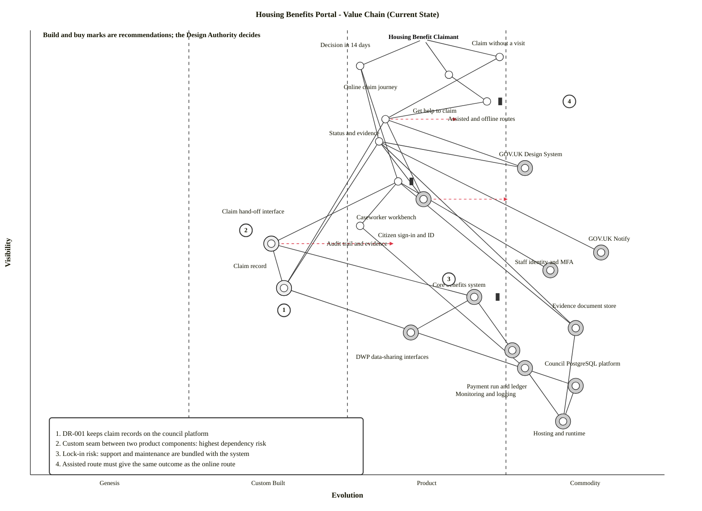
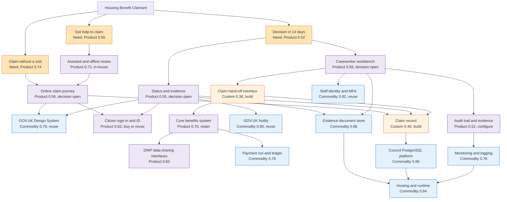

# Wardley Map: Housing Benefits Portal - Value Chain (Current State)

> **Template Origin**: Official | **ArcKit Version**: 6.16.5 | **Command**: `/arckit:wardley`

## Document Control

| Field | Value |
|-------|-------|
| **Document ID** | ARC-001-WARD-001-v1.0 |
| **Document Type** | Wardley Map |
| **Project** | Housing Benefits Portal (Project 001) |
| **Classification** | OFFICIAL |
| **Status** | DRAFT |
| **Version** | 1.0 |
| **Created Date** | 2026-09-29 |
| **Last Modified** | 2026-09-29 |
| **Review Cycle** | Monthly |
| **Next Review Date** | 2026-10-29 |
| **Owner** | Head of Digital (Chair, Design Authority) |
| **Reviewed By** | PENDING |
| **Approved By** | PENDING |
| **Distribution** | Project team; Design Authority; Architecture Review Board |

## Revision History

| Version | Date | Author | Changes | Approved By | Approval Date |
|---------|------|--------|---------|-------------|---------------|
| 1.0 | 2026-09-29 | ArcKit AI | Initial creation from `/arckit:wardley` command | PENDING | PENDING |

---

## Map Visualization

**Strategic question**: Where, between the claimant's need and the platform beneath it, should the council build, buy or reuse, so that the Design Authority can decide the sourcing approach by 30 November 2026 (ARC-001-STKE-v1.0, G-6)?

**Mapping mode**: Mode A (current-state landscape) with a procurement-strategy overlay (Mode E). "Current state" means the landscape at requirements stage: existing council and government components, the incumbent benefits system, and the components the requirements call for. No design has been chosen. A future-state map and a gap analysis should follow the Design Authority decision.

**Anchor**: the Housing Benefit claimant. The three needs beneath the anchor come from BR-001 and FR-001 (claim without a visit), BR-002 (decision in 14 days) and the inclusion principle (PRIN 1; SD-11).

**Handling**: OFFICIAL. This map draws on a stakeholder analysis marked OFFICIAL-SENSITIVE but reproduces only programme facts. See Assumptions and Limitations (A4).

**View this map**: open `ARC-001-WARD-001-v1.0.html` in this folder. It is self-contained, opens offline and makes no external requests. Click a component to trace its dependencies. You can also paste the OWM code below into [https://create.wardleymaps.ai](https://create.wardleymaps.ai); note that this sends the map to a third-party site, which may not suit sensitive work.

```wardley
title Housing Benefits Portal - Value Chain (Current State)
anchor Housing Benefit Claimant [0.98, 0.62]

component Claim without a visit [0.94, 0.74]
component Decision in 14 days [0.92, 0.52]
component Get help to claim [0.90, 0.66]
component Online claim journey [0.80, 0.56]
component Status and evidence [0.75, 0.55]
component Assisted and offline routes [0.84, 0.72] inertia
component Caseworker workbench [0.66, 0.58] inertia
component Citizen sign-in and ID [0.62, 0.62]
component GOV.UK Design System [0.69, 0.78]
component GOV.UK Notify [0.50, 0.90]
component Audit trail and evidence [0.56, 0.52]
component Claim hand-off interface [0.52, 0.38]
component Claim record [0.42, 0.40]
component Core benefits system [0.40, 0.70] inertia
component Staff identity and MFA [0.46, 0.82]
component DWP data-sharing interfaces [0.32, 0.60]
component Payment run and ledger [0.28, 0.76]
component Monitoring and logging [0.24, 0.78]
component Evidence document store [0.33, 0.86]
component Council PostgreSQL platform [0.20, 0.86]
component Hosting and runtime [0.12, 0.84]

Housing Benefit Claimant -> Claim without a visit
Housing Benefit Claimant -> Decision in 14 days
Housing Benefit Claimant -> Get help to claim
Claim without a visit -> Online claim journey
Decision in 14 days -> Status and evidence
Decision in 14 days -> Caseworker workbench
Get help to claim -> Assisted and offline routes
Assisted and offline routes -> Online claim journey
Online claim journey -> GOV.UK Design System
Online claim journey -> Citizen sign-in and ID
Online claim journey -> Claim record
Status and evidence -> GOV.UK Design System
Status and evidence -> Citizen sign-in and ID
Status and evidence -> GOV.UK Notify
Status and evidence -> Claim record
Status and evidence -> Evidence document store
Caseworker workbench -> Claim hand-off interface
Caseworker workbench -> Audit trail and evidence
Caseworker workbench -> Staff identity and MFA
Caseworker workbench -> Evidence document store
Claim hand-off interface -> Claim record
Claim hand-off interface -> Core benefits system
Claim record -> Council PostgreSQL platform
Core benefits system -> DWP data-sharing interfaces
Core benefits system -> Payment run and ledger
Audit trail and evidence -> Monitoring and logging
Evidence document store -> Hosting and runtime
Council PostgreSQL platform -> Hosting and runtime
Monitoring and logging -> Hosting and runtime

build Claim record
build Claim hand-off interface
buy Core benefits system
buy Citizen sign-in and ID
buy GOV.UK Design System
buy GOV.UK Notify
buy DWP data-sharing interfaces
buy Payment run and ledger
buy Staff identity and MFA
buy Monitoring and logging
buy Evidence document store
buy Council PostgreSQL platform
buy Hosting and runtime

evolve Citizen sign-in and ID 0.76
evolve Online claim journey 0.68
evolve Claim hand-off interface 0.58

annotation 1 [0.37, 0.40] DR-001 keeps claim records on the council platform
annotation 2 [0.55, 0.34] Custom seam between two product components: highest dependency risk
annotation 3 [0.44, 0.66] Lock-in risk: support and maintenance are bundled with the system
annotation 4 [0.84, 0.85] Assisted route must give the same outcome as the online route
annotations [0.06, 0.03]

note Build and buy marks are recommendations; the Design Authority decides [0.985, 0.02]

style wardley
```

<details>
<summary>Mermaid Wardley Map (renders in GitHub, VS Code, and other Mermaid-enabled viewers)</summary>

> **Note**: Mermaid Wardley Maps use the `wardley-beta` keyword, supported from Mermaid 11.14.0 onward. ArcKit generated pages use Mermaid 11.15.0.



**Decorator Guide**:

- `(build)` - Custom components the council should own (triangle marker)
- `(buy)` - Product or Commodity components procured from the market or reused; GOV.UK services and council platform services are marked `(buy)` because there is no separate reuse marker (diamond marker)
- `(inertia)` - Components with resistance to change (vertical line)
- No decorator - the component is an outcome (the three needs), is delivered in-house (Assisted and offline routes), or has a sourcing decision that is still open (Online claim journey, Status and evidence, Caseworker workbench, Audit trail and evidence)

</details>

The OWM block is canonical. The Mermaid block was generated from it by `owm-to-mermaid.mjs` and the HTML by `owm-to-html.mjs`. To change the map, edit the OWM and re-run both converters rather than editing either rendering.

### Reading the Map

- **Top**: the claimant (anchor) and three needs at visibility 0.90 to 0.94: claim without a visit, decision in 14 days, and help to claim.
- **Middle**: capabilities and products at Product stage (0.52 to 0.72), most of them shared with, or bought alongside, the incumbent benefits system.
- **Green rings (build)**: the only two Custom components are the claim record (0.40) and the claim hand-off interface (0.38). Nothing sits in Genesis.
- **Bottom right**: commodity platform and utility components, all recommended for reuse.
- **Dashed arrows**: expected movement over 24 months for Citizen sign-in and ID (0.62 to 0.76), Online claim journey (0.56 to 0.68) and Claim hand-off interface (0.38 to 0.58).
- **Vertical bars**: inertia on the core benefits system, the caseworker workbench and the assisted routes.

| No. | Placed near | Annotation |
|-----|-------------|------------|
| 1 | Claim record | DR-001 keeps claim records on the council platform |
| 2 | Claim hand-off interface | Custom seam between two product components: highest dependency risk |
| 3 | Core benefits system | Lock-in risk: support and maintenance are bundled with the system |
| 4 | Assisted and offline routes | Assisted route must give the same outcome as the online route |

---

## Strategic Summary

1. **Almost everything the portal needs already exists as a product or a utility.** 19 of 21 components sit in Product or Commodity. Two are Custom (the claim record and the claim hand-off interface) and none is Genesis. The delivery risk is integration and change, not novel technology.
2. **The risk concentrates at the custom seam.** Three of the five dependency edges scoring above 0.40 end at the claim record or the claim hand-off interface. Specify and version that seam first: it is what keeps both the front end and the core system replaceable.
3. **DR-001 narrows the sourcing options.** Claim records must be held in the council's PostgreSQL platform service. A supplier-hosted e-claims module may not satisfy that; it would need to persist claim records to the council platform, or DR-001 would need to change through the exception process. The online-forms market is Product stage: a peer council buys online forms as a separate G-Cloud product that updates its core system [TNDR-Q1-C5]. The options appraisal should test the DR-001 question early.
4. **Reuse the commodity layers; do not build them.** Nine components score above 0.40 on commodity leverage (GOV.UK Notify, staff identity, core benefits system, DWP interfaces, evidence store, payment run, monitoring, PostgreSQL platform, hosting). The only differentiation pressure above 0.40 is on the outcome "Decision in 14 days" (D = 0.44), not on any technology component. Spend design effort on the outcome and on the seam.
5. **The core benefits system is a bought product with lock-in.** Councils buy these from a few suppliers, often by direct award or framework call-off, with support and maintenance bundled [TNDR-Q1-C1] [TNDR-Q1-C2] [TNDR-Q1-C3] [TNDR-Q1-C4]. Keep it, secure exit and data-portability terms (PRIN 7), and reach it through an interface the council owns.
6. **Time favours composition over new build.** About three months separate the Design Authority decision (30 November 2026, G-6) from private beta (28 February 2027, G-1).

### How the Map Frames the Design Authority Options

The Stakeholder Analysis (G-6) names three options: build on the platform, buy an e-claims module, or a hybrid. The appraisal has not been done. The table shows where each option lands on this map and is a hypothesis for the appraisal to test, not a recommendation.

| Option | What it means on this map | Fit with DR-001 | Main risk | Steer from the map |
|--------|---------------------------|-----------------|-----------|--------------------|
| A. Build on platform | Compose the claim journey and status pages from GOV.UK Design System parts, hold the claim record on the council PostgreSQL platform, and build the claim hand-off interface to the incumbent system | Fits | Effort to reach private beta in about three months; the council owns the seam | Strong fit with PRIN 5, 7 and 13 if the scope stays thin |
| B. Buy an e-claims module | The supplier module supplies the journey and status pages and, if supplier-hosted, may hold the claim data | May conflict: the claim record would sit outside the council platform unless the module can persist there, or DR-001 is changed | Deepens dependence on the incumbent (SD-4) and weakens exit | Only if it passes the DR-001 and exit tests |
| C. Hybrid | Buy or configure a forms product for the journey, but keep the claim record and hand-off interface on the council platform | Fits if the product writes to the council platform | Two suppliers plus a council-owned seam | Viable; depends on the product's data-residency and interface options |

---

## Evolution Stages Reference

| Stage | Maturity | Characteristics | Strategic Actions |
|-------|----------|-----------------|-------------------|
| **Genesis** (0.00 - 0.25) | Novel, uncertain, rapidly changing | - Unique and rare<br>- Poorly understood<br>- Rapid change<br>- High uncertainty<br>- Future value uncertain | - R&D focus<br>- Accept failure<br>- Explore and experiment<br>- Build in-house if strategic |
| **Custom** (0.25 - 0.50) | Emerging, growing understanding | - Bespoke solutions<br>- Artisanal development<br>- Competitive advantage<br>- Requires significant skill<br>- Still evolving rapidly | - Invest in differentiation<br>- Build custom if competitive advantage<br>- Patent/protect IP<br>- Hire specialists |
| **Product** (0.50 - 0.75) | Maturing, good/rental services | - Products with feature differentiation<br>- Rental models<br>- Slower evolution<br>- Defined practices<br>- Training available | - Buy products<br>- Compare features<br>- Use market leaders<br>- Standardize where possible |
| **Commodity** (0.75 - 1.00) | Industrialized, utility | - Standardized<br>- Volume operations<br>- Cost of deviation high<br>- Utility services<br>- Highly evolved | - Use commodity/utility<br>- Cloud services<br>- Outsource/procure<br>- Focus on cost efficiency |

---

## Component Inventory

> **Reference key**: BR, FR and DR numbers are requirement IDs in ARC-001-REQ-v1.0. PRIN n is principle n in ARC-000-PRIN-v1.0. SD, G, O and R numbers are driver, goal, outcome and risk IDs in ARC-001-STKE-v1.0.
>
> **Source column**: each component cites the artefact it came from, or `Assumption` where it is analytical judgement with no source document. No value chain (WVCH) exists for this project, so visibility values are the analyst's placements by depth from the claimant (see A1). Evolution positions are analyst judgement, anchored in market evidence where cited (see A2). Component names match the OWM block exactly.

### User Needs (Top of Map - High Visibility)

| Component | Visibility | Evolution | Stage | Description | Strategic Notes | Source |
|-----------|-----------|-----------|-------|-------------|-----------------|--------|
| Claim without a visit | 0.94 | 0.74 | Product | The claimant submits a housing-benefit claim online without visiting an office (BR-001) and can pause and resume it (FR-001). | Placed by how widely the need is met: digital-by-default claiming is now an ordinary expectation. An outcome, not a procurement item. | ARC-001-REQ-v1.0 |
| Decision in 14 days | 0.92 | 0.52 | Product | A decision is issued within 14 calendar days of a complete submission (BR-002). | Not yet standard practice: the Stakeholder Analysis puts the national average at around three weeks (not verified here) and sets a goal of 90% within 14 days (G-2). Highest differentiation pressure on the map (D = 0.44), so invest through the capabilities beneath it. | ARC-001-REQ-v1.0; ARC-001-STKE-v1.0 |
| Get help to claim | 0.90 | 0.66 | Product | People who cannot or will not use the online service reach the same outcome by an assisted or non-digital route (PRIN 1; SD-11). | Established practice (telephone, paper, assisted digital, advice agencies). An outcome, not a procurement item. | ARC-000-PRIN-v1.0; ARC-001-STKE-v1.0 |

### Supporting Capabilities (Mid-Level Visibility)

| Component | Visibility | Evolution | Stage | Description | Strategic Notes | Source |
|-----------|-----------|-----------|-------|-------------|-----------------|--------|
| Assisted and offline routes | 0.84 | 0.72 | Product | Telephone, paper and advice-agency routes, plus staff-assisted online entry, all landing in the same claim record under the same rules (PRIN 1). | Established contact-centre practice, so Product. Inertia comes from habit and from a pension-age caseload with lower digital take-up (SD-11). To be retained through 2027-28 (G-7). Run in-house by Customer Services: not a build or buy item. | ARC-000-PRIN-v1.0; ARC-001-STKE-v1.0 |
| Online claim journey | 0.80 | 0.56 | Product | Guided, mobile-first claim form with validation and save-and-resume (BR-001, FR-001). | Early Product: online forms are bought as products and integrated with revenues and benefits systems (a G-Cloud call-off for online forms that update the NEC system [TNDR-Q1-C5]; supplier e-claim modules, SD-4), so building a form engine would fight evolution. Council-specific research, content and accessibility work still needs shaping. Sourcing is the Design Authority decision (G-6) and DR-001 constrains where claim data may sit. | ARC-001-REQ-v1.0; ARC-001-STKE-v1.0 |
| Status and evidence | 0.75 | 0.55 | Product | The claimant sees claim status and progress updates and uploads requested evidence from a phone (SD-10, SD-14); caseworkers raise evidence requests against a claim (FR-002). | Judged early Product: status tracking and upload are common features of forms and case-portal products (analyst judgement, not researched). Evidence handling drives the 14-day outcome and the subsidy audit trail (SD-2). Account creation must not be mandatory to reply to a request (SD-10). | ARC-001-REQ-v1.0; ARC-001-STKE-v1.0 |
| GOV.UK Design System | 0.69 | 0.78 | Commodity | Shared, accessibility-tested components and patterns for the claim journey and status pages (PRIN 1). | Open and widely reused across government, so Commodity: reuse rather than restyle. Supports the WCAG 2.2 AA goal (G-7). Availability to a district council is assumed from general knowledge and was not re-verified this session (A5). | ARC-000-PRIN-v1.0; ARC-001-STKE-v1.0 |
| Caseworker workbench | 0.66 | 0.58 | Product | Staff-facing work queues, claim-age management information and evidence-request handling (FR-002; SD-6). | Case handling and document workflow are sold as modules of revenues and benefits suites, one notice bundling the system with a document management system and a housing system [TNDR-Q1-C3], so Product. Inertia: staff skills and process built around the current tool. | ARC-001-REQ-v1.0; ARC-001-STKE-v1.0 |
| Citizen sign-in and ID | 0.62 | 0.62 | Product | Sign-in for save-and-resume and status, with identity assurance proportionate to the risk (PRIN 2) and no mandatory steps that exclude people (SD-10). | Government-recommended identity approaches exist and are maturing. GOV.UK One Login is the obvious candidate, but its availability to a district council was not verified this session (A5). Expected to move towards Commodity. | ARC-000-PRIN-v1.0; ARC-001-STKE-v1.0 |

### Supporting and Infrastructure Components (Visibility below 0.60)

| Component | Visibility | Evolution | Stage | Description | Strategic Notes | Source |
|-----------|-----------|-----------|-------|-------------|-----------------|--------|
| Audit trail and evidence | 0.56 | 0.52 | Product | A tamper-evident record of who did what, when, on what evidence and under which rule version (PRIN 8; SD-2, SD-13). | The practice is well understood and platform features exist, but the scope is domain-specific: configure, do not build a bespoke product. Keep audit records under separate control from the systems audited (a named violation in PRIN 8). | ARC-000-PRIN-v1.0; ARC-001-STKE-v1.0 |
| Claim hand-off interface | 0.52 | 0.38 | Custom | A versioned interface that passes a submitted claim and its evidence from the claim record to the core benefits system and returns status (PRIN 5, 14, 15). | The seam between two Product-stage components is Custom. Inferred, not named in any source: it follows from DR-001 (claim records on the council platform) plus the existence of an incumbent benefits system. Own it, version it and test it as a contract. | Assumption |
| GOV.UK Notify | 0.50 | 0.90 | Commodity | Email and text notifications for status updates and evidence requests (SD-14). | A shared government utility: do not build or buy an alternative (PRIN 7). Availability to a district council is assumed from general knowledge and was not re-verified this session (A5). | ARC-000-PRIN-v1.0; ARC-001-STKE-v1.0 |
| Staff identity and MFA | 0.46 | 0.82 | Commodity | Multi-factor sign-in and least-privilege roles for caseworkers and administrators (PRIN 2). | Mature identity services: use the council's existing workforce identity provider, not a portal-specific one. | ARC-000-PRIN-v1.0 |
| Claim record | 0.42 | 0.40 | Custom | The system of record for the claim as captured online, held on the council PostgreSQL platform with point-in-time recovery (DR-001). | The claim data model is council-specific and is the asset the council must own (PRIN 7, 13). No shared standard schema was identified (not researched). It is the lowest-maturity dependency of the claimant-facing components. | ARC-001-REQ-v1.0; ARC-000-PRIN-v1.0 |
| Core benefits system | 0.40 | 0.70 | Product | The incumbent revenues and benefits system: assessment rules, award, payment and the current caseworker record; the system of record for award and payment. | Councils buy these as products from a few suppliers, often by direct award or call-off (G-Cloud 14 [TNDR-Q1-C2]; RM6259 [TNDR-Q1-C1]), with support and maintenance bundled [TNDR-Q1-C3] [TNDR-Q1-C4]. NEC and Civica recur as awardees in the notices reviewed. The Stakeholder Analysis records a concentrated market and lock-in risk from add-on e-claim modules (SD-4). The incumbent is not named in the source documents (A6). | ARC-001-STKE-v1.0 |
| Evidence document store | 0.33 | 0.86 | Commodity | Storage for uploaded evidence, retained six years after the claim closes and deleted automatically (DR-002; PRIN 11). | Storage with lifecycle rules is a utility. The retention schedule is the council's configuration to own. Data residency rules apply (PRIN 11). | ARC-001-REQ-v1.0; ARC-000-PRIN-v1.0 |
| DWP data-sharing interfaces | 0.32 | 0.60 | Product | Secure exchange of claimant data with DWP under its data-sharing and security conditions (SD-13). | Set by DWP and usually reached through the core system. Any change to these data flows must meet DWP security conditions (regulatory inertia). Specific services are not named in the source documents. | ARC-001-STKE-v1.0 |
| Payment run and ledger | 0.28 | 0.76 | Commodity | Payment of awards to claimants and landlords, reconciled to the finance ledger (PRIN 8). | Standard finance and payment services. ARC-001-REQ-v1.0 has no payment requirement, but the claimant's outcome depends on it, so it is mapped as a boundary dependency. | ARC-000-PRIN-v1.0; ARC-001-STKE-v1.0 |
| Monitoring and logging | 0.24 | 0.78 | Commodity | Structured logs, metrics, traces and alerts (PRIN 6) and security-event logging (PRIN 2). | Reuse the council's observability tooling. Keep audit records apart from application logs. | ARC-000-PRIN-v1.0 |
| Council PostgreSQL platform | 0.20 | 0.86 | Commodity | The council's PostgreSQL platform service with point-in-time recovery (DR-001). | Managed PostgreSQL is a commodity in the market and the council already runs it as a platform service (SD-15). Reuse it: no portal-specific database. | ARC-001-REQ-v1.0; ARC-001-STKE-v1.0 |
| Hosting and runtime | 0.12 | 0.84 | Commodity | Compute, network and the deployment pipeline for the portal (PRIN 19, 21). | The hosting model (council platform or UK cloud) is not stated in any source. Data residency rules (PRIN 11) and infrastructure as code (PRIN 19) constrain it. | Assumption |

---

## Strategic Metrics

Formulas from the Wardley mathematical model: differentiation pressure D(v) = visibility x (1 - evolution); commodity leverage K(v) = (1 - visibility) x evolution; dependency risk R(a,b) = visibility(a) x (1 - evolution(b)). Values above 0.40 are flagged. In a public service, "differentiation" means where the council must shape the service around its own users, rules and policy, not competitive advantage.

### Differentiation and Commodity Leverage

| Component | Visibility | Evolution | D(v) | K(v) | Reading |
|-----------|-----------|-----------|------|------|---------|
| Claim without a visit | 0.94 | 0.74 | 0.24 | 0.04 | Outcome; low pressure |
| Decision in 14 days | 0.92 | 0.52 | 0.44 | 0.04 | Outcome; the only value above 0.40: invest through the capabilities beneath it |
| Get help to claim | 0.90 | 0.66 | 0.31 | 0.07 | Outcome; moderate: keep the route resourced |
| Assisted and offline routes | 0.84 | 0.72 | 0.24 | 0.12 | Run in-house; low pressure either way |
| Online claim journey | 0.80 | 0.56 | 0.35 | 0.11 | Moderate: compose from reusable parts and invest in research-led design |
| Status and evidence | 0.75 | 0.55 | 0.34 | 0.14 | Moderate: compose from reusable parts |
| GOV.UK Design System | 0.69 | 0.78 | 0.15 | 0.24 | Reuse |
| Caseworker workbench | 0.66 | 0.58 | 0.28 | 0.20 | Configure a product |
| Citizen sign-in and ID | 0.62 | 0.62 | 0.24 | 0.24 | Buy or reuse |
| Audit trail and evidence | 0.56 | 0.52 | 0.27 | 0.23 | Configure on the platform |
| Claim hand-off interface | 0.52 | 0.38 | 0.32 | 0.18 | Build: own the seam |
| GOV.UK Notify | 0.50 | 0.90 | 0.05 | 0.45 | Reuse (K above 0.40) |
| Staff identity and MFA | 0.46 | 0.82 | 0.08 | 0.44 | Reuse (K above 0.40) |
| Claim record | 0.42 | 0.40 | 0.25 | 0.23 | Build: own the data and keep it minimal |
| Core benefits system | 0.40 | 0.70 | 0.12 | 0.42 | Buy and retain (K above 0.40) |
| Evidence document store | 0.33 | 0.86 | 0.05 | 0.58 | Rent |
| DWP data-sharing interfaces | 0.32 | 0.60 | 0.13 | 0.41 | Reuse the DWP-provided route (K above 0.40) |
| Payment run and ledger | 0.28 | 0.76 | 0.07 | 0.55 | Buy or reuse |
| Monitoring and logging | 0.24 | 0.78 | 0.05 | 0.59 | Rent |
| Council PostgreSQL platform | 0.20 | 0.86 | 0.03 | 0.69 | Reuse |
| Hosting and runtime | 0.12 | 0.84 | 0.02 | 0.74 | Rent |

**Consistency check**: no component with D above 0.40 is recommended for purchase (the one value above 0.40 is an outcome), and no component with K above 0.40 is recommended for building. The two Build items (claim record, claim hand-off interface) score below 0.40 on both measures, so the recommendation is to build small and own them, not to invest heavily.

### Dependency Risk

Component-to-component dependencies with R above 0.40 (edges from the anchor are excluded):

| Dependency | R(a,b) | Reading and mitigation |
|------------|--------|------------------------|
| Online claim journey to Claim record | 0.48 | Highest. The journey depends on the least mature data component. Define the claim data contract before building screens. |
| Status and evidence to Claim record | 0.45 | The same dependency. Share one contract across both. |
| Decision in 14 days to Status and evidence | 0.41 | The outcome depends on a mid-maturity capability. Measure completion and evidence-request rates from the first beta. |
| Caseworker workbench to Claim hand-off interface | 0.41 | The interface is unbuilt. Contract-test it (PRIN 20) and version it (PRIN 5). |
| Claim without a visit to Online claim journey | 0.41 | The outcome depends on a mid-maturity capability. Test the journey with pension-age claimants and assistive-technology users (PRIN 1). |

Next tier (0.30 to 0.39): Decision in 14 days to Caseworker workbench (0.39), Assisted and offline routes to Online claim journey (0.37), Caseworker workbench to Audit trail and evidence (0.32), Claim hand-off interface to Claim record (0.31), Online claim journey to Citizen sign-in and ID (0.30).

---

## Evolution Analysis

### Components in Genesis (0.00 - 0.25)

None. Every component is an established public-sector or market pattern, so there is no novel-technology risk in the chain. The uncertainty sits in integration, sourcing and change.

### Components in Custom (0.25 - 0.50)

**Emerging practices, competitive advantage**

| Component | Current Position | Competitive Advantage? | Action |
|-----------|------------------|------------------------|--------|
| Claim record | 0.40 (Custom) | No: a public service does not compete on this. It is strategic in another sense: owning the data model protects against lock-in (PRIN 5, 7, 13). | Build small and keep the model service-agnostic; hold it on the council PostgreSQL platform (DR-001); agree the system-of-record boundary with the core system (PRIN 13). |
| Claim hand-off interface | 0.38 (Custom) | No, for the same reason. Owning the seam keeps the front end and the core system replaceable. | Specify, version and contract-test it in the first build cycle; publish the specification where security allows (PRIN 7). |

**Strategic Recommendations**:

- [ ] Build only these two components; compose or buy everything else
- [ ] Decide early whether the seam is resourced in-house or with specialists
- [ ] Watch the hand-off interface for movement to Product (0.38 to 0.58 over 24 months) as suppliers expose documented interfaces
- [ ] Treat both as first-cycle work: three of the five highest dependency risks end here

### Components in Product (0.50 - 0.75)

**Maturing market, feature differentiation** (the three needs are outcomes and are excluded)

| Component | Current Position | Market Options | Action |
|-----------|------------------|----------------|--------|
| Assisted and offline routes | 0.72 | In-house Customer Services and advice-agency partners; no product needed | Retain; make staff-assisted entry use the same journey and claim record (PRIN 1). |
| Online claim journey | 0.56 | Compose on GOV.UK Design System; third-party forms products integrated with the core system [TNDR-Q1-C5]; supplier e-claim modules (SD-4). No reusable open-source benefit-claim service surfaced [GRSC-Q1-C1] [GRSC-Q2-C1]. | Decide at the Design Authority; test each option against DR-001 and exit terms. |
| Status and evidence | 0.55 | The same product families as the journey | Decide with the journey so both share one claim record. |
| Caseworker workbench | 0.58 | Modules of the core benefits system (case handling, document management) [TNDR-Q1-C3] | Configure. Build only the FR-002 evidence-request view if the product cannot provide it. |
| Citizen sign-in and ID | 0.62 | A government identity service (GOV.UK One Login; eligibility unverified); a council-run passwordless sign-in as the fallback | Confirm eligibility, then choose an approach proportionate to the risk (PRIN 2). |
| Audit trail and evidence | 0.52 | Platform logging with append-only storage; audit features of the core system | Configure with separate control from the audited systems (PRIN 8). |
| Core benefits system | 0.70 | NEC Software Solutions and Civica recur as awardees in the notices reviewed [TNDR-Q1-C1] [TNDR-Q1-C2] [TNDR-Q1-C3] [TNDR-Q1-C4]; other suppliers exist (not researched) | Retain; secure exit and data-portability terms (PRIN 7). |
| DWP data-sharing interfaces | 0.60 | DWP-provided routes, usually via the core system | Keep flows in the existing channel and meet DWP conditions (SD-13). |

**Strategic Recommendations**:

- [ ] Procure from the market only where DR-001 and exit tests are met
- [ ] Compare options on whole-life cost, including exit (PRIN 7)
- [ ] Standardise on GOV.UK patterns for the front end
- [ ] Avoid custom development beyond the seam unless the appraisal shows a gap

### Components in Commodity (0.75 - 1.00)

**Industrialized, utility services**

| Component | Current Position | Commodity Provider | Action |
|-----------|------------------|-------------------|--------|
| GOV.UK Design System | 0.78 | Government Digital Service (open source) | Reuse. |
| GOV.UK Notify | 0.90 | Government Digital Service | Onboard; confirm eligibility for a district council. |
| Staff identity and MFA | 0.82 | The council's existing workforce identity provider (not named in the sources) | Reuse; enforce MFA for all staff and administrative access (PRIN 2). |
| Payment run and ledger | 0.76 | The council finance system and bank payment service (not named in the sources) | Reuse; automate reconciliation between decision, payment and ledger (PRIN 8). |
| Monitoring and logging | 0.78 | The council's observability tooling (not named in the sources) | Reuse; keep audit logs apart from application logs. |
| Evidence document store | 0.86 | Council platform storage or UK cloud object storage (decision open) | Configure six-year retention and automated deletion (DR-002). |
| Council PostgreSQL platform | 0.86 | Council IT Operations / Platform team | Reuse; prove point-in-time recovery before public beta (G-6). |
| Hosting and runtime | 0.84 | Council platform or UK cloud (decision open) | Decide with the options appraisal; infrastructure as code (PRIN 19). |

**Strategic Recommendations**:

- [ ] Use commodity and utility services; do not build alternatives
- [ ] Focus on cost and reliability, not features
- [ ] Reuse GOV.UK services first (PRIN 7)
- [ ] Confirm which procurement route applies to any cloud service with Procurement

---

## Build vs Buy Analysis

### Build (In-House Development)

**Candidates for Building**:

| Component | Evolution Stage | Rationale | Risk | Investment |
|-----------|----------------|-----------|------|------------|
| Claim record | Custom (0.40) | The council must own the data model and the system of record (PRIN 7, 13); DR-001 fixes where it lives | Medium: lowest-maturity dependency of the claimant-facing components (R 0.45 to 0.48) | Not estimated here; keep the model minimal and size it in the options appraisal |
| Claim hand-off interface | Custom (0.38) | Owning the seam keeps the front end and the core system replaceable (PRIN 5, 14) | Medium: it is unbuilt and carries one of the five highest dependency risks (R 0.41) | Not estimated here; size it in the options appraisal |

**Build Criteria** (assessment against the template criteria):

- ✅ Custom stage (below 0.50 evolution)
- ❌ Competitive advantage: none, because the service does not compete
- ✅ Strategic ownership matters: data, interface and exit control (PRIN 5, 7, 13)
- ⚠️ No suitable market alternative: not established; the reuse assessment is incomplete (A9)
- ⚠️ Skills available or acquirable: not yet assessed

### Buy (Procurement)

**Candidates for Buying**:

| Component | Evolution Stage | Market Options | Rationale | Procurement Route |
|-----------|----------------|----------------|-----------|-------------------|
| Core benefits system | Product (0.70) | NEC Software Solutions and Civica recur in the notices reviewed | Retain the incumbent as the system of record for award and payment; not a differentiator | Existing contract. Any change or add-on: the routes peers use are G-Cloud 14 direct awards [TNDR-Q1-C2] and RM6259 call-offs [TNDR-Q1-C1]; confirm the live frameworks with Procurement. |
| Citizen sign-in and ID | Product (0.62) | A government identity service (unverified) or other identity providers | Proportionate assurance without building an account system (PRIN 2, 7) | Government service if eligible; otherwise G-Cloud |
| DWP data-sharing interfaces | Product (0.60) | DWP-provided routes | Set by DWP, not chosen by the council | DWP onboarding and data-sharing conditions; no framework call-off |

**Open sourcing decisions** (not yet decided; the Design Authority decides): Online claim journey, Status and evidence and Caseworker workbench. If the appraisal favours buying a forms or e-claims product, the route peers use is a G-Cloud call-off [TNDR-Q1-C5], subject to DR-001 and exit terms.

**Buy Criteria**:

- ✅ Product stage (above 0.50 evolution)
- ✅ Mature market with several suppliers (evidence: repeated awards in the notices reviewed)
- ✅ Not a competitive differentiator
- ⚠️ Cost of building is greater than the cost of buying: not costed here
- ✅ Time to market is critical (about three months to private beta)

### Rent/SaaS (Utility Services)

**Candidates for SaaS/Cloud**:

| Component | Evolution Stage | Provider | Rationale | Procurement Route |
|-----------|----------------|----------|-----------|-------------------|
| GOV.UK Notify | Commodity (0.90) | Government Digital Service | Shared utility; avoids a bespoke notification service (PRIN 7) | Direct onboarding |
| GOV.UK Design System | Commodity (0.78) | Government Digital Service | Open, accessibility-tested patterns (PRIN 1) | No procurement; open source |
| Evidence document store | Commodity (0.86) | Council platform or UK cloud | Utility storage with lifecycle rules | Existing platform or G-Cloud |
| Council PostgreSQL platform | Commodity (0.86) | Council IT Operations / Platform team | Required by DR-001 | Existing platform service |
| Hosting and runtime | Commodity (0.84) | Council platform or UK cloud | Operational burden not worth carrying | Decide with the options appraisal |
| Staff identity and MFA, Monitoring and logging, Payment run and ledger | Commodity (0.76 to 0.82) | Existing council services | Reuse before buying (PRIN 7) | Existing services |

**Rent Criteria**:

- ✅ Commodity stage (above 0.75 evolution)
- ✅ Utility services available
- ✅ Low switching cost, provided the claim data stays on the council platform
- ✅ Standardised functionality is sufficient

---

## Inertia and Barriers to Change

**Inertia** = resistance to evolution due to existing practices, skills or investments.

| Component | Current Evolution | Desired Evolution | Inertia Factor | Barrier Description | Mitigation Strategy |
|-----------|-------------------|-------------------|----------------|---------------------|---------------------|
| Core benefits system | 0.70 | 0.70, with exit terms and an owned interface | High (supplier, capital, skills) | Support, maintenance and often hosting are bundled with the system [TNDR-Q1-C1] [TNDR-Q1-C3]. An add-on e-claims module is a quick path that can deepen lock-in (SD-4). DWP data flows are routed through it. | Exit and data-portability terms (PRIN 7); claim capture and status on the council platform; a versioned interface the council owns (PRIN 5). |
| Assisted and offline routes | 0.72 | 0.72, better integrated | Medium (consumer, process) | Pension-age claimants have lower digital take-up (SD-11). There may be pressure to withdraw non-digital routes once online take-up rises. | Keep the routes through 2027-28 (G-7); complete an Equality Impact Assessment before public beta; use the same claim record and rules (PRIN 1). |
| Caseworker workbench | 0.58 | 0.68 | Medium (skills, process) | Staff skills and process are built around the current tool. | Role-based training before each office goes live and caseworker involvement in design (G-4). |
| DWP data-sharing interfaces | 0.60 | 0.60 | Medium (regulatory) | Changes to DWP data flows must meet DWP security conditions (SD-13). | Keep flows in the existing channel; show the flows in the DPIA; involve the security lead early. |
| Claim record and Evidence document store | 0.40 and 0.86 | Unchanged | Medium (regulatory, process) | Retention schedule approval and DPIA sign-off are gates before go-live (G-5, DR-002). | Start the DPIA in discovery; target the January 2027 Information Governance Group (G-5). |
| Citizen sign-in and ID | 0.62 | 0.76 | Low (consumer) | Identity steps that exclude people (SD-10). | Proportionate assurance; no mandatory account to start or resume a claim. |

**Inertia types present**: supplier (core system), skills (caseworkers), process and consumer (assisted routes), regulatory (DWP, data protection). Change-readiness detail sits in ARC-001-STKE-v1.0 (OFFICIAL-SENSITIVE) and is deliberately not reproduced here.

**De-risking Strategies**:

- [ ] Phased go-live, office by office (G-4)
- [ ] Pilot the journey with invited users at private beta (G-1)
- [ ] Negotiate exit terms before any commitment to an add-on (PRIN 7)
- [ ] Publish the interface specification so a second supplier could be added (PRIN 5)

---

## Movement and Evolution Predictions

**Evolution Velocity** = how fast components are expected to move along the evolution axis. Positions are directional ranges, not forecasts (a climatic pattern: evolution cannot be timed precisely).

### Next 12 Months

| Component | Current | Predicted (12m) | Velocity | Impact | Action Required |
|-----------|---------|----------------|----------|--------|-----------------|
| Claim hand-off interface | 0.38 | 0.48 | Medium | Moves from bespoke to a documented, versioned interface once specified and contract-tested. Council-driven, not market-driven. | Specify and version it in the first build cycle |
| Citizen sign-in and ID | 0.62 | 0.70 | Slow | A government-recommended identity approach becomes easier for a district council to adopt (unverified) | Choose an approach at the Design Authority decision and keep it behind an interface |
| Online claim journey | 0.56 | 0.62 | Slow | Forms and e-claim products converge on common patterns | Keep claim data and the interface council-owned so the front end can be swapped |
| Status and evidence | 0.55 | 0.60 | Slow | Status, notification and upload become standard features of forms and case-portal products | Compose from GOV.UK patterns; avoid bespoke features |
| Core benefits system | 0.70 | 0.71 | Slow | Stable product market. Supplier investment in housing-benefit modules may soften as the working-age caseload falls (R-9) | Watch the supplier roadmap; agree exit terms |
| DWP data-sharing interfaces | 0.60 | 0.60 | Slow | Set by DWP; no change expected in the window | Track DWP conditions |
| GOV.UK Notify | 0.90 | 0.90 | Slow | Stable utility | Onboarding only |

### Next 24 Months

| Component | Current | Predicted (24m) | Velocity | Impact | Action Required |
|-----------|---------|----------------|----------|--------|-----------------|
| Claim hand-off interface | 0.38 | 0.58 | Medium | A documented interface supports supplier choice and lowers the cost of change | Publish the specification; run contract tests in the pipeline |
| Citizen sign-in and ID | 0.62 | 0.76 | Slow | Moves into Commodity if a government identity service is open to the council | Reassess at public beta |
| Online claim journey | 0.56 | 0.68 | Slow | The council's journey becomes a reusable claims pattern (O-5) | Generalise the pattern for Council Tax Reduction |
| Status and evidence | 0.55 | 0.66 | Slow | Reusable status and upload patterns mature | Reassess with the journey |
| Audit trail and evidence | 0.52 | 0.62 | Slow | Platform-provided tamper-evident logging becomes routine | Prefer platform features over bespoke ones |
| Core benefits system | 0.70 | 0.72 | Slow | Little change in the product itself | Review contract exit and renewal points |

Arrows are drawn on the map only for the three movements that change a decision: Citizen sign-in and ID, Online claim journey and Claim hand-off interface.

**Strategic Implications**:

- [ ] Custom to Product: the claim hand-off interface. Be ready to adopt a supplier or standard interface if one appears, and keep the contract tests so a swap is safe
- [ ] Product to Commodity: citizen sign-in. Do not build an account system that a shared service could replace
- [ ] High velocity: none. Nothing moves 0.20 or more in 12 months, so dynamics come from the council's own choices and from supplier lock-in, not from market shifts
- [ ] Components with inertia (core benefits system, caseworker workbench, assisted routes): plan change management early

---

## UK Government Context

TCoP and the GDS Service Standard are central-government guidance. The Stakeholder Analysis notes that GovS 005 and CDDO spend controls do not apply to a district council, and that the council may choose to align with the Service Standard and the Local Digital Declaration. They are used here as good practice.

### GOV.UK Services and Platforms

**Mapped GOV.UK Components**:

| GOV.UK Service | Evolution Stage | Current Usage | Rationale for Evolution Position |
|----------------|----------------|---------------|----------------------------------|
| GOV.UK Notify | Commodity (0.90) | Recommended; no design exists yet | Shared utility for email and text; district-council eligibility to be confirmed at onboarding (A5) |
| GOV.UK Design System | Commodity (0.78) | Recommended | Open, accessibility-tested patterns that match PRIN 1 |
| GOV.UK One Login | Product (0.62), moving to 0.76 | Candidate; eligibility not verified | The government-recommended approach to citizen identity (PRIN 2); use only if a district council can adopt it (A5) |
| GOV.UK Pay | Not applicable | Not used | The portal takes no payments: awards are paid out through the finance ledger |
| Council PostgreSQL platform | Commodity (0.86) | Required by DR-001 | Council-run shared service, not a GOV.UK service; listed because it is the platform reuse the requirements already commit to |

**Reuse Opportunities**:

- [ ] GOV.UK Notify for notifications (avoid a bespoke service)
- [ ] GOV.UK Design System for the front end (accessibility compliance)
- [ ] Council PostgreSQL platform for claim records (DR-001)
- [ ] Other councils' and government code: none surfaced in two semantic searches [GRSC-Q1-C1] [GRSC-Q2-C1]; run `/arckit:gov-reuse` before any build
- [ ] The claims pattern for Council Tax Reduction and other claims (O-5)

### Digital Marketplace Procurement Strategy

**Components to Procure via Digital Marketplace or Framework**:

| Component | Evolution Stage | Framework | Rationale |
|-----------|----------------|-----------|-----------|
| Core benefits system (any change or add-on) | Product | G-Cloud 14 direct award [TNDR-Q1-C2] or CCS Vertical Application Solutions (RM6259) call-off [TNDR-Q1-C1] | The routes peers used in 2026. Confirm which frameworks are live with Procurement. |
| Forms or e-claims product (only if the appraisal favours buying) | Product | G-Cloud [TNDR-Q1-C5] | A product market exists; it must meet DR-001 and exit terms |
| Claim record, claim hand-off interface, journey composition (if built) | Custom | In-house team, topped up through Digital Outcomes and Specialists or its current successor route | Confirm the route with Procurement; Procurement Act 2023 rules apply |
| Commodity platform components | Commodity | Council platform services and GOV.UK services; G-Cloud for any new cloud service | Reuse before buying (PRIN 7) |

**Procurement Recommendations**:

- **Custom** (below 0.50): the seam is small enough to build in-house; buy specialist capacity only if there is a skills gap
- **Product** (0.50 to 0.75): frameworks are how peers buy; add exit and data-portability terms to any call-off
- **Commodity** (above 0.75): reuse council and GOV.UK services first
- The live framework names and call-off eligibility were not verified this session (A5); Procurement should confirm them before any call-off

### Technology Code of Practice Mapping

| TCoP Point | Related Components | Compliance Status | Gap Analysis |
|------------|-------------------|-------------------|--------------|
| 1. Define user needs | The three needs; Online claim journey | Planned | User research with pension-age claimants and advice agencies is planned for October to December 2026; no research output exists yet |
| 2. Make things accessible and inclusive | Online claim journey; Status and evidence; GOV.UK Design System; Assisted and offline routes | Planned | WCAG 2.2 AA goal and independent audit before public beta (G-7); an Equality Impact Assessment is due before public beta and none is recorded in the project artefacts |
| 3. Be open and use open source; 4. Use open standards | Claim record; Claim hand-off interface; GOV.UK Design System | Design intent | Publish the interface specification and open council-funded code where practical (PRIN 5, 7); not yet specified |
| 5. Use cloud first | Hosting and runtime; Council PostgreSQL platform; Evidence document store | Open decision | Hosting model undecided; data residency rules apply (PRIN 11) |
| 6. Make things secure | Staff identity and MFA; Citizen sign-in and ID; Monitoring and logging; Audit trail and evidence | Not yet assessed | Threat model and independent testing required (PRIN 2) |
| 7. Make privacy integral | Claim record; Evidence document store; DWP data-sharing interfaces | Not started | No DPIA exists; target the January 2027 Information Governance Group (G-5) |
| 8. Share, reuse and collaborate | GOV.UK Notify; GOV.UK Design System; Council PostgreSQL platform | Design intent | Reuse assessment incomplete (A9) |
| 11. Define your purchasing strategy | Core benefits system; forms or e-claims product | Open decision | Route to be confirmed with Procurement once the options appraisal completes |

### AI Playbook Mapping

Not applicable. No AI component appears in the requirements, the stakeholder analysis or this map. Revisit if automated updates or risk scoring are proposed. One peer's forms product automatically updates its core system "without officer intervention" when parameters are met [TNDR-Q1-C5]; a similar pattern here would need assessment against PRIN 9 (no solely automated decisions that significantly affect entitlement) and, where it applies, the Algorithmic Transparency Recording Standard.

---

## Dependencies and Value Chain

**Component Dependencies**:



**Critical Path Analysis**:

- **Claim capture**: claimant, Claim without a visit, Online claim journey, Claim record, Council PostgreSQL platform, Hosting and runtime. The weakest link is the claim record (Custom; R = 0.48).
- **Decision**: claimant, Decision in 14 days, Caseworker workbench, Claim hand-off interface, Core benefits system, then DWP interfaces and the payment run. The weakest links are the unbuilt hand-off interface (R = 0.41) and the core system's supplier lock-in.
- **Evidence**: claimant, Decision in 14 days, Status and evidence, Evidence document store, Hosting and runtime. Retention (DR-002) and the DPIA gate apply.
- **Inclusion**: claimant, Get help to claim, Assisted and offline routes, Online claim journey, Claim record. Assisted entry must use the same journey and record (PRIN 1).
- **Single points of failure**: the claim record (three dependents: the journey, status and evidence, and the hand-off interface); the core benefits system (one supplier); hosting and runtime (all three infrastructure components depend on it).
- **Inertia on the critical path**: core benefits system, caseworker workbench, assisted routes.
- **Governance gates on the critical path**: Design Authority decision by 30 November 2026 (G-6); DPIA sign-off at the January 2027 Information Governance Group (G-5); point-in-time recovery test by 30 April 2027 (G-6).

---

## Strategic Gameplay

### Doctrine Assessment Summary

Rated from the three project documents only, with no interviews or workshops. Ratings are Evidenced, Partial or Not evidenced. This is a summary; run `/arckit:wardley.doctrine` for the full scored assessment.

| Doctrine principle | Evidence in project documents | Rating | Implication for this map |
|--------------------|-------------------------------|--------|--------------------------|
| Focus on user needs | BR-001 and BR-002 are written as outcomes; the Stakeholder Analysis traces stakeholder to driver to goal to outcome | Evidenced | The map anchors on the claimant |
| Know your users | PRIN 1 requires research with real claimants; research with pension-age claimants is scheduled for October to December 2026; no research output yet | Partial | Positions of the needs rest on general expectation until research reports |
| Common language | No glossary exists; the definition of a "complete submission" is an open conflict in the Stakeholder Analysis | Not evidenced | Agree the definition; run `/arckit:glossary` |
| Challenge assumptions | The Stakeholder Analysis marks its own assumptions and gaps | Evidenced | Assumptions are listed in A1 to A10 |
| Use appropriate methods | Nothing yet shows delivery methods varying by evolution stage | Not evidenced | Design-led delivery for the journey and seam; configure and contract-manage Products; consume Commodity as utility |
| Use standards; bias towards open | PRIN 5 and 7 set open standards and open code where practical | Evidenced in policy | Publish the interface specification; open council-funded code where security allows |
| Manage inertia | The Stakeholder Analysis covers change readiness; supplier inertia is not yet addressed | Partial | Add supplier exit terms and an exit plan (PRIN 7) |
| Know the details | The decision-speed baseline is still to be measured (due 31 October 2026, G-2) | Partial | The position of "Decision in 14 days" (0.52) should be revisited when the baseline arrives |
| Think small teams; be the owner | Product and delivery management roles and information-risk ownership are not yet assigned (R-6) | Not evidenced | Assign owners for the seam and the options appraisal |
| Strategy is iterative | Monthly review cycle and fortnightly Design Authority | Evidenced | This map is versioned and reviewed monthly |

### Applicable Gameplay Patterns

| Pattern (alignment) | Category | Where it applies | How to use it | Watch-outs |
|---------------------|----------|------------------|---------------|------------|
| Open Approaches (LG) | Accelerator | Claim hand-off interface; claim record schema; Online claim journey | Publish the interface specification and, where security allows, council-funded code (PRIN 7); it lowers the cost of swapping suppliers and helps other councils | Do not publish security-sensitive detail; avoid "open washing" (publishing without maintaining) |
| Co-operation (N) | Accelerator | Online claim journey; Claim record | Share the claims pattern with other councils and reuse it for Council Tax Reduction (O-5); talk to other councils before specifying | Needs a named owner and a shared backlog to be more than intent |
| Undermining Barriers to Entry (N) | Attacking | Core benefits system; Online claim journey | Use the council-owned interface and data to open the front end to more than one supplier, so the incumbent's add-on is one option rather than the default | Do not over-engineer the interface; contract for exit before commitment |
| Managing Inertia (N) | Defensive | Core benefits system; Caseworker workbench; Assisted and offline routes | Plan for supplier, skills and process inertia explicitly: exit terms, role-based training before go-live, routes retained | Inertia is the most common reason a correct play fails in execution |
| Sensing Engines and Weak Signal (N) | Ecosystem and positional | Citizen sign-in and ID; Core benefits system; DWP data-sharing interfaces | Watch identity-service onboarding for councils, supplier interface roadmaps and DWP changes as working-age claimants move to Universal Credit | Timing is uncertain: act on direction, not dates |

**Tower and Moat**: not applicable. The council does not compete for market share. The equivalent defensive move is retaining control of the seam (data, interface and exit terms).

**Plays to recognise when used against the council**: Bundling (N) and proprietary interfaces (Standards Game, LE) by suppliers of add-on modules. The counters are an open interface, data ownership and exit terms.

**Anti-patterns to avoid**:

- Playing in the wrong evolution stage: building a form engine (Product) or a notification service (Commodity)
- Ignoring inertia: assuming a sound sourcing decision will execute smoothly
- Single-play dependence: relying on an open interface alone, without exit terms or reuse
- Misreading evolution pace: treating the online claim journey as Custom when a product market exists [TNDR-Q1-C5]

### Climatic Pattern Analysis

| Pattern | Applies to | Impact | Evidence | Horizon | Response |
|---------|-----------|--------|----------|---------|----------|
| Everything evolves | Online claim journey (0.56 to 0.68); Citizen sign-in and ID (0.62 to 0.76) | Medium | Forms products integrated with core systems already sold [TNDR-Q1-C5]; identity service maturing (unverified) | 12 to 24 months | Keep the front end and sign-in replaceable behind the claim record and interface |
| Efficiency enables innovation | The commodity platform layer (PostgreSQL platform, storage, Notify, Design System, monitoring) | High | Nine components have K above 0.40 | Now | Spend build effort only on the seam and on the journey design |
| Co-evolution | Forms products and core systems | Medium | Forms update the core system directly in a peer council [TNDR-Q1-C5] | 12 to 24 months | Define the interface before choosing the front end, so either side can change |
| Inertia (supplier, skills, regulatory) | Core benefits system; Caseworker workbench; DWP interfaces; Assisted routes | High | Bundled support and maintenance [TNDR-Q1-C3] [TNDR-Q1-C4]; DWP conditions (SD-13) | Ongoing | Exit terms, training, retained routes |
| Punctuated equilibrium (product to utility) | Citizen sign-in and ID | Medium | Identity could tip to a shared utility once council onboarding opens (unverified) | 12 to 36 months | Keep sign-in behind an interface; decide on evidence |
| Not everything survives; Peace, War and Wonder | Housing-benefit-specific modules of the core system | Medium | The working-age caseload is falling as claimants move to Universal Credit (R-9); the supplier market looks like Peace (recurring awardees, bundling) | 24 months and beyond | Avoid deep add-on dependence; keep the claim pattern reusable for other services |
| Higher-order systems create new value | Claim record; Online claim journey | Opportunity | A reusable claims pattern for Council Tax Reduction and other claims (O-5) | 12 to 24 months | Design the claim data contract to be service-agnostic |

**P[what] and P[when]**: the direction is high confidence (identity moves towards a shared utility; claims patterns become productised; supplier lock-in persists) while the timing is uncertain. Decisions here should rest on direction and be robust to timing being two to three years out.

---

## Risk Analysis

### High-Risk Areas

Likelihood and impact are analyst judgement from the documents. Carry the material ones into the risk register (`/arckit:risk`).

| Risk | Component(s) Affected | Likelihood | Impact | Mitigation |
|------|----------------------|------------|--------|------------|
| **Single vendor dependency** | Core benefits system; DWP data-sharing interfaces | High | High | Exit and data-portability terms (PRIN 7); versioned interface owned by the council; claim capture on the council platform; no add-on that fails the DR-001 or exit tests |
| **Requirement conflict**: DR-001 against a supplier-hosted module | Online claim journey; Status and evidence; Claim record | Medium | High | Ask each supplier in writing whether claim records can persist to the council platform through a documented interface; otherwise exclude the option or change DR-001 through the exception process |
| **Undefined system-of-record boundary** | Claim record; Core benefits system | Medium | High | Agree which system is authoritative for claim, award and payment (PRIN 13) before build; record it in the claim data contract |
| **Genesis component failure** | None | Not applicable | Not applicable | No Genesis component: the chain relies on established products and patterns |
| **Rapid commoditization** | Citizen sign-in and ID; Online claim journey | Medium | Low | Keep both replaceable behind stable interfaces; do not build a bespoke account system |
| **Skills gap** | Claim record; Claim hand-off interface; Caseworker workbench | Medium | Medium | Decide early whether the seam is built in-house or with specialists; role-based training for staff (G-4) |
| **Regulatory and policy change** | DWP data-sharing interfaces; Evidence document store; Claim record | Medium | High | Track DWP conditions; automate retention and deletion (DR-002); keep the DPIA current; watch the shrinking working-age caseload (R-9) |
| **Timeline compression** | Claim record; Claim hand-off interface | Medium | High | About three months between the Design Authority decision and private beta: build the seam first and reuse before building (G-1, G-6) |
| **Unassessed automation** | Status and evidence; Caseworker workbench | Low | High | Assess any automated update or risk flag against PRIN 9 before adoption [TNDR-Q1-C5] |

### Opportunities

| Opportunity | Component(s) | Potential Value | Investment Required | Action Plan |
|-------------|--------------|-----------------|---------------------|-------------|
| A reusable claims pattern | Online claim journey; Claim record; Claim hand-off interface | Reuse across Council Tax Reduction and other claims (O-5) | Low to medium, if the data contract is service-agnostic from the start | Design the contract to be generic; publish openly where practical |
| Publish the hand-off interface specification | Claim hand-off interface | Supplier choice without re-platforming; weaker lock-in (PRIN 5, 7) | Low | Version and publish the specification; contract tests in the pipeline |
| Adopt a government identity service if open to the council | Citizen sign-in and ID | Avoids building an account system; assurance proportionate to risk | Low to medium | Confirm eligibility; design sign-in behind an interface |
| Let the commodity layer carry the load | Council PostgreSQL platform; Evidence document store; GOV.UK Notify; GOV.UK Design System | Faster route to private beta; lower run cost | Low | Reuse first (PRIN 7) |

---

## Traceability

### Requirements Mapping

| Requirement ID | Related Components | Evolution Stage | Build/Buy Decision |
|----------------|-------------------|-----------------|-------------------|
| BR-001 | Claim without a visit; Online claim journey; Citizen sign-in and ID; Claim record; Council PostgreSQL platform | Product; Product; Product; Custom; Commodity | Compose the journey from reusable parts (decision open, G-6); build and own the claim record; reuse the platform |
| BR-002 | Decision in 14 days; Status and evidence; Caseworker workbench; Claim hand-off interface; Core benefits system | Product; Product; Product; Custom; Product | Retain and configure the products; build the interface |
| FR-001 | Online claim journey; Citizen sign-in and ID; Claim record | Product; Product; Custom | Save-and-resume needs sign-in without mandatory account creation (SD-10); state is held in the claim record |
| FR-002 | Status and evidence; Caseworker workbench; GOV.UK Notify; Evidence document store | Product; Product; Commodity; Commodity | Configure evidence requests in the workbench; reuse Notify for the request message |
| DR-001 | Claim record; Council PostgreSQL platform; Hosting and runtime | Custom; Commodity; Commodity | Reuse the platform; the requirement constrains the buy-module option |
| DR-002 | Evidence document store; Audit trail and evidence | Commodity; Product | Configure six-year retention and automated deletion; record deletion events in the audit trail |
| Not yet specified | Claim hand-off interface; availability and recovery targets; interfaces to the incumbent system and DWP | Custom | ARC-001-REQ-v1.0 has no non-functional or integration requirements and G-6 lists them as a dependency, so extend the requirements (`/arckit:requirements`) |

### Architecture Principles Alignment

Key: ✅ supported by the map's structure; ⚠️ needs a design decision or evidence; ❌ conflict.

| Principle | Related Components | Compliance | Gap Analysis |
|-----------|-------------------|------------|--------------|
| 1. Citizen-Centred, Inclusive Service | Get help to claim; Assisted and offline routes; Online claim journey | ⚠️ | The assisted route reaching the same outcome is shown. User research and assistive-technology testing are not yet evidenced. |
| 2. Security by Design | Staff identity and MFA; Citizen sign-in and ID; Monitoring and logging; Audit trail and evidence | ⚠️ | No threat model yet; the citizen identity approach is open |
| 5. Interoperability and Open Standards; 14. Loose Coupling | Claim hand-off interface | ⚠️ | The interface is inferred, not specified. Avoid direct database access across the seam. |
| 7. Reuse, Value for Money and Avoiding Lock-in | Core benefits system; GOV.UK Notify; GOV.UK Design System; Council PostgreSQL platform | ⚠️ | The reuse assessment is incomplete (two code searches and five award notices) and no exit plan exists yet |
| 8. Financial Integrity and Auditability | Audit trail and evidence; Payment run and ledger | ⚠️ | Audit scope and reconciliation between decision, payment and ledger are not yet designed |
| 9. Accountable Use of Automation and AI | None mapped | ✅ | No automation or AI component is mapped; revisit if automated updates are proposed |
| 10. Privacy and Data Protection by Design; 11. Data Classification, Residency and Retention | Claim record; Evidence document store | ⚠️ | The DPIA has not started (G-5 baseline); the retention schedule approval is pending |
| 13. Single Source of Truth | Claim record; Core benefits system | ⚠️ | The boundary between claim capture and award and payment records must be set before build |

---

## Recommendations

Effort is an indicative analyst estimate: S = days, M = weeks, L = months. Owners are roles.

### Immediate Actions (0-3 months, October to December 2026)

1. **Score the three options against this map**
   - **Component**: Online claim journey; Status and evidence; Claim record
   - **Rationale**: The Design Authority decides by 30 November 2026 (G-6). The online-forms market is Product stage and DR-001 may exclude a supplier-hosted module.
   - **Effort**: M
   - **Owner**: Head of Digital (Design Authority chair)
   - **Success Criteria**: Options scored against DR-001, PRIN 5, 7 and 13, whole-life cost and exit cost; the decision recorded as an ADR (`/arckit:adr`) by 30 November 2026

2. **Put the DR-001 question to each candidate supplier in writing**
   - **Component**: Core benefits system; forms or e-claims products
   - **Rationale**: Whether claim records can persist to the council platform through a documented interface, and on what exit terms, decides whether option B is viable.
   - **Effort**: S
   - **Owner**: Head of Digital with Procurement
   - **Success Criteria**: Written answers from each supplier attached to the appraisal

3. **Complete the reuse assessment (PRIN 7)**
   - **Component**: Online claim journey; Status and evidence; Caseworker workbench
   - **Rationale**: Two semantic searches and five award notices are not a reuse assessment.
   - **Effort**: M
   - **Owner**: Head of Digital (architecture function)
   - **Success Criteria**: `/arckit:gov-reuse` and `/arckit:research` completed and their findings recorded

4. **Specify the claim data contract and the system-of-record boundaries**
   - **Component**: Claim record; Claim hand-off interface
   - **Rationale**: Three of the five highest dependency risks end here, and PRIN 13 needs a single authoritative source per data domain.
   - **Effort**: M
   - **Owner**: Solution architect (to be assigned)
   - **Success Criteria**: A draft contract reviewed by the Design Authority, with data owners named for claim, award and payment records

5. **Start the DPIA from this map's data flows**
   - **Component**: Claim record; Evidence document store; DWP data-sharing interfaces
   - **Rationale**: DPO sign-off is a go-live gate and the DPIA is targeted for the January 2027 Information Governance Group (G-5).
   - **Effort**: M
   - **Owner**: Data Protection Officer with the delivery lead
   - **Success Criteria**: A draft DPIA in discovery and a slot booked at the January 2027 meeting

6. **Confirm onboarding eligibility for GOV.UK Notify and a government identity service**
   - **Component**: GOV.UK Notify; Citizen sign-in and ID
   - **Rationale**: Availability to a district council was not verified in this session (A5).
   - **Effort**: S
   - **Owner**: Head of Digital
   - **Success Criteria**: Written confirmation, or an alternative chosen and recorded

### Short-Term Actions (3-12 months, January to September 2027)

7. **Build and contract-test the hand-off interface and claim record**
   - **Component**: Claim hand-off interface; Claim record
   - **Rationale**: The seam is the only custom work and the main dependency risk (PRIN 5, 7, 20, 21).
   - **Effort**: L
   - **Owner**: Delivery team
   - **Success Criteria**: Contract tests run in the pipeline; the specification is published; a second consumer can be added without changing the first

8. **Compose the journey and status pages from GOV.UK Design System parts and test them before private beta**
   - **Component**: Online claim journey; Status and evidence
   - **Rationale**: Private beta is due by 28 February 2027 (G-1) and accessibility is a goal from the start (PRIN 1, G-7).
   - **Effort**: L
   - **Owner**: Service Owner with the Head of Digital
   - **Success Criteria**: Tested with assistive technology and with pension-age claimants; zero open AA-level accessibility issues at public beta (G-7)

9. **Prove recovery and retention**
   - **Component**: Council PostgreSQL platform; Evidence document store
   - **Rationale**: DR-001 requires point-in-time recovery and DR-002 requires six-year retention with automated deletion.
   - **Effort**: M
   - **Owner**: IT Operations / Platform team
   - **Success Criteria**: A point-in-time recovery test passed by 30 April 2027 (G-6); retention and deletion jobs evidenced

10. **Design the audit trail under separate control and walk the external auditor through it**
    - **Component**: Audit trail and evidence; Monitoring and logging
    - **Rationale**: PRIN 8 forbids audit logs held under the same control as the systems audited, and the auditor tests this trail (SD-2, SD-13).
    - **Effort**: M
    - **Owner**: Service Owner with the Head of Digital
    - **Success Criteria**: A walk-through held before public beta; no portal-attributable audit findings (G-8)

11. **Agree exit and data-portability terms for any change to the core system contract**
    - **Component**: Core benefits system
    - **Rationale**: Lock-in is the main supplier risk and PRIN 7 requires an exit plan before commitment.
    - **Effort**: M
    - **Owner**: Head of Digital with Procurement
    - **Success Criteria**: Exit and data-return clauses in any variation or call-off

### Long-Term Strategic Actions (12-24 months, October 2027 to September 2028)

12. **Re-run this map after the decision and at public beta, then produce the future-state and gap maps**
    - **Component**: All
    - **Rationale**: Evolution positions and predictions should be checked against what actually moved.
    - **Effort**: S
    - **Owner**: Head of Digital
    - **Success Criteria**: A new version published; predictions compared with actual movement

13. **Generalise the claims pattern**
    - **Component**: Online claim journey; Claim record; Claim hand-off interface
    - **Rationale**: A reusable pattern for Council Tax Reduction and other claims is an intended benefit (O-5).
    - **Effort**: M
    - **Owner**: Head of Digital with the Service Owner
    - **Success Criteria**: A second service reuses the record and interface without changing the first

14. **Review the core system's exit and renewal points against the falling caseload**
    - **Component**: Core benefits system
    - **Rationale**: The working-age caseload is falling as claimants move to Universal Credit (R-9), which may change the supplier's investment.
    - **Effort**: S
    - **Owner**: Head of Digital with Procurement
    - **Success Criteria**: Dated exit options recorded and reviewed annually

**Recommended next commands**: `/arckit:wardley.value-chain` (create the value chain that should own visibility, then re-run this map), `/arckit:research` and `/arckit:gov-reuse` (reuse assessment and options appraisal inputs), `/arckit:requirements` (add non-functional and integration requirements), `/arckit:dpia`, `/arckit:adr` (record the Design Authority decision), `/arckit:tcop`, `/arckit:risk`.

---

## Map Versioning

**Version History**:

| Version | Date | Author | Changes | Rationale |
|---------|------|--------|---------|-----------|
| v1.0 | 2026-09-29 | ArcKit AI | Initial map | Baseline landscape ahead of the Design Authority options appraisal (G-6) |

**Next Review Date**: 2026-10-29

**Review Frequency**: monthly until the Design Authority decision, then quarterly

---

## Assumptions and Limitations

| Ref | Assumption or limitation |
|-----|--------------------------|
| A1 | No value chain artefact (WVCH) exists for this project, so visibility values are the analyst's placements by depth from the claimant, not values joined from a value chain. Run `/arckit:wardley.value-chain`, then re-run this map so the value chain owns visibility. |
| A2 | Evolution positions are analyst judgement, anchored in market evidence where cited (five award notices) and otherwise in general knowledge. No workshop, ubiquity and certainty scoring, or user research informed them. Read positions within 0.05 as directional. |
| A3 | `org-structure.md`, which ARC-001-STKE-v1.0 cites as its governance source, is not in `projects/001-benefits-portal/external/`. This map relies only on what the Stakeholder Analysis itself states and has not verified those statements. |
| A4 | Handling: this map is classified OFFICIAL. The Stakeholder Analysis is OFFICIAL-SENSITIVE. This map reproduces only programme facts (dates, goals, requirement-level drivers) and omits assessments of named officers, staff-relations matters and financial savings figures. If any are added, reclassify to OFFICIAL-SENSITIVE and restrict distribution to match. |
| A5 | Web search was not available in this session. Statements about the availability of GOV.UK Notify, the GOV.UK Design System and GOV.UK One Login to a district council, and about which procurement frameworks are currently live, come from general knowledge or from 2026 award notices and are marked as unverified where they matter. |
| A6 | The incumbent benefits system supplier is not named in any source. NEC Software Solutions and Civica appear because they recur in the award notices reviewed; nothing here asserts who the council's supplier is. |
| A7 | The claim hand-off interface and the hosting and runtime component are assumptions: no source names them. The interface follows from DR-001 plus the existence of an incumbent system; the hosting model is undecided. |
| A8 | The UK Tenders search returned 15 award notices (limit 15) and its free-text match includes non-software awards. It shows how these systems are bought, not market share. No award values are used. |
| A9 | The two code searches were semantic and the repositories returned were not opened. "No reusable claim service surfaced" means none appeared, not that none exists. The PRIN 7 reuse assessment is incomplete. |
| A10 | Doctrine ratings and the high, medium and low risk ratings are judgement from documents only. |

---

## Appendix: Wardley Mapping Primer

### What is a Wardley Map?

A Wardley Map is a visual representation of:

1. **Value Chain** (Visibility axis, top to bottom): User needs, then capabilities, then components
2. **Evolution** (Evolution axis, left to right): Genesis, Custom, Product, Commodity
3. **Movement**: How components evolve over time
4. **Dependencies**: What depends on what

### How to Read This Map

- **Y-axis (Visibility)**: how visible the component is to the user. Top (0.90 to 1.00) is a direct user need; the middle (0.40 to 0.89) is capabilities and supporting components; the bottom (below 0.30) is infrastructure.
- **X-axis (Evolution)**: how industrialised the component is. Left (below 0.25) is Genesis; Custom is 0.25 to 0.50; Product is 0.50 to 0.75; right (0.75 and above) is Commodity.

### Strategic Decision Rules

1. **Genesis** (0.0 to 0.25): build only if it is a strategic differentiator
2. **Custom** (0.25 to 0.50): the build or buy decision is critical; evaluate the advantage
3. **Product** (0.50 to 0.75): buy from the market unless the need is very specific
4. **Commodity** (0.75 to 1.0): use commodity or utility services; do not build

### Common Mistakes to Avoid

- Building custom solutions for commodity components (high cost, low value)
- Buying products for Genesis-stage needs (no market solution exists yet)
- Ignoring inertia (people, process and technology resistance to change)
- Not mapping dependencies (missing critical-path risks)
- Static maps (not updating as components evolve)

---

## Additional Resources

- **Wardley Mapping**: https://learnwardleymapping.com/
- **Create Maps**: https://create.wardleymaps.ai
- **Technology Code of Practice**: https://www.gov.uk/guidance/the-technology-code-of-practice

## External References

> This section provides traceability from generated content back to source material. Follow citation instructions in the project's citation reference guide.

### Document Register

| Doc ID | Filename | Type | Source Location | Description |
|--------|----------|------|-----------------|-------------|
| TNDR-Q1 | search_tenders("revenues and benefits", stage=award, published_from=2022-01-01, limit=15) | MCP Query | uk-tenders (MCP server) | 15 award notices returned, published 2026-04-27 to 2026-09-22: a mix of revenues and benefits systems, printing, hybrid mail and outsourced services. Five system and forms notices are cited. Retrieved 2026-09-29. |
| GRSC-Q1 | search_uk_gov_code("housing benefit online claim form save and resume evidence upload") | MCP Query | govreposcrape | 10 repositories returned; none is named as a benefit-claim service. Repositories not opened. |
| GRSC-Q2 | search_uk_gov_code("council benefits claim portal GOV.UK Frontend caseworker evidence request") | MCP Query | govreposcrape | 43 repositories returned; the nearest are generic council web components. Repositories not opened. |

### Citations

| Citation ID | Doc ID | Page/Section | Category | Quoted Passage |
|-------------|--------|--------------|----------|----------------|
| TNDR-Q1-C1 | TNDR-Q1 | Result 4 of 15; Contracts Finder notice https://www.contractsfinder.service.gov.uk/Notice/abcd532d-7216-4ad6-aa3b-0f5ce862f5dc | Market Evidence | Rotherham Metropolitan Borough Council, "Revenues and Benefits System": "Direct award made via Government Commercial Agency (was Crown Commercial Services); Vertical Application Solutions Framework (RM6259) framework." Covers "Universal Revs & Bens Application", "Document and Case Disposal Module" and "Annual support, licence, maintenance and hosting services". Awardee: Civica UK Limited. |
| TNDR-Q1-C2 | TNDR-Q1 | Result 13 of 15; Find a Tender notice https://www.find-tender.service.gov.uk/Notice/051670-2026 | Market Evidence | North Lincolnshire Council, "Revenues and Benefits Software": "Revenue and Benefits Software via G Cloud 14 direct award via digital marketplace functionality." Awardee: NEC Software Solutions UK Ltd. |
| TNDR-Q1-C3 | TNDR-Q1 | Result 15 of 15; Contracts Finder notice https://www.contractsfinder.service.gov.uk/Notice/585627f9-e9b3-4f3d-9716-bd79baa3ea47 | Market Evidence | Northumberland County Council, "NCC1575 Housing, Revenue & Benefit Software": "Contract to provide the following solutions and associated support and maintenance", listing a Revenues and Benefits System, a Document Management System and a Housing System. Awardee: NEC Software Solutions UK Ltd. |
| TNDR-Q1-C4 | TNDR-Q1 | Result 9 of 15; Find a Tender notice https://www.find-tender.service.gov.uk/Notice/059633-2026 | Market Evidence | Great Yarmouth Borough Council, "Revenues and Benefits Software System for Great Yarmouth Borough Council": "Revenues and Benefits software system for Great Yarmouth Borough Council and Support and Maintenance services". Awardee: Civica Uk Ltd. |
| TNDR-Q1-C5 | TNDR-Q1 | Result 7 of 15; Find a Tender notice https://www.find-tender.service.gov.uk/Notice/070666-2026 | Market Evidence | London Borough of Haringey, "Revenues& Benefits solutions G-Cloud RM1557.14 Lot 2": "The suite of forms supplied through the Govtech solution allows residents to advise us of changes in circumstances online. Where the form meets parameters set, they automatically update the NEC Revenues and Benefits system without officer intervention." Awardee: Govtech Solutions Limited. |
| GRSC-Q1-C1 | GRSC-Q1 | Results 1 to 10 | Reuse Evidence | 10 repositories returned (for example BristolCityCouncil/send, brighton-hove-gov-uk/bhbudget, east-sussex-county-council/Escc.FormControls.WebForms); none is named as a benefit-claim service. The repositories were not opened, so licence, activity and content are unknown. |
| GRSC-Q2-C1 | GRSC-Q2 | Result 1 of 43 | Reuse Evidence | Top result Dorset-Council-UK/GdsBlazorComponents (the name suggests GOV.UK Design System components for Blazor). Not opened; licence and activity unknown. The nearest hits are generic council web components, not benefit-claim services. |

### Unreferenced Documents

| Filename | Source Location | Reason |
|----------|-----------------|--------|
| search_tenders("housing benefit", published_from=2022-01-01, limit=15) | uk-tenders (MCP server) | Returned housing-benefit audit, assurance and homelessness-support notices; no evidence about systems or online forms. |
| top_suppliers("revenues and benefits", published_from=2022-01-01, limit=10) | uk-tenders (MCP server) | The free-text match also captured printing, outsourcing and unrelated large awards, and supplier names appear under several spellings, so no award counts or values are used. |
| README.md | 001-benefits-portal/external/ | Placeholder note describing the directory's purpose; no map content. |
| org-structure.md | 001-benefits-portal/external/ (absent) | Cited by ARC-001-STKE-v1.0 as its governance source but not present in the repository, so it was not consulted (A3). |

Contains public sector information licensed under the Open Government Licence v3.0. Award notices are cited for market structure and purchasing routes only; no award values are used, and awarded value is not actual spend.

---

**Generated by**: ArcKit `/arckit:wardley` command
**Generated on**: 2026-09-29 17:57 GMT
**ArcKit Version**: 6.16.5
**Project**: Housing Benefits Portal (Project 001)
**AI Model**: Claude Sonnet 5.5 (claude-sonnet-5-5)
**Generation Context**: Built from ARC-000-PRIN-v1.0, ARC-001-REQ-v1.0 and ARC-001-STKE-v1.0. No value chain, research or external documents existed for the project. One UK Tenders search and two govreposcrape searches supplied the market and reuse evidence. Web search was not available.

<!-- arckit-provenance:start -->

## Build Provenance

*Stamped automatically by the ArcKit plugin's `provenance-stamp.mjs` PostToolUse hook. Complements (does not replace) the human-authored footer above. Carries only fields the model can't authoritatively self-report: build context from `.arckit/state.json` and effort levels derived from command frontmatter + the silent-downgrade matrix.*

| Field | Value |
|-------|-------|
| Requested Effort | `max` |
| Effective Effort | *unknown — model not parsed from existing footer* |
| Stamped at | 2026-09-29T18:02:51.786Z |

<!-- arckit-provenance:end -->
