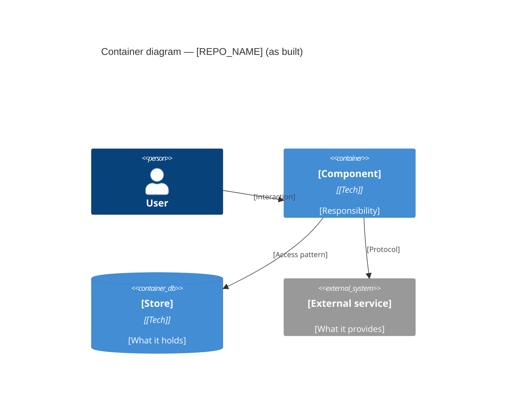

# Codebase Audit: [REPO_NAME]

> **Template Origin**: Community | **ArcKit Version**: [VERSION] | **Command**: `/arckit-repo:repo-audit`

## Document Control

<!-- DOC-CONTROL-HEADER -->
<!-- Resolved at command-execution time to _partials/document-control-uk.md or _partials/document-control-uae.md based on plugin userConfig classification_scheme + governance_framework. See _partials/RENDERING.md (when present). -->

## Revision History

| Version | Date | Author | Changes | Approved By | Approval Date |
|---------|------|--------|---------|-------------|---------------|
| [VERSION] | [DATE] | ArcKit AI | Initial creation from `/arckit-repo:repo-audit` command | PENDING | PENDING |

---

## 1. Audit Scope

| Field | Value |
|-------|-------|
| Target | [REPO_URL_OR_PATH] |
| Resolved source | [Local checkout / Shallow clone] |
| Commit audited | [SHA] |
| Branch | [BRANCH] |
| History depth | [Full / Truncated at N commits] |
| Audit date | [DATE] |
| Mode | [Conformance / Cold] |
| Scored against | [ARC-{PID}-PRIN-v*.md, ARC-{PID}-REQ-v*.md / Not applicable] |
| Dimensions covered | [list] |
| Dimensions skipped | [list, with reason] |

> **Point-in-time.** This audit reflects the repository at the commit above. Re-run after significant change.

---

## 2. Executive Summary

**Overall posture**: [✅ Sound / ⚠️ Material gaps / ❌ Not fit for purpose]

**Biggest single risk**: [one sentence]

**Findings**: [N] total — [N] CRITICAL, [N] HIGH, [N] MEDIUM, [N] LOW

**Blocking decisions**: [N] undocumented decisions requiring an ADR

**Recommendation**: [PROCEED / REMEDIATE BEFORE PROCEEDING / STOP]

---

## 3. Repository Profile

Facts only. No judgement in this section.

| Attribute | Value |
|-----------|-------|
| Primary languages | [lang: %, lang: %] |
| Top-level structure | [dirs] |
| Build tooling | [tooling] |
| Package manifests | [paths] |
| Test framework(s) | [frameworks, or None found] |
| CI/CD | [system + config path, or None found] |
| IaC | [tool + path, or None found] |
| Licence | [SPDX, or None found] |
| Commits in audited range | [N] |
| Contributors in audited range | [N] |
| Most recent commit | [DATE] |

---

## 4. As-Built Architecture

[Narrative description of what the code actually builds, not what the docs claim it builds. Note any divergence between the two explicitly.]

**Component evidence**

| Component | Evidenced by | Notes |
|-----------|--------------|-------|
| [name] | `path/to/source` | [inferred vs verified] |

---

## 5. Strengths

Each entry must cite evidence. Delete this section rather than pad it.

| # | Strength | Evidence |
|---|----------|----------|
| S-1 | [statement] | `path:line` |

---

## 6. Findings

**Severity rubric**

- **CRITICAL** — exploitable now, or data loss with no recovery path.
- **HIGH** — no exploit today, but no control either.
- **MEDIUM** — works, but will not scale or blocks safe handover.
- **LOW** — hygiene.

**Confidence**

- **Verified** — the code was read and the finding confirmed.
- **Inferred** — structural signal only (naming, layout, dependency presence).
- **Absent** — an expected artefact or control was not found anywhere in scope. Absence is the weakest evidence: state where you looked.

| ID | Dimension | Severity | Finding | Evidence | Confidence | Recommendation |
|----|-----------|----------|---------|----------|------------|----------------|
| F-001 | [dimension] | [CRITICAL/HIGH/MEDIUM/LOW] | [one sentence] | `path:line` or `SHA` or "not found in [scope]" | [Verified/Inferred/Absent] | [one action] |

---

## 7. Principles Conformance

> Conformance mode only. In cold mode, replace this section with: *Not assessed — no PRIN artefact for this project.*

Source: `ARC-{PID}-PRIN-v*.md`

| Principle | Statement | Verdict | Evidence | Gap |
|-----------|-----------|---------|----------|-----|
| [P-01] | [statement] | [Met / Partial / Not met / Not evidenced] | `path:line` | [what is missing] |

**Summary**: [N] Met, [N] Partial, [N] Not met, [N] Not evidenced.

---

## 8. Requirements Coverage

> Conformance mode only. In cold mode, replace this section with a seed capability list suitable for `/arckit:requirements`.

Source: `ARC-{PID}-REQ-v*.md`. Sort not-met first.

| Requirement | Verdict | Implementing component | Evidence | Gap |
|-------------|---------|------------------------|----------|-----|
| [FR-001] | [Met / Partial / Not met / Not evidenced] | [component] | `path:line` | [what is missing] |

**Summary**: [N] of [N] requirements evidenced in code.

---

## 9. Blocking Decisions

Decisions the codebase implies but never records. Each is a ready-to-file ADR. Hand to `/arckit:adr`.

### C-1: [Decision needed]

- **Context found in repo**: [what the code does today, with a path]
- **Options visible from the code**: [options]
- **Why it blocks**: [consequence of leaving it unrecorded]
- **Suggested ADR title**: [title]

---

## 10. Recommended Next Actions

Ordered. Each names the command that does it.

| # | Action | Command | Rationale |
|---|--------|---------|-----------|
| 1 | [action] | `/arckit:adr` | [why first] |

---

## 11. Limitations

State plainly what this audit could not see. A reader must never mistake this report for exhaustive.

- History truncated at [N] commits; older architectural decisions are not visible.
- Paths not read: [list or "none"].
- Submodules skipped: [list or "none"].
- Generated and vendored directories excluded: [list].
- No code was executed, so runtime behaviour, actual performance, and live configuration are out of scope.
- [Any dimension skipped and why.]

---

**Generated by**: ArcKit `/arckit-repo:repo-audit` command
**Generated on**: [DATE]
**ArcKit Version**: [VERSION]
**Project**: [PROJECT_NAME]
**Model**: [AI_MODEL]
