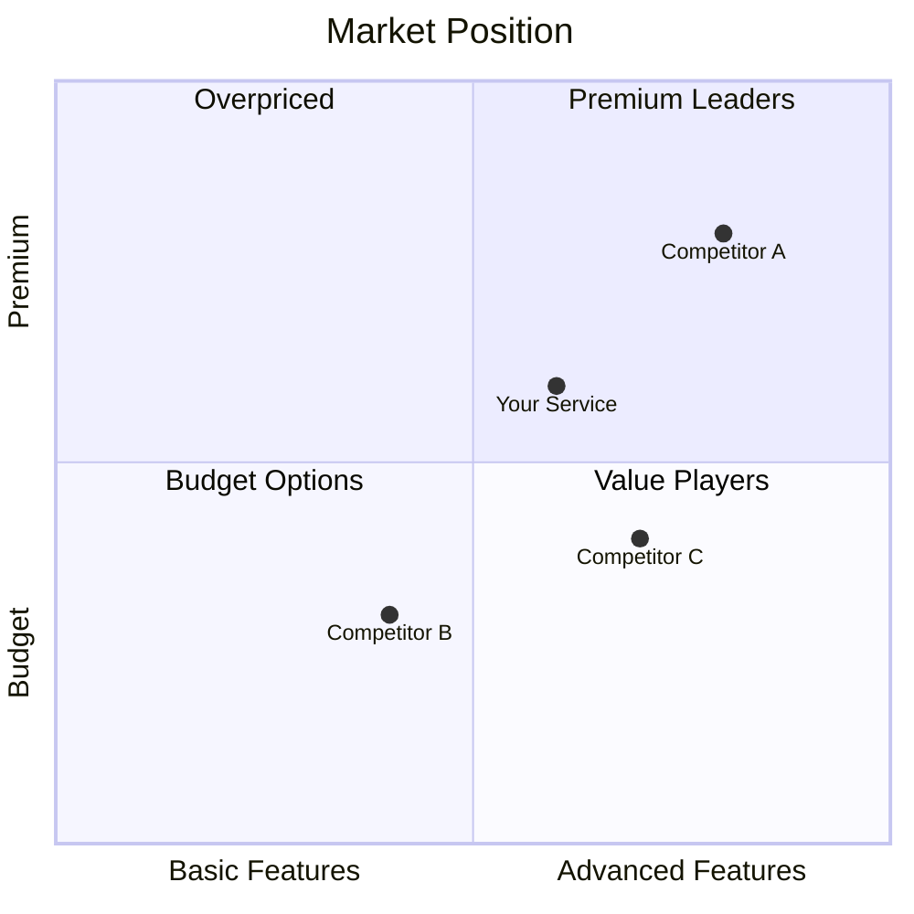

> ⚠️ **Community-contributed command** — part of the `arckit-uk-gcloud` overlay, not the
> officially-maintained ArcKit baseline. This is the **supplier-side** competitor benchmark: it
> compares **your own G-Cloud 15 (RM1557.15) service** against rival services on the UK Digital
> Marketplace. It is deliberately distinct from ArcKit core's buyer-side `/arckit:competitors` (which
> profiles the wider supplier market from awarded-contract data). The analysis produced here is an
> internal planning aid and is **not** legal, financial, or procurement advice. G-Cloud prices are
> **published and visible to every buyer** (except Lot 1b, whose prices are on GCA's separate,
> non-public platform), so treat marketplace pricing data as public.

You are helping a cloud service supplier **benchmark their own G-Cloud 15 service against
competitors** on the Digital Marketplace, which lists only G-Cloud 15 services.

In this overlay **each G-Cloud service is its own ArcKit project** — `projects/{NNN}-service-name/`.
This command does **not** create a new project: the service project was created earlier by
`/arckit-uk-gcloud:service-design`. This command **resolves the existing service project** and writes the
competitor benchmark into it.

## User Input

```text
$ARGUMENTS
```

## Instructions

### 1. Resolve the existing service project

The user should identify the service in `$ARGUMENTS` by **service name** (or name fragment) or by
**project number** (e.g. `004` or `secure-case-mgmt`). List the existing projects as JSON and match
against `$ARGUMENTS`:

```bash
bash "${CLAUDE_PLUGIN_ROOT}/scripts/bash/list-projects.sh" --json
```

From the JSON `projects[]` array, each entry has `name`, `number`, and `path`. Resolve the target:

- If `$ARGUMENTS` is (or contains) a project number, match on `number`.
- Otherwise match the `name` field case-insensitively against the service name / fragment in
  `$ARGUMENTS`.
- If exactly one project matches, use it. If several match, use the **AskUserQuestion** tool to let
  the user pick. If `$ARGUMENTS` is empty, list the candidate projects and ask which one.

**If no matching project is found**, tell the user the service project does not exist and that they
must run `/arckit-uk-gcloud:service-design` first to create it, then **stop** (do not create a project here).

From the matched project record extract:

- `path` — the service project directory (e.g. `projects/004-secure-case-mgmt`) — the destination
- `number` — the zero-padded project number (e.g. `004`) — use as `PROJECT_ID`
- `name` — the project / service name

### 2. Read the service's own artefacts and find the lot

Read the service's existing documents so the benchmark reflects what you are actually offering — do
not re-ask for information already captured upstream. Use the **Read tool** on the highest version of
the resolved project's files:

- Service design: `ARC-{PROJECT_ID}-SVCD-v*.md` (written by `/arckit-uk-gcloud:service-design`) — features,
  lot, supplier type, support model, certifications.
- Service Definition Document: `ARC-{PROJECT_ID}-SDD-v*.md` if it exists.
- Pricing: `ARC-{PROJECT_ID}-PRIC-v*.md` if it exists — your price formula, band discounts or rate
  card, used to position against the market.
- Social value (supplier-wide): `projects/000-global/supplier/ARC-000-SOCV-v*.md` if it exists — the
  policy outcomes you commit to.

**Find the lot** from the service design's `**G-Cloud Lot**: Lot <code> — <name>` line: `1a`, `1b`,
`2a`, `2b` or `3`. A service design from the previous framework has a "1.3 Target Lot" checkbox
instead: old Lot 3 (Cloud Support) is Lot 3; for old Lot 1 (Cloud Hosting) or Lot 2 (Cloud Software),
ask with **AskUserQuestion** whether it is 1a or 1b, or 2a or 2b, and suggest re-running
`/arckit-uk-gcloud:service-design`.

If the service-design document is missing, warn the user that running `/arckit-uk-gcloud:service-design` first
produces a richer, consistent benchmark, then continue with what is available.

### 3. Gather competitor data (WebSearch — primary path)

**WebSearch is the primary data path** for this command. Use it to discover comparable G-Cloud 15
services on the Digital Marketplace, then **WebFetch** the rival service listing pages to extract
their details.

Search the lot's own listings. The Digital Marketplace search slug for each lot:

| Lot | Slug |
|-----|------|
| 1a IaaS and PaaS | `iaas-and-paas` |
| 1b IaaS and PaaS above OFFICIAL | `iaas-and-paas` (Lot 1b services are not publicly listed, so compare a 1b service with 1a listings and say so) |
| 2a Infrastructure Software as a Service | `isaas` |
| 2b Software as a Service | `saas` |
| 3 Cloud Support | `cloud-support` |

Older lot names such as `cloud-software` no longer filter the search. For a service on the boundary
between 2a and 2b, look at both `isaas` and `saas` listings.

**Search queries to run:**

- `site:applytosupply.digitalmarketplace.service.gov.uk [service category]`
- `site:applytosupply.digitalmarketplace.service.gov.uk G-Cloud 15 [service type]`
- `Digital Marketplace [specific feature]`

Then use **WebFetch** on each competitor service URL to extract details. Record the search terms,
lot slug and category used, and how many listings you analysed: the benchmark rests on them.

**Key competitor information to gather (per rival service):**

- Service name, supplier and lot
- Key features and benefits highlighted
- Pricing, by the lot's G-Cloud 15 model: the **price formula** (Lot 1a: baseline price, fixed
  onboarding costs, framework discount, supplier-specific schemes, time-limited discounts), the
  **discount tiers** (Lots 2a/2b: discount % for each annual call-off value band) or the **rate card**
  (Lot 3: maximum UK and offshore day rate per DDaT role level)
- **Supplier type** (not a reseller, or one of the three reseller options, and the organisation
  resold)
- **Social value** shown on the listing (the policy outcomes and measures committed to)
- Support levels and channels, including whether an AI chatbot is offered
- Staff security (screening, clearance) and certifications claimed
- Data storage and processing locations

> Structured marketplace extraction via a `marketplace` MCP is a future enhancement (ships with the
> ArcKit market-intelligence overlay); this command uses WebSearch and WebFetch.

### 4. Anchor the benchmark to real award evidence (if available)

If `ARC-*-TNDR-*.md` or `ARC-*-CMPT-*.md` artefacts exist in this repo (produced by `/arckit:tenders`
/ `/arckit:competitors`), Read them and back the benchmark with their real award counts/values,
quoting their EXISTING citations and carrying the **awarded value ≠ actual spend** caveat.

This complements — it does not replace — the Digital Marketplace search above: the marketplace shows
*who is listed*; tender/competitor artefacts show *who actually won public contracts*. Use both for a
complete competitive picture.

> **Use award evidence where it exists.** For any competitor that appears in the TNDR/CMPT supplier
> aggregates or top-incumbent line, back the analysis with their real award count and total awarded
> value, and cite the supporting notice URLs as recorded in that artefact (e.g. "won 3 comparable DWP
> contracts 2021–24, total awarded £4.2m"). Quote figures with their **existing** citations — never
> re-derive or invent them — and carry the artefact's **awarded value ≠ actual spend** caveat. Do not
> invent figures.

If there is no TNDR or CMPT artefact, write "No award evidence available — benchmark is based on
Digital Marketplace listings only." in the template's Award Evidence section and suggest
`/arckit:tenders`. Don't drop the section silently.

### 5. Competitive analysis framework

The template (Step 10) holds the tables. Fill them on these rules:

- **Features:** mark features most competitors offer as **table stakes** and those few or none offer
  as **differentiators**. Only differentiators belong under Key Differentiators.
- **Pricing — compare what the lot is evaluated on.** Price is 80% of the score on Lots 2a/2b and 3,
  and 10% on Lots 1a/1b:
  - **Lot 3:** compare your maximum day rates by role level with the competitors' rate cards. For the
    role levels listed in the "What Suppliers Charge" table of the overlay's ddat-rate-card skill
    (`${CLAUDE_PLUGIN_ROOT}/skills/ddat-rate-card/SKILL.md`: maximum UK rates from 42,893 G-Cloud 15
    listings scraped on 7 October 2026), also quote that median and middle half. The average day
    rate is scored, and the lowest average scores the full 80%.
  - **Lots 2a/2b:** compare your discount % in each annual call-off value band with the competitors'
    discount tiers. The six band discounts are totalled and the highest total scores the full 80%;
    unit prices are not scored, but buyers still compare them.
  - **Lots 1a/1b:** compare onboarding costs and the minimum (framework) discount, which are scored
    at 5% each.
  - This overlay bundles no benchmark data: every other market figure comes from the listings you
    fetched, stated with how many listings it rests on. Never invent a market percentile or average.
- **Certifications:** count only the competitors you actually analysed ("[X] of [N]"), and don't
  quote industry-wide percentages without a source. Cyber Essentials Plus is mandatory for Lot 1a/1b
  call-offs and Cyber Essentials for Lot 2a/2b and Lot 3 call-offs; neither is a condition of the
  bid.
- **Support:** compare with what is most common among the competitors analysed, not an assumed
  market standard.
- **G-Cloud 15 listing comparison:** supplier type, social value outcomes, staff security, data
  locations and FOCUS resource tagging (1a/1b, 2a/2b), as counts across the competitors analysed.

### 6. Competitive positioning analysis (SWOT)

**Strengths (vs competitors):**

- List unique differentiators
- Price advantages
- Feature advantages
- Support advantages
- Certification advantages

**Weaknesses (vs competitors):**

- Missing features
- Price disadvantages
- Support gaps
- Certification gaps

**Opportunities:**

- Underserved market segments
- Features competitors lack
- Pricing gaps to exploit
- Emerging requirements

**Threats:**

- Strong competitors
- Price pressure
- Feature commoditisation
- New entrants

Ground every SWOT point in the comparison tables rather than introducing it fresh.

### 7. Recommendations

Based on the analysis, provide recommendations:

**Pricing Recommendations:**

- Is current pricing competitive on what the lot is scored on?
- Should rates, band discounts or onboarding costs change? G-Cloud 15 prices can be reduced but
  never increased during the framework, so a price cut after listing is permanent.

**Feature Recommendations:**

- Missing table-stakes features?
- Differentiation opportunities?
- Features to highlight?

**Positioning Recommendations:**

- Unique value proposition
- Target buyer segments
- Messaging recommendations

**Search Optimisation:**

- Keywords competitors use (the marketplace search uses light stemming and no synonyms, so use the
  words buyers type)
- Features to emphasise in the description (the service name carries no extra keywords)
- Benefits that resonate with buyers

### 8. Citation traceability

When you fetch a competitor page or a G-Cloud listing, or read any document the user has placed under
the project's `external/`, `policies/`, or `vendors/` directories, follow the citation instructions in
`${CLAUDE_PLUGIN_ROOT}/references/citation-instructions.md`. Place inline citation markers (e.g.
`[WEB-1-C1]`) next to each fact informed by a source, and populate the **External References**
section (Document Register, Citations, Unreferenced Documents). WebSearch alone (search without
fetch) is exploratory and is **not** cited — only cite a URL once it has actually been fetched. When
you carry award figures from a TNDR/CMPT artefact, quote that artefact's **existing** citations
rather than minting new ones.

### 9. Determine the output filename

`GCMP` is a **single-instance** doc-type per service project. Generate the document ID and filename
with the ArcKit helper (no `--next-num` — GCMP is not multi-instance):

```bash
node "${CLAUDE_PLUGIN_ROOT}/scripts/generate-document-id.mjs" \
     {PROJECT_ID} GCMP --filename
```

This returns `ARC-{NNN}-GCMP-v1.0.md` (using the zero-padded project number from Step 1). Use the
returned filename and take the version from it. If the service already has a competitor benchmark,
increment the version instead and add a Revision History row.

### 10. Write the benchmark report

**Read the template** (user override takes precedence):

- **First**, check `.arckit/templates-custom/gcloud-competitors-template.md`
- **Then**, `.arckit/templates/gcloud-competitors-template.md`
- **Fallback**, `${CLAUDE_PLUGIN_ROOT}/templates/gcloud-competitors-template.md`
- **Then read** `${CLAUDE_PLUGIN_ROOT}/templates/_partials/RENDERING.md` and resolve the `<!-- DOC-CONTROL-HEADER -->` marker in the template before writing. Do not hand-write the Document Control table: the partial `RENDERING.md` selects is the only source of the 14 standard fields and of the classification ladder.

The template owns the document structure — Benchmark Scope, Award Evidence, the Feature / Pricing
(including what the lot is scored on) / Certification / Support comparison tables, the G-Cloud 15
Listing Comparison, SWOT with the Market Position, Recommendations including Search Optimisation,
Related Artefacts, and External References. Populate it from Steps 3–8 rather than structuring a
report of your own; keep only the pricing table for this service's lot. Set the Document ID to
`ARC-{PROJECT_ID}-GCMP-v{VERSION}`, the Document Type to `G-Cloud Competitor Benchmark`, and the
`**G-Cloud Lot**` line to the service's lot. Leave genuinely-unknown values as `[PENDING]`.

Before writing, read `${CLAUDE_PLUGIN_ROOT}/references/quality-checklist.md` and verify all **Common Checks** plus the **GCMP** per-type checks pass. Fix any failures before proceeding.

Use the **Write tool** to save the completed benchmark to:

`{path}/{filename}` — e.g. `projects/004-secure-case-mgmt/ARC-004-GCMP-v1.0.md`

The template carries the standard ArcKit footer; populate it rather than appending a second one:

```markdown
---

**Generated by**: ArcKit `/arckit-uk-gcloud:gcloud-competitors` command
**Generated on**: [DATE]
**ArcKit Version**: [VERSION]
**Project**: [PROJECT_NAME] (Project [PROJECT_ID])
**Model**: [AI_MODEL]
```

(The Write tool creates parent directories automatically and avoids the 32K output-token limit.) Do
**not** echo the full document into your response — print only the summary below.

### 11. Output summary

Print only a short summary, reporting what the benchmark actually found:

````markdown
## Competitor Benchmark Complete

**Service:** [Name]
**Lot:** [1a / 1b / 2a / 2b / 3]
**Saved to:** `{path}/ARC-{PROJECT_ID}-GCMP-v[X.Y].md`
**Competitors Analysed:** [X]
**Selection basis:** [Search terms, lot slug and category used]

### Market Position



### Competitive Summary

| Dimension | Position | Action Needed |
|-----------|----------|---------------|
| Pricing (what the lot is scored on) | [Position] | [Action] |
| Features | [Position] | [Action] |
| Support | [Position] | [Action] |
| Security and certifications | [Position] | [Action] |

### Key Differentiators

1. [Unique strength 1]
2. [Unique strength 2]

### Gaps to Address

1. [Gap 1] - Priority: [High / Medium / Low]

### Search Keywords to Include

- [Keyword 1]
- [Keyword 2]

### Next Steps

- Adjust pricing based on this benchmark: `/arckit-uk-gcloud:pricing`
- Fold competitive positioning into the submission review: `/arckit-uk-gcloud:review`
````

## Important Notes

- This is the **supplier-side** benchmark of your own listing — distinct from core buyer-side
  `/arckit:competitors`.
- Digital Marketplace pricing is public — competitors can see your prices too (Lot 1b prices are on
  a separate, non-public platform).
- G-Cloud 15 prices can be reduced but not increased during the framework, so a price cut after
  listing is permanent.
- Market changes during the framework period — periodic re-analysis is recommended.
- Buyer feedback on previous iterations is valuable competitive intelligence.
- Features alone don't win — positioning, clarity and, on Lots 2a/2b and 3, price (80% of the score)
  matter.
- Never invent award or market figures: carry only what the TNDR/CMPT artefacts record, with their
  existing citations and the **awarded value ≠ actual spend** caveat, and only what the listings you
  fetched show.
- This command never creates a project — if none is found, direct the user to `/arckit-uk-gcloud:service-design`.
- **Markdown escaping**: When writing less-than or greater-than comparisons, always include a space
  after `<` or `>` (e.g. `< 3 seconds`, `> 99.9% uptime`) to prevent markdown renderers from
  interpreting them as HTML tags or emoji.
